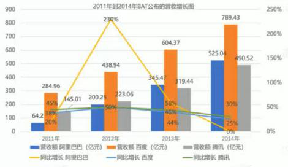
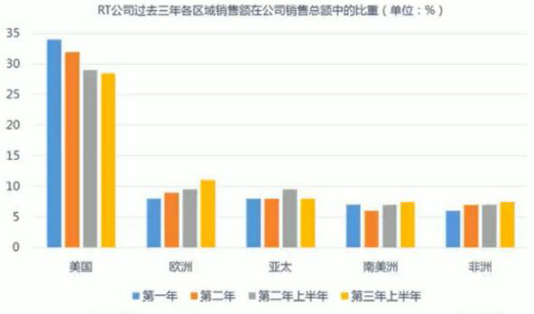
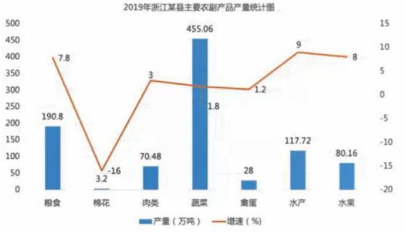
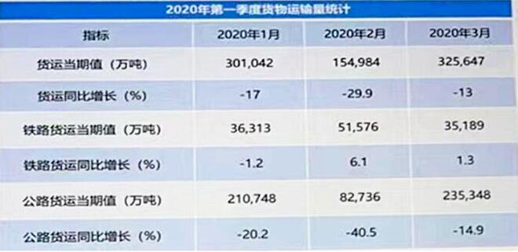
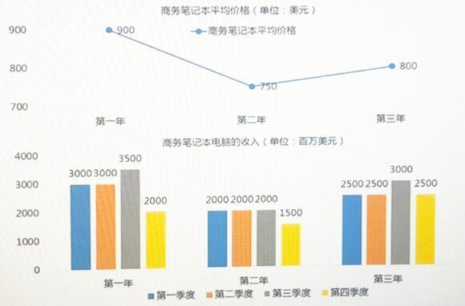
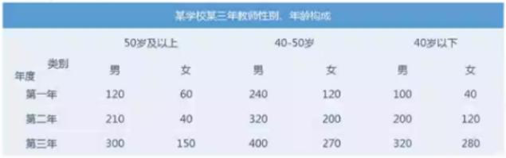
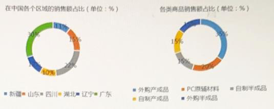
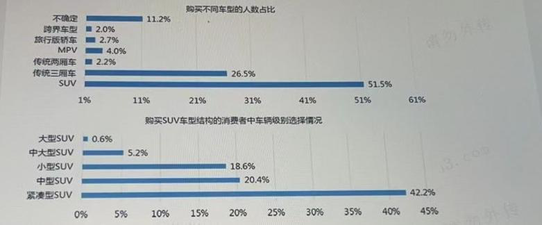

# 言语理解 #

# 1

高新科技成果转化为生产力，有一个客观的转化过程。从基础理论到技术研究，进而设计、开发、研制出样品、样机，从试验或小批生产到建立经济规模的生产及相应的经营管理和销售服务,高科技成果转化成为具有使用价值和经济效益的社会生产力，要经过许多环节，要做大量具体的转化工作。

其中，应特别注意的是必须切实解决经济规模生产的工艺问题。

A: 高新科技成果转化为生产力要经许多环节和做大量具体的转化工作
B: 解决经济规模生产的工艺问题是高新科技成果转化为生产力的首要任务
C: 解决经济规模生产的工艺问题与设计、开发等问题同等重要
D: 高新科技成果转化为生产力要做许多具体工作，主要包括解决经济规模生产的工艺问题

答案: D

解析: 第一步，分析文段。首先提出"高新科技成果转化为生产力"有一个转化过程，接着详细介绍了转化过程各个环节的转化工作。最后通过"其中""特别注意""必须"指出除了以上的转化工作，要特别注意"经济规模生产的工艺问题"。第二步，对比选项。D 项是对文段主旨的同义替换。因此，选择D。要点:A 项:没有强调高新科技成果转化为生产力需要解决经济规模生产的工艺问题，偏离重点。B 项:"首要任务"无中生有。C 项:没有提及"高科技成果转化为生产力"，偏离重点。

# 2

虽然春节、清明、端午和中秋都被称为中国四大传统节日，不过与其他三个相比，中秋要年轻许多，直到宋代才以"节日"的姿态示人。在中国的四大传统节日中，春节是资格最老的。虽然将正月初一定为春节是民国成立以后的事了,但是这个节日本身历史久远保守估计也已经在中国走过了三千年的历程。四大传统节日中排行第二的是端午节。端午节起源于先秦,而最终形成独立节日则是在汉魏时期。相比较之下,清明节比中秋节略年长些虽然有关清明从节气演变到节日的起源，一般会提到春秋时晋文公重耳和其忠臣介子推的传说但传说终归是传说清明节的最终生成则是在中国历史上最为辉煌的大唐。

A: 中秋节在宋代以前就已经中国的节日了
B: 端午节在先秦时期已形成独立节日
C: 清明节与春秋时晋文公重耳和其忠臣介子推的传说未必有关
D: 中秋节的最终是在中国历史上最为辉煌的大唐形成独立节日的

答案: C

解析: 由题意可知：中秋要年轻许多，直到宋代才以"节日"的姿态示人。所以A错误。端午节起源于先秦,而最终形成独立节日则是在汉魏时期。所以B错误。一般会提到春秋时晋文公重耳和其忠臣介子推的传说但传说终归是传说清明节的最终生成则是在中国历史上最为辉煌的大唐。所以C对，B错。所以答案选C。

# 3

每个人在学习新事物时都会有恐惧、畏难的心态，但如果因此而( )，那我们就永远也学习不到新知识。

A: 因噎废食
B: 瞻前顾后
C: 首鼠两端
D: 视为畏途

答案: D

解析: 题中意思是每个人对学习新事物都会害怕，但如果就此害怕学习，就永远也学不到新知识。因噎废食：因为吃饭噎住了，索性连饭也不吃了。瞻前顾后：形容顾虑过多，犹豫不决。形容迟疑不决或动摇不定。视为畏途：比喻把事情看得艰难可怕，而不敢去做。所以答案选D。

# 4

生长在水中或水边的动植物的遗体是最易被保存下来的，因为保存动植物遗体的必要条件是快速掩埋，而在淤泥不断淤积的海洋、河流乃至湖泊中，动植物的遗体以及其他东西能够被快速掩埋。

A: 动植物遗体很容易在淤泥不断淤积的海洋、河流乃至湖泊中保存下来
B: 只有生长在水中或水边的动植物的遗体才能被保存下来
C: 淤泥不断淤积的海洋、河流乃至湖泊是保存动植物遗体的最佳环境
D: 只要被快速掩埋，动植物遗体就能被保存

答案: A

解析: 本题考查的是考生对关键词语的把握能力。文章是解释为什么"生长在水中或水边的动植物的遗体是最易被保存下来"，所以答案为A。开头一句话的"最"字，是需要考生把握的，由此选择A，A说"很容易"，与原文程度相符。B"只有"犯了绝对化的错误，"最容易"不代表"只有"。其他地方仍然可能保存动植物的遗体。C项中的"最佳"错误。D选项和题干矛盾．题干说的是"快速掩埋"是"保存动植物遗体"的必要条件。

# 5

教育上"谁受益、谁出钱"这一提法如果是正确的话，只能理解为国家是教育的最大受益者。这是因为一方面，教育的经济效益，虽然不能直接、立即体现在市场经济交换过程中，却存在于社会之中:另一方面，教育不仅有经济效益，而且是国家综合国力的重要组成部分。

A: 教育经费主要由国家承担是合理的
B: 教育经费应由个人，社会与国家共同承担
C: 个人是教育的次要受益者，所以应该承担相当大部分的教育经费
D: 应该实行由幼儿园到大学的免费教育

答案: A

解析: 由题意可知：国家是教育的最大受益者。教育上"谁受益、谁出钱"这一提法如果是正确。教育经费主要由国家承担是合理的。所以答案选A。

# 6

父亲忽然看见两位先生在请两位打扮得漂亮的太太吃牡蛎。一个衣服褴楼的年老水手拿小刀一下撬开牡蛎，递给两位先生，再由他们递给两位太太。她们的吃法很文雅，用一方小巧的手帕托着牡蛎，头稍向前伸，免得弄脏长袍;然后嘴很快地微微一动,就把汁水吸进去，蛎壳扔到海里。毫无疑义，父亲是被这种高贵的吃法打动了，走到我母亲和两个姐姐身边问:"你们要不要我请你们吃牡蛎?"母亲有点迟疑不决，她怕花钱;但是两个姐姐赞成。母亲于是很不痛快地说:"我怕伤胃，你只给孩子们买几个好了，可别太多，吃多了要生病的。"然后转过身对着我，又说:"至于若瑟夫，他用不着吃这种东西，别把男孩子惯坏了。"

A: 想请家人品尝牡蛎的鲜味道
B: 借机摆出高雅的绅士风度
C: 羡慕别人吃牡蛎的动作
D: 想力法为家人的旅游助兴添乐

答案: B

解析: 父亲请家人吃牡蛎的动机是借机摆出高雅的绅士风度。

# 7

经济学应具有伦理的方法，伦理学也可引进经济学的方法。伦理学与经济学之所以有相通之处，可以相互联系、相互引进，是由人们的经济行为和道德行为本身相互关联决定的。例如在工业生产中，人们的创造能力不仅取决于知识和技术水平，也取决于是否肯于奉献的道德水平。

A: 经济学为何与伦理学有相通之处
B: 经济学与伦理学是相互联系，相互引进的
C: 经济学与伦理学的关系
D: 经济学与伦理学的方法是相通的

答案: B

解析: 首句为中心句，第二句为解释说明原因，第三句为例子解释。即文段中心：经济学与伦理学之间有联系，能互相引进。选B。

# 8

人们通常把个人成长看作是容易识别和衡量的外在行为表现，例如青年不痴迷于游戏，学生掌握了一门新语言等。这些都是付出努力之后取得成绩的行为表现。相比之下，从过程的角度,测量成长就较为困难了。它像是一次旅行，不是路上的里程碑，是当人遇到新体验或困难时所持的态度和情感。从这个意义上来说，成长的过程没有真正的尽头，因为新挑战和新体验随时都会发生。

A: 在工作中很努力
B: 克服掉了抽烟的习惯
C: 渴望学习新的事物
D: 不断接受挑战

答案: B

解析: 文中"人们通常把个人成长看作是容易识别和衡量的外在行为表现，例如青年不痴迷于游戏，学生掌握了一门新语言等"。问题是"一个人如果被大家认为取得了成长"，被大家认为，那么也就是行为表现，B项符合。

# 9

陌生人社交平台引发了荷尔蒙经济的热潮，之所以如此是因为由荷尔蒙引起的欲望本就存在于人性中,经验告诉我们，所有基于人性的生意都是刚需，并且长久不衰。尤其是在中国市场，人们既被传统思想束缚，表面上必须遵守许多规矩,尤其是伦理与道德的标准，但也许正是因为这样，被压抑的荷尔蒙才更容易刺激人们做一些不那么遵守规则的事情。所以，陌生人社交提供给荷尔蒙经济一个极好的发展平台，在这个平台中，荷尔蒙可以被无限次消费，而且收益惊人。以陌陌为例，去年第四季度，陌陌的付费用户达到390万人，季度净增人数30万.在第四季度增值业务的营收中，陌陌的收入为4.99亿元，余下的则是探探创造的2.23亿元。

A: 荷尔蒙经济热潮
B: 陌生人社交平台收益惊人
C: 荷尔蒙经济的推手------陌生人社交平台
D: 消费荷尔蒙的时代

答案: C

解析: 最适合本文的标题是荷尔蒙经济的推手------陌生人社交平台。

# 10

在美国，目前官方认为肥胖是一种疾病。这可将人们从超重带来的精神负罪感中解脱出来。但也可能让有些人会放弃减肥。节食本身并不一定有效。有很多饮食的倡导者们会声称某种饮食方式明显减轻了体重。节食效果可能是真实的，但是几乎没什么意义，除非知道节食的人中体重减轻的的占百分之几，以及保持了多久。最成功的治疗需要改变生活方式。研究发现，每天至少饮用一杯软饮料的人比其他人更易超重。原因之一是几乎所有软饮料都用果糖添加甜味，而果糖不能像其他糖那样多地增加胰岛素或瘦素，使人获得卡路里却没有饱足感。另一个选择是减肥药。虽然大多减肥药能降低进食量，阻止肠道吸收脂肪，但也存在副作用。最后，还有一种选择是进行胃分流术。通过手术减少胃的容积，使少量进食即可产生饱足感，但会使人遭受感染、肠梗阻等。手术只是在重度肥胖的情况下值得考虑。

A: 面对超重时，我们可以选择食用安全无副作用的减肥药来减轻体重。
B: 进行胃分流术虽然可以减少进食，控制食物的进入，但是产生的消极影响太多，因此不能用于控制体重。
C: 节食可能的确有利于减轻体重，但是我们要根据自身的实际情况来进行判断。
D: 如果我们饮用不添加果糖的饮料，体重就能够得到控制。

答案: C

解析: 由题意可知：另一个选择是减肥药。虽然大多减肥药能降低进食量，阻止肠道吸收脂肪，但也存在副作用。题中并未提到由安全无副作用的减肥药，所以A错。还有一种选择是进行胃分流术。通过手术减少胃的容积，使少量进食即可产生饱足感，但会使人遭受感染、肠梗阻等。胃分流手术可能会控制体重，但可能会产生消极影响。所以B错。每天至少饮用一杯软饮料的人比其他人更易超重。原因之一是几乎所有软饮料都用果糖添加甜味，而果糖不能像其他糖那样多地增加胰岛素或瘦素，使人获得卡路里却没有饱足感。文中写的是原因之一是，可能软饮料中还有其他原因。所以答案选C。

# 11

怀旧一词来自希腊词"回家"和"疼痛"的结合,意为"思念家而带来的疼痛"。它被用来描述在奔波于异乡的商人身上的思乡综合症:心率不齐、啜啼、疲倦而且毫无食欲。怀旧被认为是一种多愁善感、难以消除的消极情绪。但怀旧也具有积极的心理功能，怀旧感被激发的人比普通人更愿意为慈善基金服务,并捐赠更多金钱。在这个过程中，怀旧启动了同情心，让人们对他人的处境感同身受，从而增加了人们的捐赠行为。

A: "孩子们的那些日子"------呈现孩子们在地震前的生活场景
B: "为了孩子们更好的明天"------呈现孩子们未来的生活场景
C: "孩子们的生活，需要我们"------呈现孩子们在地震中失去家乡的场景
D: "我们的一小步，孩子们的一大步"------呈现每个人捐款以及灾后重建的场景

答案: A

解析: 好在下面哪种广告语中，人们更愿意为地震地区的儿童捐款:"孩子们的那些日子"------呈现孩子们在地震前的生活场景。

# 12

对于考上北大这个目标，他（）。

A: 坚心守志
B: 坚忍不拔
C: 坚贞不屈
D: 石赤不夺

答案: D

解析: 由题意可知：坚心守志：坚定地恪守节操。坚韧不拔：形容意志坚定，不可动摇。坚贞不屈：坚定而有气节，绝不屈服。石赤不夺：意思是比喻意志坚定不移。所以答案选D。

# 13

从哲学的角度看，不可否认原始儒家思想中存在很多人性的光辉，而从历史的角度看，儒家思想世俗化之后建构的传统文化，最明显的缺陷就在于没有提供一种包含起码的人道主义精神的底线伦理。当我们在批判传统文化和创造新文化的时候，应该在人道主义的框架内建立一种起码的道德底线。

A: 提倡建立底线文明
B: 批判儒家思想的缺陷
C: 批判地继承儒家思想
D: 应创造什么样的新文化

答案: A

解析: 由题意可知：文中主旨句是最后一句话：当我们在批判传统文化和创造新文化的时候，应该在人道主义的框架内建立一种起码的道德底线。所以答案选A。

# 14

我们的一些科普文章常常激不起公众的兴趣，原因之一便是枯燥。要把科普文章写得"郁郁乎文哉",就需要作家的笔。科学的飞速发展，为文学写作提供了一座富矿。相信有眼光的文学家一旦领略科学题材的广阔富饶，便会陶醉在它的无限风光中乐而忘返。

A: 科普文章对作家的依赖
B: 科学和文学的互相激励作用
C: 科学和文学互相依赖
D: 科学发展为文学提供了丰富的素材

答案: B

解析: 本题属于主旨概括题。题干中第一句和第二句的意思是，科普文章要靠作家写得好才能激起公众兴趣，而后面两句则讲到科学发展可以为文学创作提供素材，从而促进文学的发展。这两者是互相激励作用的表现。A项和D项只反映了题干的一部分意思。C项中的"依赖"过于绝对。故答案为B。

# 15

群众的眼睛是雪亮的，但如果缺乏足够的引导和约束，这种"雪亮"有可能变成一种偏执，一种没有方向的自负。而建立在"多数人"压过"少数人"基础上的制度安排，很可能走进片面和褊狭的陷阱中。"上级"评议，官员面对的是"一个人"，"公众"评议，官员面对的是"一群人"，只有在"顶天"的压力和"立地"的责任互相补充下才能真正起到足够的监督作用。自上而下与自下而上的监督力量有机地结合，才可能在博弈中避免"一个人"的片面和"一群人"的片面。

A: 质疑群众评议的合理性
B: 群众的意志要得到合理的引导和约束
C: 如何对官员进行有效的监督
D: 怎样在群众和上级间达到平衡

答案: C

解析: 从题干分析，题干的前两句是说明群众对于官员的监督是可能存在误区的，由此推导出（第三句和最后一句）：只有把群众评议和上级评议结合起来，才能保证评议的合理和真实性。由此可见，题干主要表达的意思是怎样才能对官员形成有效的监督，故选C。A和B都只表达了前两句话的意思，不能选，D所表达的意思脱离了"对官员进行监督"这个主题，也不能选。

# 16

人们为保护海龟采取了一系列措施，例如使用全球定位系统追踪他们的行踪、志愿者主动把孵化的幼龟送到海边、政府出面保护海龟的产卵场等。研究人员使用卫星设施跟踪海龟的迁移情况，试图弄清这些海龟常常穿越广阔海域洄游数干公里的原因，以让保护海龟措施的制定更加科学。这类定位跟踪研究能更清晰地认识海龟的活动规律，例如海龟在产卵期要产五六窝卵，每产窝卵需要回到海中休息半个月，一旦知道海龟在产卵间隙回到海洋休息的活动范围，就可以确切地知道保护区范围应该有多大才合适;又如海龟产完卵后会去哪里?会走一条什么样路线?这些研究成果会让我们更明确应在哪些区域保护海龟。但是自然对人类公平的理念却漠不关心。实际上，如果没有额外的保护，海龟很有可能会永远消失。

A: 人类的活动改变了海龟的存活方式
B: 人为地干预生态系统导致了海龟的灭绝
C: 人们已经做出了防止海龟灭绝的努力

答案: C

解析: 由材料可以推论出人们已经做出了防止海龟灭绝的努力。

# 17

对于身边大多数物品，比如一把椅子,无论如何放置，人类都可以轻易识别。然而脸却不同，当照片中出现两张正置的面孔，即使非常相似，我们也可以轻而易举地指出两张脸的差异。但如果面孔是倒置的，找出不同就有些困难，这种现象称为面孔识别效应。这是因为大脑有一个特定识别面孔的区域，当面部上下颠倒时，大脑会通过识别物体的通路来识别图像,而不再使用面孔识别通路。人们一直认为"面孔倒置效应"是哺乳类动物独有的，仅在灵长类生物与绵羊中被观测到。但最近一项发现表明日本田鱼似乎也有这种效应。日本田鱼,又称青鲋鱼，生性喜欢社交，因此正确识别其他个体对它们来说非常重要。为了探究青鏘鱼对颠倒的面孔的辨识能力，研究人员们使用棱镜对鱼的面孔进行垂直或水平翻转,测试雌鱼对各种翻转面孔的识别能力。令人惊讶的是,青终鱼也表现出"面孔倒置效应",这项发现表明鱼与人类类似，可能有特定的加工面孔的脑机制。

A: 人们通常认为面孔识别效应是哺乳类动物独有的。
B: 倒置的面孔会通过识别物体的通路来被认知。
C: 当面孔方向与预期不一致时，社会信息就减弱。
D: 面孔识别效应有特定的脑机制。

答案: C

解析: 由题意可知：人们一直认为"面孔倒置效应"是哺乳类动物独有的，仅在灵长类生物与绵羊中被观测到。所以选项A对。当面部上下颠倒时，大脑会通过识别物体的通路来识别图像,而不再使用面孔识别通路。所以选项B对。这是因为大脑有一个特定识别面孔的区域。所以选项D对。C选项的内容题中并未提到。所以答案选C。

# 18

听莫扎特的音乐能够提高智商，这被称为"莫扎特效应"。无论"莫扎特效应"有无这样的神奇效果，音乐在陶冶情操、抚慰心灵的作用正在逐渐显现出来。人类离不开音乐也是显而易见的事实。

A: 作者认同"莫扎特效应"
B: 作者认为音乐能提高智商
C: 无法判定作者是否认同"莫扎特效应"
D: 音乐在大脑的开发方面起关键作用

答案: C

解析: 题干中,首先向读者介绍了"莫扎特效应",其次,表达了作者的主观见解,即承认音乐在陶冶情操,抚慰心灵上的作用。但对"莫扎特效应"是否真有奇效,作者并无明确表示是否认同,因此最恰当的选项应为C。B、D两项承认音乐在提高智商或大脑开发方面的观点是"莫扎特效应"所支持的,故排除B、D两项。

# 19

公众宣传是一种为吸引公众的注意而在各类传播媒体上发布有关个人、团体或产品的信息的宣传方式。公众宣传有较大优势，如它的信息传播没有空间成本，可信度高等。新闻报道就是公众宣传的一种形式，读者乐于将报道的独立性与客观性相联系，认为新闻报道更有可信度。但不可否认选择公众宣传本身也有局限性,如公司对产品的信息、播报时间等几乎没有控制权，如果公司在一个特定时期需要宣传，则媒体很有可能因未能及时报道而影响宣传效果。所以媒体宣传固然有优势，但也有其局限，它的发展只能说是差强人意。

A: 新闻报道更加客观
B: 新闻报道数量多，报道鲜明
C: 新闻报道是独立的
D: 新闻报道的观众群比广告的观众群大

答案: A

解析: 由题意可知，新闻报道就是公众宣传的一种形式，读者乐于将报道的独立性与客观性相联系，认为新闻报道更有可信度。所以A正确；选项B、C、D均与原文不符，所以选择A。

# 20

英雄豪杰与民众在历史上的作用孰轻孰重，历来是史家津津乐道的一个话题，当然也是一个非常不易说清楚的问题。常言道，一个好汉三个帮，这句明白易懂的话让人觉得平实而中肯，可以省去我们做历史辩证法深思的不少麻烦。然而，这些历史中的好汉与帮手的学术地位却是非常不平衡的。研究英雄的著作，或是给英雄出谋划策的各类宝鉴，千百年来不绝如缕,而就那些帮手们而言，在"群众社会"到来之前，操持着改变或维持历史方向的势力并不是他们，而是遍布于这个世界大大小小的帝王将相和各路神仙，因此鲜有人把他们当作一个心理实体进行研究。

A: 英雄豪杰主宰着历史发展的方向，在历史发展中有着很高的地位。
B: 帮手的地位与他们实际的贡献是不相符的，应该加强对他们的研究以及肯定。
C: 掌握历史方向的英雄的背后往往有许多有着很大贡献的帮手，然而在学术与研究中却常常被忽略。
D: "群众社会"的到来使得帮手的地位有所提升。

答案: C

解析: 掌握历史方向的英雄的背后往往有许多有着很大贡献的帮手，然而在学术与研究中却常常被忽略。

# 21

以制度安排和政策导向方式表现出来的集体行为。不过是诸多个人意愿与个人选择的综合表现。除非我们每一个人都关心环境，并采取具体的行动，否则，任何政府都不会有动力(或压力)推行环保政策。即使政府制定了完善的环保法规，但如果每个公民都不主动遵守，那么，再好的环保法规也达不到应有的效果。

A: 政府有责任提高全民的环保意识
B: 完善的环保法规是环保政策成败的关键
C: 政府制定的环保法规应该体现公民个人意愿
D: 每个公民都应当提高自己的环保意识

答案: D

解析: 每个公民都应当提高自己的环保意识。

# 22

现在的社会中有许多有很大的发展潜力但生活困难的人，他们无法靠自己的力量来改变目前的处境，但若有人进行扶持,则会前途无限。一些人认为社会的资源以及职位要通过市场来进行配置，政府无法包办。现在的情况是市场不可能自动实现与协调社会中各阶层人民收入的平衡，也不可能估计到整个社会的贫弱阶层，这样一来贫高差距过大，必然会影响社会的和谐发展。

A: 应该为贫弱群众谋取利益。
B: 贫弱阶层的人民靠自己难以脱贫。
C: 市场本身无法自动协调社会收入。
D: 贫富差距过大势必影响社会发展。

答案: A

解析: 由该段文字可行，B、C、D三项都只是为了说明某一观点的原因，归根到底是为了说明A项，即"应该为困难群众谋利益"。

# 23

改革开放的成败与否，与中华民族的复兴( )。

A: 息息相关
B: 休戚相关
C: 唇亡齿寒
D: 唇齿相依

答案: B

解析: 息息相关：意思是彼此呼吸都相互关联，形容关系非常密切。休戚相关：彼此之间的忧喜、祸福都互相关联。形容关系密切，利害关系一致。唇亡齿寒：比喻两者关系密切，利害相关。唇齿相依：比喻互相依存，关系密切。选择B。

# 24

虽然以往研究显示正在交往中的人更加快乐，但单身不一定就不快乐。单身者通常有更低的生活满意度和身心健康状态，但对于那些有高社交回避倾向的人来说，单身可以消除某些由人际冲突引起的焦虑现象，因此他们在单身时或交往时，感受到的快乐程度是一样的。但研究者表示过于避免人际关系的冲突可能具有反效果，如果一个高社交回避的人在单身时比较快乐，他就会更加倾向于回避人际交往，而在社交中的容忍度更低，更容易感到焦虑。这会不断增加单身人口，降低生育率，不利于社会的持续发展。

A: 对高社交回避的人来说，单身和恋爱的快乐程度一样, 因此没有必要谈恋爱。
B: 人际交往虽然会让人感到焦虑不适，但也可以提高人们的社交容忍度。
C: 提高高社交回避者的恋爱率可以帮助高他们解决社交中的人际冲突。
D: 如果人们的社交容忍度更高，恋爱的快乐程度就更高，单身人口就更少。

答案: D

解析: D选项的推断符合题干最后的描述，是"社交中的容忍度更低，更容易感到焦虑。"相反的推断。故正确答案为D。

# 25

长辈毕竟经历了更多的事，积累了更多的人生经验，因此对于他们分享的生活感悟，我们都要牢记在心，认真领悟，而不是当作( )。

A: 充耳不闻
B: 言不入耳
C: 马耳东风
D: 玉马朝周

答案: C

解析: 由题意可知：充耳不闻：意思是塞住耳朵不听。形容有意不听别人的意见。言不入耳：指说的话不中听。马耳东风：意思是比喻把别人的话当成耳边风。玉马朝周：意思是指朝政腐败，贤臣出走；亦指贤臣另择明主。长辈毕竟经历了更多的事，积累了更多的人生经验，因此对于他们分享的生活感悟。并不是给予意见，充耳不闻不太符合，所以答案选C。

# 26

虽然电子烟会在产品性能和配料上突出科技含量高、新潮时尚，但其配料无非是尼古丁、水、丙二醇等，原理就是电子蒸发。真正吸用电子烟上瘾的人都是年轻人，他们多数没有吸过传统香烟，只是为了追赶时尚。在正常使用条件下，电子烟气溶胶中的铅、铭和镍及甲醛的浓度等于或高于传统卷烟中的浓度。此外，电子烟还会产生一些传统卷烟烟气中没有的有毒物质，如乙二醛，该物质有毒，蒸气或雾对眼睛、黏膜和上呼吸道有刺激作用。随着消费者的理智回归和社会评价的不断客观化，电子烟遭受质疑是必然。

A: 吸电子烟的人大多没有吸过传统香烟。
B: 电子烟带来的巨大危害最终会引导消费者选择传统香烟。
C: 铅、铬和镍及甲醛是电子烟与传统香烟都有的成分。
D: 乙二醛带来的危害是电子烟遭受质疑的主要原因。

答案: C

解析: 由上文可知，在正常使用条件下，电子烟气溶胶中的铅、铭和镍及甲醛的浓度等于或高于传统卷烟中的浓度。所以选择C。

# 27

金融经济学家早前做的有关股票期权回溯调查,着重研究的是公司股权价格在授权后的不规则增长的程度范围。我与我的同事则着重研究股权授权日当天的股票价格在当月内股票价格分布图里所处的位置。研究者们对全球19000上市公司的首席执行官在10年内(1996-2005)所获得的平价期权许可及其它计划之外的津贴进行了调查研究之后发现，选择授权日进行股票期权分配与其公司当日股票价格在当月股价排列分布图中的位置有很大的关联性:这就是说，如果股票价格在当月位于最低水平，那么这一天就极有可能被选为股票期权授日，那么倒数第二低位置的价格就第二有可能被选中成为股票期权授权日，诸如此类推算。

A: 股票期权授权日与股票的价格低有关
B: 股票期权授权日与股票价格关系不大
C: 股票期权授权日的决定由每年度股票价格决定
D: 股票期权授权日是不会发生变化的

答案: A

解析: 如果股票价格在当月位于最低水平，那么这一天就极有可能被选为股票期权授权日。选择A。

# 28

科学研究本质上是机会主义的，其目的不在于做或好或坏的实验,而在于解决问题，如果一个问题碰巧笨拙地解决了，那么优美的方法就永远不会找寻了。

A: 科学研究不在乎方法的笨拙或优美，只要达到解决问题的目的就可以了
B: 科学研究的机会主义致使优美的方法永远不会被找寻
C: 科学研究的目的是解决问题
D: 优美的方法不是科学研究追求的目标

答案: B

解析: 题干中是说"如果一个问题碰巧笨拙地解决了，那么优美的方法就永远不会找寻了"，言外之意是如果问题没有碰巧笨拙地解决，优美的方法还是可能会被找寻的，B却直接去掉了题干中的"如果"条件句，结论太过绝对，是没有根据的。所以选择B。

# 29

李渔是我国杰出的戏曲理论家。他的戏曲理论远比他的剧作更受人们重视。在吸取前人戏曲理论成果的同时，李渔根据自己丰富的戏曲创作经验和导演经验，对我国的戏曲、特别是昆曲艺术的经验和规律，作了相当全面的总结，建立了一套比较完整的理论体系。他在我国戏曲理论史上做出了重大贡献。他的戏曲理论主要见于《闲情偶寄》的《词曲部》、《演习部》和《声谷部》的一部分。在其他诗文中，也有一些对戏曲的可贵见解。李渔对我国戏曲艺术的特征和特殊规律最有认识，而且十分注重戏曲的舞台性、通俗性和趣味性。他明确说:"填词之设，专为登场。"由此可见，李渔的戏曲创作有着鲜明的方向性，即戏曲创作是要为了舞台演出。

A: 李渔反对不考虑演出而只考虑案头略剧作
B: 李渔反对戏曲的娱乐性，主张戏剧表现要深刻
C: 李渔对戏曲语言的要求比对戏曲立意的要求更严苛
D: 李渔在戏曲方面同时注重编剧和导演的精细

答案: A

解析: 李渔反对不考虑演出而只考虑案头略剧作。

# 30

有一种看法，认为结构游戏只不过是幼儿拼拼凑凑、搬搬运运而已，无须教师过多的参与。其实，结构游戏如能进行得好，它不但能培养幼儿的搭配能力、空间想象能力、思维能力，而且能促进幼儿手、脑、眼协调一致的能力和培养幼儿对造型艺术的审美能力。但要使结构游戏发挥出如此的作用，教师不仅要参与，更要不失时机地示范、指导、点拨，否则，便不可能有这样的效果。

A: 幼儿对造型艺术的审美能力有赖于结构游戏
B: 合格的幼儿教师应掌握结构游戏的教学方法
C: 幼儿教师与幼儿能力的形成有很大关系
D: 幼儿的健康发展离不开结构游戏

答案: B

解析: 合格的幼儿教师应掌握结构游戏的教学方法。

# 31

湖州羽毛扇与苏州的团扇、杭州的折纸扇并誉为中国三大名扇。唐代颜真卿《石柱记》记吴兴旧事，有"姚苌雉尾扇"的记载，距今有1300多年历史。湖州羽毛扇向以选料严格、毛片平薄、制工精细、造型美观而闻名。花色品种繁多，有诸葛扇、桃形扇、圆形扇、半月扇、绒折扇等100余种，质软风柔，堪为消暑纳凉之上品，人们常说此种扇子扇出来的风是"和风",特别适宜于老、弱、病人及孕妇使用，不会扇出病来，因而被人们誉为"纳凉妙品"，俗称"清凉悠悠鸟毛扇"。湖州民间习俗。男女婚后头年端午回赠长辈礼品必用羽毛扇，名为"端扇子",相沿至今。2007年,湖州羽习毛扇制作技艺被公布为浙江省非物质文化遗产。

A: "姚苌雉尾扇"选自明朝文震享《长物志》。
B: 2007年之前，湖州扇并非获得重视。
C: 湖州扇最有名的扇形是半月扇。
D: 湖州扇的"和风"适宜一些体质较差需要被照顾的人群。

答案: D

解析: 由题意可知：唐代颜真卿《石柱记》记吴兴旧事，有"姚苌雉尾扇"的记载，距今有1300多年历史。所以A错。2007年,湖州羽习毛扇制作技艺被公布为浙江省非物质文化遗产。所以B错。选项C中内容文中并未提到，所以C错。人们常说此种扇子扇出来的风是"和风",特别适宜于老、弱、病人及孕妇使用。所以D正确。所以答案选D。

# 32

虽然他利用罚球投进了一个三分，但是由于犯规次数过多,导致他在这场比赛的征程也提前结束，可谓是（）。

A: 人浮于食
B: 牛鼎烹鸡
C: 明珠弹雀
D: 投闲置散

答案: C

解析: 人浮于食：原指人的才能超过所得的俸禄。后比喻人员太多超过了工作的需要。牛鼎烹鸡：比喻大材小用。明珠弹雀：比喻做事轻重颠倒，得不偿失。投闲置散：指不被重视或不被任用。选择C。

# 33

恐惧是恐怖片给予人最普遍的情绪之一，这种恐惧情绪在不同文化之间具有共同的演化起源。人们看恐怖片产生的恐惧，与害怕受到攻击，个人资源被占有的恐惧类似，都来源于对"掠夺"的原始恐惧。弗洛伊德认为,恐怖电影可以提供一种二手但是安全的惊悚体验来探究本我，并唤起深埋已久的情绪，以及被长期禁止的欲望。恐怖电影有一种类似于做梦的功能，是一种虚拟实境演练，以利于应付真实人生的危急情况。在虚构的世界里预先体验恐惧，可以让我们做好准备，以应对真实世界里的危机。

A: 就算语言不同，文化背景不同的人也能感知到恐怖片带来的恐惧感。
B: 恐怖片之所以兴起，为了让人们预先演练真实人生。
C: 人们之所以喜欢看恐怖片，是为了体验"掠夺"的原始恐惧。
D: 恐怖片引发的恐惧是虚拟恐惧，但害怕受到攻击的恐惧是真实恐惧。

答案: A

解析: 就算语言不同，文化背景不同的人也能感知到恐怖片带来的恐惧感。

# 34

当男性遭遇"性别气质威胁"(如你不够man)时，会刻意和"女孩子气"的物品保持距离。此外，为了保持自身与代表"男人"的准则相符，他们会在自己的男性气质遭到威胁时，想方设法在其他方面做出补偿。比如，那些男性气质受到威胁的男生，平均夸大了身高2厘米，而对照组只多报了0.4厘米。这类男生自称有过的恋爱关系次数也要显著更多，并指自己更有攻击性和运动能力。气质受到威胁的男性会更多地对女性进行性骚扰和怪罪强暴中的受害者。但由于睾酮的影响,女性相对并不容易受性别气质威胁影响。

A: 性别气质决定了男性的行为
B: 当男人不"男人"，他们会怎么办
C: 夸大自己一维护性别气质
D: 像个男人，远离女性化

答案: B

解析: 最适合本文的标题是当男人不"男人"，他们会怎么办。

# 35

在大多数经济领域，一般是买方在交易过程中起主导作用，然而在医疗保健行业，却是相反的。医忠关系是生产者和消费者一般关系的虚幻印象,一个人一旦选择了去看医生,通常会由医生做出所有重大的决策:病人是否应该再来医院、是否住院等等。在医院的眼中，医生才是真正的"消费者"，因此，在医疗决策方面，医务人员是"集权者"，而不是管理者。尽管病人在普通疾病方面有一些选择权,但对于一些重要疾病，这种选择权往往会被蒸发。大约有70%的医疗保险开支是由医生决定的。正因如此，指导病人和普通民众的经济措施相对无效。

A: 医患关系是一种虚幻的关系。
B: 在治疗过程中，一般由医生做出实质性决定
C: 医疗行业在经济领域中是一个特殊的行业
D: 病人在一些情况下拥有少许选择权

答案: A

解析: 由题意可知：医忠关系是生产者和消费者一般关系的虚幻印象，并不是指医患关系是一种虚幻的关系。所以A错误。一个人一旦选择了去看医生,通常会由医生做出所有重大的决策。所以B对。在大多数经济领域，一般是买方在交易过程中起主导作用，然而在医疗保健行业，却是相反的。所以C对。尽管病人在普通疾病方面有一些选择权,但对于一些重要疾病，这种选择权往往会被蒸发。所以D对。所以答案选A。

# 36

在监狱教导员、志愿者、心理咨询师的的耐心帮助下，他终于树立了正确的价值观，认识到( )。

A: 今是昨非
B: 自知有愧
C: 如梦初觉
D: 昔不如今

答案: A

解析: 今是昨非：现在是对的，过去是错的。指认识过去的错误；自知有愧：内疚,惭愧,做了错事,不好直说,表达比较委婉的意思；如梦初觉好像从睡梦中刚醒过来。比喻从糊涂、错误的认识中恍然大悟；昔不如今现在不是过去能比得上的。多指形势、自然面貌等发生了巨大的变化。由原文的意思可知，他已经知道了自己过去是错的，现在是对的。因此，本题选A。

# 37

附石式盆景把树木和山石有机地融合为一个整体,提高了景物的观赏价值，体现了盆景艺术源于自然又高于自然源于生活又高于生活的艺术魅力。

A: 注重有机融合
B: 合理运用想象
C: 提升感性认识
D: 重视实践尝试

答案: B

解析: 盆景艺术的创作是以物质实体为基础的，但要创作出自己的特色并表现出高于自然的艺术魅力，就必须运用合理想象，故选B项。A、C、D三项均不符合题意。

# 38

通过参与国际分工，参与资本与技术的引进和输出，摆脱封闭的自我调整，在国际产业结构的转换中实现产业结构的调整。这与世界经济一体化的发展趋势是密不可分的，通过商品和劳务的交流，通过利用外资和引进技术，可以对我国产业结构起补调作用，实现对原有企业的技术改造，提高劳动生产率。同时填补国内的一些空白产业，促进产业结构的调整和升级。在这里，关键是如何瞄准国际产业结构的动向，盯住国际产业结构变动的重心，顺利实现产业结构的调整。

A: 积极发展对外经济关系是实现我国产业结构调整的一条有效途径
B: 通过参与国际分工，在国际产业结构的转换中实现我国产业结构的调整
C: 通过商品和劳务的交流，促进产业结构的调整和升级
D: 瞄准国际产业结构的动向，盯住国际产业结构变动的重心，顺利实现产业结构的调整

答案: A

解析: 原文第一句话主要讲通过参与国际分工、参与资本与技术的引进和输出调整我国产业结构，第二、三两句主要讲通过商品和劳务的交流，通过利用外资和引进技术调整我国的产业结构，第四句是对前三句的补充。所以原文的主要内容是积极发展对外经济关系，实现我国产业结构调整。故正确答案为A。

# 39

周人取代商人而统治中原时，仍然使用贝币。在西周的社会经济中，货物交换发展，贝币的流通量日趋庞大。如殷代甲骨文中不过是"二朋""十朋"的数量，而周代的金文中，"百朋"甚至"万朋"等数字就很常见了。个人的交往动辄即有百朋之数，社会上的交易之大自然可想而知，由于天然贝的来源有限，于是出现了各种仿制贝，即以贝为模本，用其他材料仿制而成。现已出现的有蚌贝、骨贝、石砚、陶贝、铜贝、金贝等等，其中，最有重大意义的是贝与铜的结合而产生的铜贝。因为它是同后代的金属铸币连在一起的。

周代的铜贝可以说是世界上最早的铜造货币。而春秋战国时代的楚国把铜贝发展为一种椭圆形的小铜币，中国的钱币学家称为"鬼脸钱"和"蚊鼻钱"。这是中国古代铜钱的滥觞。

A: 周代的人们普遍采用贝壳作为流通手段
B: 从周到商可能经历了一定程度的通货膨胀
C: 贝币经历了由真实贝类到贝形态钱币的发展过程
D: 春秋战国时，楚国最早发明了铜贝

答案: D

解析: 由题意可知：周人取代商人而统治中原时，仍然使用贝币。所以A对。如殷代甲骨文中不过是"二朋""十朋"的数量，而周代的金文中，"百朋"甚至"万朋"等数字就很常见了。所以B对。由于天然贝的来源有限，于是出现了各种仿制贝，即以贝为模本，用其他材料仿制而成。所以C对。周代的铜贝可以说是世界上最早的铜造货币。周代最早发明了铜贝。所以选项D错误。与原文内容不相符，所以答案选D。

# 40

通过追踪人们在音频片段中使用的词语，研究者发现人们的语言模式比他们自己对压力等级的评价更准确地预测了焦虑、抑郁等与压力相关的生理疾病。在人们的语言中，比起意义词(名词或动词)，功能词(代词和形容词)虽然没有任何意义，但它们明确了正在发生的事情，因此人们会更加自然地使用。正处于压力中的人会更少说话，但会使用更多的副词，如真的、难以置信，这些词是一种"情绪增强剂"，意味着更高的觉醒状态。他们也不太可能使用第三人称复数代词，如他们。因为当人们受到威胁时，他们可能会更少地关注他人和外部世界。

A: 语言模式预测人们的身体反应
B: 语言变化预测压力水平
C: 语言的不同类型与表达功能
D: 情绪增强剂------语言与生理的关系

答案: B

解析: 最适合本文标题的是语言变化预测压力水平。

# 41

在十七八岁的年纪，我们既有最强健的体魄，还有对未来的无限希望，真可谓是（）。

A: 芳年华月
B: 豆蔻年华
C: 良辰美景
D: 满眼韶华

答案: A

解析: 由题意可知：芳年华月：意思指美好的年华。豆蔻年华：意思是指少女十三岁。代指少女的青春年华。良辰美景：意思是美好的时光与景物。满眼韶华：比喻到处都是欣欣向荣的景象。题中在十七八岁的年纪。所以B不对。C、D指的是美好的景物,所以C、D错误。所以答案选A。

# 42

研究发现野果对大脑的益处远远超过海产品，排在第一位，蔬菜是第二位。红莓苔子因其中含有大量能与自由氧离子发生相互作用的抗氧化剂，能破坏对血管和心脏有极大破坏性的胆醇激素。黑莓果有对视力和听力非常有益的成分。大叶子的圆白菜含有能把发展成帕金森氏综合症的酶破坏掉的物质。但是鱼只有金枪鱼、沙丁鱼含有能分解有害酶的脂肪酸和大脑大量需要的酶。如果认为只要吃了上述食品就变得聪明，就错了。食品应该多种多样。还有观点认为巧克力可以提高智力。每天吃50克巧克力可以延缓机体的衰老但指的是黑色的苦巧克力。过多食用非常甜的、含有奶制品的巧克力会产生糖尿病，肥胖症等。含有维生素B的食品，可促进大脑思维的过程，消除疲劳。但要开发智力，最好的方法是不断学习，读好书，与有文化有知识的人交流。

A: 虽然金枪鱼、沙丁鱼等能够分解有害酶，但它们对大脑的营养比不上蔬菜。
B: 红莓苔子中有益于大脑，同时益于视力和听力的成分。
C: 食品可以促进大脑思维的过程，但是本身并不能提高智力。
D: 每天吃50克苦巧克力可以延缓机体的衰老。

答案: B

解析: 又题意可知：研究发现野果对大脑的益处远远超过海产品，排在第一位，蔬菜是第二位。所以A对。红莓苔子因其中含有大量能与自由氧离子发生相互作用的抗氧化剂，能破坏对血管和心脏有极大破坏性的胆醇激素。黑莓果有对视力和听力非常有益的成分。是黑莓果有对视力和听力非常有益的成分@@。文中并未提到红莓苔子也有有对视力和听力非常有益的成分，所以B错。如果认为只要吃了上述食品就变得聪明，就错了。所以C错。每天吃50克巧克力可以延缓机体的衰老但指的是黑色的苦巧克力。所以D对。所以答案选B。

# 43

在新中国成立之后，尤其是改革开放以来，中国的政治、经济、社会和文化都经历剧烈变迁。新的土地政策、户籍制度使宗族迅速瓦解，家庭日趋小型化、核心化。而工业化、城市化推动的大规模人口流动，再加上计划生育政策，则使传宗接代和光宗耀祖渐渐失去现实土壤。在这样的现实环境中，鼓励孩子"随母姓"以消除姓氏传承意识、降低男孩偏好，才成为一种可能。

A: 社会的发展致使户籍制度也随之调整。
B: 政府鼓励孩子"随母姓"的社会背景。
C: 城市化和计划生育政策使男孩偏好度降低。
D: "随母姓"是我国社会发展的大势所趋。

答案: B

解析: 文段主要说明在最后一句，在这样的现实环境中，鼓励孩子"随母姓"以消除姓氏传承意识、降低男孩偏好，才成为一种可能。所以选择B。

# 44

现代科学的思维方式在现代科学发展过程中经历了巨大的变化，形成了与近代科学差异很大的新角度、新方位，从机械观思维向以系统观为主导的思维转变，强调认识系统的整体性、动态性、复杂性和或然决定性。

A: 现代科学的思维方式在现代科学发展过程中经历了巨大的变化
B: 现代科学的思维方式与近代科学的思维方式基本相同
C: 现代科学的主导思想从机械观向系统观转变
D: 现代科学以系统观为主导思维

答案: C

解析: "从机械观思维向以系统观为主导的思维转变"-句是材料的中心,故选C。

# 45

帕累托最优(Pareto Optimality)，也称为帕累托效率(Pareto efficiency)，是指资源分配的一种理想状态，假定固有的一群人和可分配的资源，从一种分配状态到另一种状态的变化中，在没有使任何一人境况变坏的前提下，使得至少一个人变得更好。帕累托最优状态就是不可能再有更多的帕累托改进的余地;换句话说，帕累托改进是达到帕累托最优的路径和方法。帕累托最优是公平与效率的"理想王国"。

A: 有人受损失的情况下有人获益。
B: 在不使其他人受损失的情况下有人获益。
C: 不使其他人受损失就不能使另一个人获益。
D: 使其他人受损失同时没人获益。

答案: B

解析: 对怕累托最优理解正确的是在不使其他人受损失的情况下有人获益。

# 46

科学家发现，地球磁场除了有规则的昼夜变化外，还有约十年左右的周期性磁暴发生;又发现，磁暴的周期性经常与太阳黑子的活动周期相吻合;同时，随着太阳上的黑子数目的增加，磁暴的强度也增大，太阳黑子数目减少时，磁暴的强度也随之减小。

A: 太阳黑子与有规则的昼夜变化有关
B: 磁暴是周期性变化的
C: 磁暴的发生及强度变化与太阳黑子的活动密切相关
D: 磁暴是太阳黑子周期变化的原因

答案: C

解析: 磁暴的发生及强度变化与太阳黑子的活动密切相关。

# 47

人的血型通常是由红细胞表面某些可遗传的糖蛋白及糖链构成的抗原决定的。截至目前，像这样的血型系统已被发现超过30种，而Rh血型系统是其中最复杂的一类。在Rh系统中，如果红细胞表面含有D抗原，被称为RhD阳性，反之则称为阴性。研究发现，RhD阴性则非常少见，被称为熊猫血。有科研团队尝试用"易容术"解决"熊猫血"患者输血难题，即将RhD阳性红细胞"改造"成RhD阴性红细胞。目前已在小鼠体内实现了安全的单次及多次输血，展示了良好的临床转化前景。

A: 易容术改造的熊猫血(RhD阴性)同样也能在人类身上实现安全的单次及多次输血。
B: 易容术改造的熊猫血(RhD阴性)同样也将在人类身上实现安全的单次及多次输血。
C: 熊猫血(RhD阴性)非常少见，一方面是因为Rh血型系统的复杂性导致的。
D: 熊猫血(RhD阴性)罕见主要因为Rh血型系统是目前最复杂的血型系统。

答案: C

解析: 熊猫血(RhD阴性)非常少见，一方面是因为Rh血型系统的复杂性导致的。

# 48

不管在学习还是工作中，缺乏自信都会影响个人的发展。但是在工作能力和男性相当的前提下，自信的女性却不能为自己带来和男性相当的收益。有研究表明，男性工程师越自信，他们的影响力更大；而女性若要提升自己的影响力，除了自信，还需要具备亲社会倾向。也就是说女性要与其他人分享她的工作收益。因为人们对女性的刻板印象是不好胜、野心小，过于自信的女性不符合这样的人设，因而会遭受社会性、经济性的报复，产生"反冲效应"。女性很少自我推销，因为她们担心他人对此的看法和反应。研究人员让一组女大学生写重名的奖学金申请书，另一组写具名的申请书，结果发现在重名的申请书中，女生都会报告更多的成就；而那些名字会显示的女生则更低调。

A: 职场中的女性刻板印象  
B: 为什么女性表现得不如男性自信?  
C: 刻板印象如何摧毁女性的自信  
D: 他人看法如何影响女性表现  

答案: B  

解析: 本文主要讨论了女性在职场中表现得不如男性自信的原因，因此选B。

# 49

社会上的各种传言和议论，有的是无中生有，有的是空穴来风，我们要善于思考和分辨。此处"空穴来风"的意思是:

A: 有洞穴没有风进来，比喻无原由的事  
B: 有洞穴就有风进来，比喻事情不是完全没有原由的  
C: 好像洞穴中的风一样飘忽不定，一会儿这样一会儿那样  
D: 好像洞穴中的一般风，它是朝着某个方向吹去的  

答案: B  

解析: "空穴来风"的意思是有孔洞便会进风，后用来比喻自身存在弱点，流言蜚语等得以乘隙而入，也比喻传言不是没有根据。由于广泛的误用，现在多用来指消息和传说毫无根据。本题选B。

# 50

璋是中华礼器中较为正宗的祭祀用品，它的起源很早，而且在中华传统文化中有深刻的印迹。目前国内已发现的璋大约有140件，主要分布在山西、湖北、河南、河北、山东、福建、广东、四川等地，但它们大多数属于传世品或者采集品，通过正式考古发掘的出土品却极为罕见。而这些出土品主要出现在三星堆的两个祭祀坑中。虽然中原的早期文献中常常提到璋，好像中原人所遵从的祭礼从来就有一套完整的规章制度，既繁复又高明，璋一类的礼器本该多如牛毛，但事实上，真正能够传诸后世的物证，还是出现在成都平原这一被中原视为"夷"的地方。

A: 璋起源于我国的原始文明时期  
B: 璋作为在祭祀礼器中有着神圣的地位  
C: 三星堆中出土了大量的礼器  
D: 中原较为正统的祭祀仪式中会用到璋  

答案: D  

解析: A项错误，原文中提到的璋起源很早并未说明时期；B项原文并未提及；C项错误，原文说这些出土品主要出现在三星堆的两个祭祀坑中；第一句璋是中华礼器中较为正宗的祭祀用品，所以D正确。

# 51

鲁迅将神话解释为"昔者初民,见天地万物,变异不常,其诸现象,又处于人力所能以上,则自造众说以解释之:凡所解释,今谓之神话。"同时,神话是一类极具生命力的传奇故事,它通过在叙述中心保持高度不变的常量和在边际保持变化来生存,它的恒常性产生了通过艺术或礼仪的再现而被认识的魅力,而它的可变性则产生了探索新的个人化的表现手段的魅力。这就构成了"主题"与"变奏"的关系。不论是作曲家还是听众,都不难领略音乐的魅力。

因而,那些不能做丝毫变更的"神圣文本"与神话不可同日而语。材料的核心思想是:

A: 神话与音乐的关系  
B: 神话与"神圣文本"的区别  
C: 神话的突出特点及其魅力  
D: 神话的不变性与可变性  

答案: D  

解析: 文中最后一句话"神话的不变性与可变性"是文章的核心思想，因此选D。

# 52

人类的正常活动是白天工作晚上休息,然而工业自动化却要求机器24小时不间断工作。一个人大约需要6天才能适应黑夜和白天颠倒,但在工业生产中几乎每星期都要倒班,倒班制度使工人的所有生活都变得混乱。解决这个问题似乎只有把夜班固定给一批人干,但同时也要挑选一些能快速适应倒班的人来缓解轮班干活的紧张。根据提问挑选人员不失为一种好方法,因为人们工作效率高时体温也较高,只是这种方法至今并未得到实际的应用。根据材料内容,轮班工作的主要问题是:

A: 寻找一批固定做夜班工作的人很难  
B: 轮班工人的生活周期被打乱  
C: 上夜班的人生活质量降低  
D: 工人适应不了夜班生活  

答案: B  

解析: "解决这个问题"之前应该就是轮班工作的问题，即工人生活变得混乱，选B。

# 53

我们都知道,睡眠在生活中不可或缺,是必需品,这是很久以来人们广泛认同的一个事实。如若不然,我们怎么还会选择花费有生之年里三分之一的时间来做这件事?研究发现,大鼠在睡眠完全被剥夺的情况下,只能存活几个星期。人类中持续清醒没有睡眠的最长记录也不过只有11天,长期缺乏睡眠的人在记忆和思维反应方面也会受到影响。比如,研究人员给他指派一个从100中连续减7的任务,他算到65的时候突然莫名其妙地停下来。研究人员问:"您为什么停了?" "我忘了自己正在做什么。"他答道。

尽管睡眠的重要性毋庸置疑,但人们并不清楚睡眠真正的功能:睡眠是否能够加强我们对白天活动的记忆?睡眠是否能调节我们的免疫系统?在学术界,关于睡眠的功能,研究者们有许多不同的观点。尽管人们尚不清楚这一具体功能,但目前被学术界广为接受的共识是睡眠对机体起着重要的恢复作用:或者补充某些消耗殆尽的元素,或者清除人们在清醒状态下积累的某些东西。美国纽约罗切斯特大学的内德高及其同事们最近发表在《科学》杂志上的一篇文章,为这个"恢复"假说提供了非常有力的支持证据。他们的研究结果显示,睡眠时大脑是在进行自我"清洗"的,即清除大脑清醒状态下所产生的毒素。这里提到的毒素主要是指β-淀粉样蛋白,它由细胞分泌,在细胞基质沉淀聚积后具有很强的神经毒性。β-淀粉样蛋白的沉积不仅与神经元的退行性病变有关,而且可以激活一系列病理事件,包括星型胶质细胞和小胶质细胞的活化、血脑屏障的破坏和微循环的变化等,是阿尔茨海默病人脑内老年斑边神经元变性和死亡的主要原因。

以下哪项内容在文中有体现:

A: 人类在睡眠被完全剥夺的情况下,最多生存11天  
B: 每个人都会用生命的三分之一的时间来睡眠  
C: 保持充足的睡眠可以降低阿尔茨海默症发生的概率  
D: 学界认为睡眠可以加强人们白天活动的记忆  

答案: C  

解析: A项错误，文中说了"人类中持续清醒没有睡眠的最长记录也不过只有11天"，并没有说最多生存11天。B项错误，说法太绝对。D项错误，文中说了，尽管睡眠的重要性毋庸置疑,但人们并不清楚睡眠真正的功能:睡眠是否能够加强我们对白天活动的记忆?睡眠是否能调节我们的免疫系统?所以选C。

# 54

互联网解决的主要是信息的问题,以前是信息不对称,做生意时一方知道的另一方不知道,这样的不公平交易就可能会造成信息弱势的那一方吃亏。而网购的发展也是有代价的,北京的商场人最多的是第五层和地下一层,都是吃饭的楼层,中间的几层往往顾客没有营业员多,这些行业受到了很大的冲击。

这段话支持的观点是:

A: 信息弱势方是互联网发展的获利者  
B: 互联网解决了信息不对称的问题  
C: 网购的发展是一把双刃剑  
D: 北京商场日趋日落  

答案: C  

解析: 由"网购的发展也是有代价的"可知，网购的发展有好有坏。因此，本题选C。

# 55

嗜盐菌有着非常顽强的生命力,其根本原因是其在死海这样一个原本不适合生命生存的地方生存进化而来的。多数海洋生物在高盐含量的死海中都会很快死亡,高盐浓度会导致与辐射相类似的后果,使有机体的DNA受损。在强紫外线照射下,大多数的嗜盐菌都能够存活并继续繁殖,但其余生物大多均会死亡。另外研究人员还将含有嗜盐菌细胞的海水置于模拟太空的真空环境中,结果水分很快蒸发,留下的盐分形成了含有微量水分的结晶,嗜盐菌能够躲在这些晶体中避免进一步失水。如果盐的晶体有机会重新融入有水环境,嗜盐菌便会重新活跃起来,修复由于缺水引起的DNA损伤。

下列选项中不属于上文中所描述的研究的是:

A: 观察嗜盐菌在高浓度环境中是否具有承受强辐射的能力  
B: 观察嗜盐菌在DNA被破坏之后能否重新恢复正常功能  
C: 观察嗜盐菌DNA被破坏的过程并探索其被修复的奥秘  
D: 观察嗜盐菌在模拟太空的真空环境中是否能够继续生存  

答案: A  

解析: A项是"无中生有"，另外，根据文中信息，嗜盐菌在高盐浓度环境中具有承受强辐射的能力是确定的，无需实验观察。

# 56

虽然从神经生物学的角度来讲,数学之美与一般的美学具有相同特性,然而差别仍然存在。发现音乐之美,我们不需要理解其中复杂的乐理;同样,我们也只需在本能层面感受绘画或者雕塑所呈现的美,而无需明白作品所运用的专业技巧。然而,我们很难把"感受数学之美"与"理解数学之意"两种体验分别开来。

前述研究的参与者有16位来自数学专业,另有12位来自非数学专业。在数学专业的参与者当中,"感受数学之美"与"理解数学之意"二者之间有很强的关联,但并非完全相关,有些公式即使他们已经充分理解,仍然被评为丑陋。同时,非数学专业的参与者也会把某些公式评为美丽,尽管他们并不能真正理解这些公式的奥妙。或许那些非数学专业的参与者喜欢那些公式所具有的某些特质,比如对称性。因此,"感受数学之美"与"理解数学之意"二者之间到底有怎样的关联,仍然是未来需要我们深入研究的课题。

上述资料的主旨是:

A: "感受数学之美"与"理解数学之意"之间有着千丝万缕的联系  
B: 数学之美不同于其他领域的美  
C: 数学之美与数学之意对于数学专业的学生有不同的含义  
D: 数学之美与一般的美不同,有其特征  

答案: A  

解析: 文中最后一句话"感受数学之美"与"理解数学之意"二者之间到底有怎样的关联,仍然是未来需要我们深入研究的课题，就是文章的主旨。因此本题选A。

# 57

花未眠这众所周知的事,忽然成了新发现花的机缘。自然的美是无限的,人感受到的美却是有限的。正因为人感受美的能力是有限的,所以说人感受到的美是有限的。至少人的一生中感受到的美是有限的,是很有限的,这是我的实际感受,也是我的感叹。人感受美的能力,既不是与时代同步前进,也不是伴随年龄而增长。凌晨四点的海棠花,应该说也是难能可贵的。如果说,一朵花很美,那么我有时就会不由地自语道:要活下去!画家雷诺阿说:只要有点进步,那就是进一步接近死亡,这是多么凄惨啊。

米开朗琪罗临终的话也是:事物好不容易如愿表现出来的时候,也就是死亡。米开朗琪罗享年八十九岁。

基于以上文学,下列说法错误的是:

A: 人发现美的机会并不常在,发现美是需要机缘的。  
B: 人一生中感受到的美是有限的,即使雷诺阿和米开朗琪罗这些对美很敏感的大艺术家也不例外。  
C: 雷诺阿和米开朗琪罗临终的话说明了艺术美和自然美难以结合。  
D: 现在的人并不一定比过去的人领略到更多的美,年龄大的也不一定比年龄小的感受美的能力强。  

答案: C  

解析: 雷诺阿和米开朗琪罗临终的话并未说明艺术美和自然美难以结合，因此C项错误。

# 58

与外貌毫无吸引力的人相比,美貌的人拥有更多的社会理想属性。研究者发现当外貌信息是人们已知的唯一信息时,它会在很大程度上影响他人对这个人的判断。实验中,被试被告知一位女性犯了入室盗窃罪或诈骗罪,他们需要为罪犯量刑。结果显示,在入室盗窃案中,被试给外貌吸引人的罪犯的平均量刑低于外貌不吸引人的罪犯;在诈骗案中,情况则截然相反——被试对外貌吸引人的罪犯的平均量刑高于外貌不吸引人的罪犯。

当犯罪行为本身与罪犯的外貌无关时,人们会对貌美的罪犯从宽处理;当犯罪行为本身与罪犯的外貌有关时,人们会对貌美的罪犯更严厉。

根据本文内容,下面推断正确的是:

A: 当人们充分了解一个人的所有信息之后,即使这个人非常美貌,也不会影响人们的判断。  
B: 如果适当运用自己的美貌,人们就可以为自己谋取更大的利益。  
C: 人们对诈骗罪的量刑高于入室盗窃罪,是因为人们认为诈骗案比入室盗窃案更加严重。  
D: 如果一个人的外貌完全没有吸引力,那么人们对他的评价也会更加中立。  

答案: D  

解析: 根据文中"当外貌信息是人们已知的唯一信息时,它会在很大程度上影响他人对这个人的判断"，可以推断D正确。

# 59

潜在疗法具有优势和劣势两重性。癌症通常无法治愈,是因为恶性肿瘤会附着在血管壁上,吸收附近所有的营养,从而使恶性细胞不断长大直至扩散到全身。癌症不治的主要原因是无法阻止癌细胞的蔓延。

医学家已经发现了潜在疗法,它通过单个的生物化学转换刺激血管生长,但因为血管生长的生物途径非常复杂,多数实验仍需进一步探索。潜在疗法与传统疗法不同,它不会损坏正常的组织,蛋白质干扰只在创造新血管时发挥重要作用。事实证明,虽然潜在疗法目前仍不太稳定,但一方面使用传统疗法,一方面除去肿瘤的供血来源的组合方法,应该是今后抗癌的一种有效治疗方案。

根据材料推断,潜在疗法主要是针对:

A: 肿瘤组织  
B: 肿瘤细胞  
C: 血管壁  

答案: C  

解析: 根据文中"癌症不治的主要原因是无法阻止癌细胞的蔓延"和"潜在疗法通过单个的生物化学转换刺激血管生长"，可以推断潜在疗法主要针对血管壁。

# 60

父亲忽然看见两位先生在请两位打扮得漂亮的太太吃牡蛎。一个衣服褴褛的年老水手拿小刀一下撬开牡蛎,递给两位先生,再由他们递给两位太太。她们的吃法很文雅,用一方小巧的手帕托着牡蛎,头稍向前伸,免得弄脏长袍;然后嘴很快地微微一动,就把汁水吸进去,蛎壳扔到海里。毫无疑义,父亲是被这种高贵的吃法打动了,走到我母亲和两个姐姐身边问:"你们要不要我请你们吃牡蛎?"

母亲有点迟疑不决,她怕花钱;但是两个姐姐赞成。母亲于是很不痛快地说:"我怕伤胃,你只给孩子们买几个好了,可别太多,吃多了要生病的。"然后转过身对着我,又说:"至于若瑟夫,他用不着吃这种东西,别把男孩子惯坏了。"

母亲在吃牡蛎问题上的态度和言语表现出的性格特征是:

A: 处事圆滑,善于筹划  
B: 吝啬又爱慕虚荣  
C: 勤俭持家,善于筹划  
D: 虚伪,冷酷  

答案: B  

解析: 母亲既怕花钱又想尝试牡蛎，表现出吝啬和爱慕虚荣的性格特征，因此选B。

# 61

辽代的乐舞形象造型很特殊。体态上大都呈现出面部宽圆,体形敦厚的特点。服饰上兼容汉族服饰与契丹服装,如有的戴汉人的头巾,有的戴契丹毡帽。这些特征在多个乐舞壁画上都有体现。内蒙古库伦旗辽墓壁画的乐舞形象(残缺),其服饰动作和乐器等有着明显的中原特色。河北宣化辽墓壁画中的乐舞人皆戴头巾,乐工手执鼓板、笛、笙、排箫等汉传乐器。河北蓟县独乐寺辽塔砖雕乐舞人,其造型服饰与动作方面有着少数民族的特点,比如着毡帽、靴子及脸型扁圆、两腮胡须等。

根据上述材料,我们能够推测出:

A: 根据辽墓壁画的考据,辽代歌舞融合了汉代和辽代的特色  
B: 辽代乐舞形象是以壁画的方式保存下来的  
C: 辽代的乐舞形象往往是根据本民族的人物形象塑造的  
D: 辽代的乐舞受到了中原的影响  

答案: D  

解析: 根据原文"其服饰动作和乐器等有着明显的中原特色"，可以推断辽代的乐舞受到了中原的影响，因此选D。

# 62

学习记忆是脑的高级机能,其神经基础是中枢神经系统的可塑性,包括神经网络、神经环路和突触连接等不同的层次水平,其中突触是最易变的环节,也是神经可塑性的关键部位。突触可塑性的表现形式有两个方面:一是突触传递效能的改变;二是突触结构参数的变化。

这段话主要支持了这样一种论点,即:

A: 突触具有可塑性  
B: 突触可塑性的表现形式  
C: 突触是神经可塑性的表现形式  
D: 学习记忆的神经基础是什么  

答案: A  

解析: 文中主要强调突触是神经可塑性的关键部位，因此支持突触具有可塑性，选A。

# 63

神经性厌食症患者不愿意摄入与其所需等量的食物。他们变得极度消瘦,有时甚至死亡。罹患神经性厌食症的患者通常在青少年时期发病,在较严重的病例中,女性的比例较高。问题并不在于缺乏食欲。厌食症患者享受食物的味道和气味,而且,很多患者还喜欢烹调食物。他们的问题在于对变胖或丧失自我控制的恐惧。与濒于饿死的人不同,大多数厌食症患者是勤奋工作的完美主义者,而且惊人的活跃。

神经性厌食的病因现在还知之甚少。患这种疾病的人血液和脑内存在多种生物化学反应的异常,但这些异常也可能是体重降低的结果。一个有趣的推测将厌食症与麋鹿及其他大型哺乳动物为寻找更好的觅食地而进行的长距离迁徙时的行为进行比较。可以想象,当运动与节食的结合引发人类大脑中相似的机制时,厌食症就发生了。

下面哪项内容在文中提到过?

A: 神经性厌食症患者容易在青少年时期发病,而且通常以男性居多。  
B: 有推测认为,厌食症的病因可能和运动与节食的结合所引发的大脑生化反应有关。  
C: 神经性厌食症患者缺乏食欲,不愿意摄入食物,因此十分消瘦。  
D: 神经性厌食症患者不缺乏食欲,但是往往不愿意摄入食物,因此十分消瘦。  

答案: B  

解析: 根据文中"当运动与节食的结合引发人类大脑中相似的机制时,厌食症就发生了"，可以推断B正确。

# 64

在一项关于9个月大婴儿的研究中,科学家发现定期安排和音乐相关的娱乐活动有助于提升他们的认知技能。研究人员将47名婴儿分为"音乐欣赏"及"正常娱乐"两组,在其他条件均相同的情况下,给两组分别分配了包含音乐和不包含音乐的游戏。四周之后,研究者检测这些婴儿对不同声音模式的回应。他们发现,当音乐或演讲出现波动或干扰时,来自音乐欣赏组的婴儿表现出更多的神经元被激活。研究者认为音乐欣赏组的孩子表现出了更强的模式识别能力,即他们会更快地找到干扰后的音律模式或是语音模式。根据上述材料我们能推论出:

A: 音乐熏陶可以提升婴幼儿的记忆力
B: 当音乐出现波动时.更多神经元被激活可能与认知模式探测器在工作有关
C: 音乐熏陶可以促进婴幼儿的语言发展能力
D: 当音乐出现波动时.婴幼儿的认知模式发生了改变

答案: B

解析: B项最符合文意。文中提到"研究者认为音乐欣赏组的孩子表现出了更强的模式识别能力"，与B选项相符。

# 65

语言有很多功能,最常见和最重要的功能就是帮助我们描述各种现象,例如事件,情境与人:"这是什么?"另外一个功能是评价这些现象:"是好还是坏呢?"通常来讲,我们认为描述是客观的,而评价是主观的。然而,客观描述与主观评价间的界限清楚吗?答案在多数情况下是否定的。为什么呢?因为我们描述某事或某人的时候,用词总是附有价值的,这代表了我们个人的喜好和憎恶。这个问题在描述物体的时候不如描述人的时候那么严里,例如冷和热这对概念。对物体来讲,这两个概念都指温度:"这种液体很冷"或"这种液体很热".当我们用同样的概念描述个体时,它们就有了评价的意义:"那个人很冷漠"或"那个人很火辣".为了避免社会交往中的误解,我们只能通过限制语言来尽可能保持中立,即在描述人的时候找出不带评价意义的词,虽然我们几乎找不到人格描述的中性形容词。以下最能表达文章主旨的是:

A: 语言的功能
B: 语言在社会交往中的应用
C: 语言中的评价与描述
D: 语言的特点与功能

答案: B

解析: 文章从语言的功能入手，重点论述了语言在社会交往中的应用问题，B项最符合文章主旨。

# 66

性格在很大程度上是与生俱来的,A型性格的父母通常会有A型的后代。但不可否认,环境对此也有着很大的影响。孩子形成A型性格的一个地方是学校。就本质而言,学校是一个存在高度竞争的机构。有太多学校将"不惜一切取得成功"作为"道德标准",并用成绩衡量学生的成败。目前学校热衷让孩子们与同学或与时间竞争,这催生了一种机制。在这种机制中,竞争型的A型性格的孩子在某种程度上似乎比B型性格的孩子表现要好。而太想获胜可能导致危险的结局:记得第一个跑马拉松的人费迪皮迪兹吧,他在说完"欢呼吧,我们胜利啦"之后几秒钟便倒地而亡了。到目前为止,学校里最严重的竞争形式就是不恰当地强调考试。通过考试来竞争的优点有点令人质疑,但明知会失败却还要竞争则肯定是有害的。世界需要各种性格的人,学校的一个重要职责就是使孩子的性格适合未来可能从事的职业。这才是最佳管理模式。如果学校对课业的重视减少一些,或许就有更多的时间教孩子们一些更有价值的东西。也许在对护理行业,特别是对医学界人员的选择上,对化学成绩的重视可以少一些,而可以更多考虑其敏感性及同情心。只从A型性格的人中挑选医生肯定是个错误。B型性格的人同样重要,应该受到重视。基于材料,我们可以推论出:

A: 孩子的性格生来就已经确定
B: B型性格的人无法在竞争中立足
C: 不适度的竞争意识不利于孩子的健康成长
D: 学校环境对学生性格的形成最为重要

答案: C

解析: A项环境对性格也有着很大的影响，错误；B项未提及B型性格的人在竞争中不能立足；D项虽提到学校环境的影响，但未说是最重要的；C项符合文意，过度竞争会导致不良后果。

# 67

有研究发现,将水带入考场并且喝水的学生,要比不这样做的学生在考试中表现得更好。对成年人的研究证明,只要丧失仅仅占体重1%的水分就会使人注意力和警戒性下降。对比成人更容易脱水的小学生的研究也发现,补充额外的水分能够提升他们的注意力和记忆力。因此,水分摄入能够保证学生生理上的思考功能,从而提高了他们在考试中的表现。此外,摄入水分可以短暂地分散注意力,打断焦虑的思维,让思绪暂时从考试上脱离出来。下面最适合本文的标题是:

A: 缓解焦虑,试试喝点水
B: 适当补水,保持注意力
C: 多喝水的学生考试结果更好
D: 带水上考场,表现更好

答案: D

解析: 文段中介绍的是学生带水上考场之后的表现。因此，本题选D。

# 68

某市将公开发行股票,共四家公司股票上市。为此,某报就发行股票问题对3000余人进行调查结果显示:非股民对四家公司股票发行价的评价较温和,一半以上的人因无炒股经验而无从评价。虽然五分之一强的人认为发行价偏高,认为偏低的几乎近于零,但这应视为人之常情---买东西的人多倾向于认为东西贵。老股民认为新股发行价格偏高,因为他们对二级市场的情况熟悉。近年来二级市场股价低迷,相比之下,四新股的发行价就显得高了。从这段话中可以知道:

A: 购股者可能会少而又少
B: 老股民不会购买新股
C: 非股民可能购买新股
D: 大部分人对股票知之甚少

答案: D

解析: 通过某报的调查结果知大部分的人对股票知之甚少，因此对于新股的发行无从评价。ABC三项的内容无法由文段的内容得知，故选D。

# 69

如今,越来越多的人放弃"为生活忙碌"的人生观念,从快节奏高压力的现代社会中脱离出来,转而采取另一种放慢生活节奏的方式。这种随着经济低迷、减少消费而出现的生活节奏被称为"自愿的简单化"。实际上,这种"归隐恬退"在早期与其说是追寻一种梦想般的美好生活(不重物质享受,简化生活内容),不如说是承认自身能力的有限。而随着人们生活态度的转变和闲适生活观念的逐渐盛行,越来越多的人认识到这种慢生活所带给人的回报远远大于经济成功与社会地位。

A: 放松心灵  
B: 承认了自身能力有限  
C: 减轻了消费压力  
D: 失去高等的社会地位  

答案: A

解析: 由原文中括号里的内容"不重物质享受,简化生活内容"可得出:放慢生活节奏的结果是放松心灵。因此，本题选A。

# 70

各种媒体暴力节目与个体暴力性行为之间是否存在直接的因果?怀疑论者认为多数研究夸大了媒体暴力对观众的影响。危言耸听者则认为暴力媒体直接造成了侵略性行为,他们认为暴力节目会使越来越多的人把观看暴力视频当成有趣的娱乐活动,从而进一步巩固社会暴力倾向。而现实是，一种社会行为背后也许不只有一种原因。在反驳危言耸听者时,首先要弄清何为暴力,在为两者关系下定义前,要重新考虑前提条件。

A: 给媒体暴力与暴力行为下定义  
B: 批评媒体暴力节目造成的不良影响  
C: 讨论暴力节目与个体暴力的关系  
D: 揭示暴力行为对社会的影响  

答案: C

解析: 由原文中第一句话"各种媒体暴力节目与个体暴力性行为之间是否存在直接的因果?"可知，材料的主要内容是媒体暴力节目与个体暴力性行为的关系。因此，本题选C。

# 71

中国西部通常是指黄河与秦岭相连一线以西,包括我国西北和西南的12个省市、自治区。土地面积为546万平方公里,占国土总面积的57%,人口为2.8亿,占全国总人口的23%。西部是华夏文明的源头。长江上游出土过元谋人牙齿化石,黄河中游出土过蓝田人头盖骨。秦皇汉武以后,东西方文化在这里交汇融合,从而有了丝绸之路的驼铃声声。敦煌莫高窟在继承汉晋艺术传统的基础上,形成了自己博大精深的恢宏气度。秦始皇陵兵马俑、西夏王陵、楼兰古国、大足石刻等历史文化遗产,都成为中华文化重要的象征。西部地区也是中国革命的重要发祥地。道义、延安、红岩村等革命圣地孕育了深厚的革命文化传统。毛泽东的《在延安文艺座谈会上的讲话》成为革命文艺发展的一面旗帜。延安的"鲁迅艺术学院"也造就了一大批著名作家、艺术家和文艺理论家。西部地区还是我国少数民族及其文化的集萃地。这里聚集着50多个少数民族,几乎包括了我国所有的少数民族。在一些偏远的少数民族地区,落后的经济和闭塞的交通给人们的生活带来了贫困,却也使这些地方保留下了一些久远时代的艺术晶种,成为珍贵的"活化石",如纳西古乐、戏曲、剪纸、刺绣、岩画等民间艺术和宗教艺术。西部地区拥有的历史文化和民族文化资源,是西部大开发的重要组成部分。目前国家十分重视这些得天独厚的资源优势,正在加强对它们的抢救、保护和合理利用,力争建立良好的民族民间文化生态环境,为推进西部大开发作出贡献。

A: 中国西部是华夏文明和中国革命的发源地,拥有丰富的历史文化资源。  
B: 中国西部在地理位置、革命传统、历史文化、民族艺术等方面胜于全国其他地区。  
C: 中国西部是中国的重要组成部分,因此有必要进行西部大开发。  
D: 地理位置、文明源头、革命传统和民族艺术造就了中国西部的特殊性。  

答案: C

解析: 原文中，这句话"西部地区拥有的历史文化和民族文化资源,是西部大开发的重要组成部分。"起到了承上启下的作用，所以文章中的主旨句就是这句。因此，本题选C。

# 72

神经学家通过研究失语症患者的语言学习情况,发现人类语言的习得存在"临界期"。它从2到3岁开始,至青春期到来之前结束。自然的语言学习只能在语言学习的"关键期"进行,超过青春期就不那么容易完全掌握第二语言。研究也表明,患失语症的人可在此期间进行完全的语言恢复训练,但这通常需要一段长达数年的尝试时间。根据材料内容,如果孩子患有失语症,可能在哪个年龄段恢复?

A: 14岁之前  
B: 两岁之前  
C: 18岁之前  
D: 青春期之后  

答案: C

解析: 患失语症的人可在2到3岁开始,至青春期到来之前结束，在此期间进行完全的语言恢复训练，有可能恢复。因为青春期大约在18岁左右结束。因此，本题选C，18岁之前。

# 73

对灵长类动物而言,能否融入团体对身心的健康发展至关重要,倭黑猩猩就经常通过互相梳理毛发来维持友谊。但理毛需要一对一服务,这样既费神又费时。因此对人类来说,音乐是将彼此连结在一起更好的方法。

研究者让不同的合唱小团队分别进行独立合唱和集体合唱,在唱歌前后对他们的情绪、人际关系及对疼痛的耐受性进行测量。结果发现,合唱能显著增强成员的积极情绪、社会亲密感和接纳感,同时对疼痛的忍受性有了显著提升。此外这些感受在集体合唱中的程度要高于独立合唱,说明合唱可以拉近成员彼此的心,同时合唱在大社群中发挥的作用大于在小社群中的作用。下面不属于合唱的好处的是:

A: 让自己更能够忍受疼痛  
B: 让自己更加开心  
C: 让自己与成员关系更亲密  
D: 让自己更受人喜欢  

答案: D

解析: 由题干可知:"合唱能显著增强成员的积极情绪、社会亲密感和接纳感，同时对疼痛的忍受性有了显著提升，合唱可以拉近成员彼此的心,同时合唱在大社群中发挥的作用大于在小社群中的作用"。因此，本题选D。

# 74

长期以来,在传统观念的影响下,对于司法机关在执法过程中侵害公民、法人和其他组织的合法权益的行为,缺乏有效可行的保障机制来恢复和弥补被侵权人的权利。遭受侵害的当事人不知道怎样保护自己的合法权益,更没有一条光明、可靠的渠道来支持这种保护。这段文字的主旨是:

A: 司法机关执法受到传统观念的深刻影响  
B: 司法机关的执法过程也应有法可依、有法必依  
C: 目前缺少保障机制来弥补被司法机关侵犯的权利  
D: 制定规范和约束司法机关执法过程的法律势在必行  

答案: C

解析: A项的观点不能从题干推出，可排除。B、D两项是由题干可能推出的结论，但这都不是文章的主旨，排除。根据"缺乏有效可行的保障机制"和"更没有一条光明、可靠的渠道来支持这种保护"，可知C项是题干的主旨。故选C。

# 75

抽卡是指在游戏中通过免费赠送或花钱购买的道具,随机抽得稀有材料的游戏方式。除了抽卡,消耗自己积攒的材料以一定的概率合成罕见的游戏角色,也采用了相似的游戏机制。抽卡游戏实际上是一个概率问题。不确定性的奖励是吸引人们抽卡的主要原因。有研究让小鼠按下控制杆,到达一定次数可以获得食物。但组是随机得到的,另一组是有规律地得到的。结果发现,在奖励消除后,随机得到食物奖此外,当我们成功的时候,大脑会释放多巴励的小鼠会更持久地按控制杆,这种现象被称为"间歇强化"。

胺以让人感觉愉悦。但与成功失之交臂时,多巴胺同样会分论。这种机制会鼓励人们继续努力直到成功。下面哪个词能够代替"失之交臂",而使原文意义不变?

A: 错失良机
B: 擦肩而过 
C: 机不可失
D: 不期而遇

答案: B

解析: 交臂:胳膊碰胳膊，指擦肩而过。形容当面错过。因此，本题选B。

# 76

从汉字拼写大会倡导的"焐热冰封汉字"备受欢迎,到文言文翻译"神器"走红,不妨都可看成一种启示,传统文化的继承弘扬,尤其是推向大众,不能靠高文典册生搬硬套、照本宣科,也不必非得引经据典去寻求严丝合缝、一丝不苟,那些博大精深的古文献典籍固然需要专业化的研究、著述,但对一般公众来说,最关键的还是要找到一个贴近生活、引发兴趣的切入点。这段文字意在说明的是:

A: 互联网等新技术手段拉近了传统与现代的距离
B: 贴近生活引发兴趣是"炬热" 传统文化的"神器"
C: 传统文化的继承弘扬关键还是依靠大众传承
D: 博大精深的古文典籍只适合专业化的研究

答案: B

解析: 文段根据汉字拼写大会、文言文翻译"神器"的走红，总结出传统文化的继承与弘扬，尤其是推向大众，最关键的是要找到一个贴近生活、引发兴趣的切入点。B项表述与此相当，故选B。

# 77

用含0.25mg/m的藻蓝蛋白(藻青素)处理培养的小鼠骨髓瘤细胞,再经514nm激光辐照300J/平方厘米,发现癌细胞存活率仅15%;而单纯采用激光辐照或藻蓝蛋白处理,细胞存活率69%和71%。人大肠癌细胞株HR8348培养后分别用100μg, 50μg , 25μg 的钝顶螺旋藻的藻蓝蛋白处理,经光波为630nm的铜激光辐照12J/cm,用MTT法检测培养癌细胞存活率分别为22.2%,6%和89.7%,显示良好的剂量效应。对肉瘤S180 小鼠,分别给予藻蓝蛋白注射2mg或口服20mg 后,经铜激光福照瘤体15天后,有效率分别为50%和53%,与对照组相比具显著差异。体内外试验证实藻蓝蛋白确有光教作用,且无毒副反应,是一种理想的光敏剂。对这段话的理解正确的一项是:

A: 藻蓝蛋白与激光照射相结合的杀菌效果比单纯的藻蓝蛋白好得多
B: 激光的杀灭癌细胞的效果取决于用多少藻蛋白处理癌细胞株
C: 对小白鼠注射藻蓝蛋白的吸收效果比同等剂量口服藻蓝蛋白的吸收效果好
D: 藻蓝蛋白是一种很理想的光敏剂,无杀菌作用

答案: A

解析: 通过实验数据可以看出，藻蓝蛋白与激光照射相结合的杀菌效果显著优于单纯的藻蓝蛋白处理或激光照射，故选A。

# 78

随着希腊债务重组、第二个救助计划得以发放,欧元区国家似乎松了一口气,体现在最近几次欧盟和欧元区会议不再充满了戏剧性的紧张感。欧洲央行两轮的三年期低息流动性工具给欧元区金融体系输了血,也带来了表面的平静。但暂时排除某个欧元区国家破产的可能,不代表欧债危机就真正结束,除非认清欧元区的趋势,拿出能帮助他们实现增长的措施,失去紧迫感反而可能导致自满。德国等国家尽管对上面再不情愿,也只有拿出更多的钱帮希腊与过去决裂,掀开新的一页,否则货币同盟只有走向分裂。对这段文字的理解有误的一项是:

A: 在希腊债务重组之前的几次欧盟会议都充满看紧张感
B: 在现在的情况下,欧债危机应该不会带来某个国家的破产
C: 如果现在各个国家能够认清欧元区的趋势,等到欧债危机结束,一切就可以走上正轨
D: 如果要让货币同盟一直存在,德国等国家必须要拿出资金去帮助希腊

答案: C

解析: 文段强调欧债危机并未真正结束，失去紧迫感可能导致自满，C项表述过于乐观，与文意不符，故选C。

# 79

扩声系统的基本作用是通过建筑声学和电声学的手段使听众或技术、艺术人员获得所需要的声音信息。所有的扩声系统按照工作环境可分为室外系统和室内系统。室外扩声的特点是反射声音小，有回声干扰，扩声区域大,声学条件复杂，噪声干扰强，音质受气候条件影响比较严重。室内扩声的特点是对音质要求高，有混声干扰，扩声质量受房间的声学缺陷影响较大。而按照声源性质，扩声系统又可分为语言扩声系统、音乐扩声系统、信息发布系统、语言同声传译系统、转播系统和已录声音的重放系统等,其中后两种系统的扬声器和话筒并不处于同一声场环境中。根据上述材料我们能够推断出:

A: 室外扩声比室内扩声更清晰

B: 室外扩声的干扰与室内扩声的干扰相比，更容易被控制

C: 扩声系统主要功能是增强声音的清晰度

D: 语言扩声系统的扬声器和话筒处于同一声场环境中

答案: D

解析: 

# 80

众所周知饮酒过量会给身体带来严重影响，包括损伤肝脏。但多少是过量呢?对于肝硬化等疾病,通常每周饮酒超过210克纯酒精，相当于一周大约两瓶葡萄酒或一天饮用230毫升左右的啤酒。英国的首席医疗官建议成年人每周饮酒应不超过140克纯酒精,以降低患病风险。研究发现，即使是适度饮酒也会导致脑容量下降。饮酒超过英国目前的低风险指标，就会增加患痴呆的风险。一般人认为的合理和适度的饮酒方式，可能也会缓慢地损伤我们的大脑。减少饮酒量或者完全戒酒可以降低脑损伤的风险，但这也需要我们保持良好的生活方式，包括健康的饮食习惯和锻炼。根据本文内容，下面推断正确的是:

A: 酒精对大脑的损害能够被经验丰富的饮酒者敏锐地感知

B: 人们很少能够主动察觉到酒精对大脑的潜在损伤

C: 过早检测大脑损伤对于喝酒的人没有任何好处

D: 酒精对年轻人的危害比老年人大的多

答案: B

解析: 由题意可知：一般人认为的合理和适度的饮酒方式，可能也会缓慢地损伤我们的大脑。所以A正确B错误。过早检测大脑损伤对于喝酒的人应该是有好处。所以C错误。英国的首席医疗官建议成年人每周饮酒应不超过140克纯酒精,以降低患病风险。并未提到酒精对年轻人的危害比老年人大的多。也推断不出。所以D错。所以答案选B。

# 81

人的头发直径仅60-70微米,但却含有18种氨基酸。这些氨基酸用途众多。用头发提取合成的精氢酸。胱复酸已临床应用于医治肝炎及各种脱发症，组氨酸可治行消化道溃疡，脯氨酸可治疗高血压,赖要酸为儿童身体发育所必不可少。由于氨基酸对人类的健康有重要作用，人发已逐渐代替鲸鱼成为生产氨基酸的重要原料。此外，头发还被用以生产各种毛笔。近年来,科学家又发现人发中含丰富的黑色素和角朊--制造防晒油的高级原料。过去用人造原料制成的防晒油易引起皮肤过敏，而以人发为原料的防晒油不仅不会造成过敏，还具有吸收紫外线光谱范围广、在强烈光照下不会变质等诸多优点。下面不属于头发的用途的是:

A: 促进儿童身体发育

B: 预防脱发症

C: 生产氨基酸

D: 制造防晒油

答案: A

解析: 

# 82

作为大自然的一员，我们一直在追寻可预测性与秩序:秩序带给我们安全感、理智与平静;对季节更替的描绘让农业得以发展，对摆锤运动的顶测让摆钟得以发明，了解了人体在遇到牛痘病毒时会重新产生T细胞，让我们得以根治天花。贯穿于整个人类历史中的科学进步，来自于人类给我们所处的陌生而又混乱的宇宙强加上的各类秩序与秩序完全相对的随机性,对于大自然的运转甚至是人类自身的存在同样是不可或缺的。无序与随机最著名的例子,当然要数基因突变了。通过这一随机的过程，生物体构有机会尝试从未有过的不同身体结构。基因旋转的轮盘在哪停下并不能提前预知，但如果没有这些突变，生物必定会被困在少数的固定设计形式中迟滞不前。那么，地球上的生物多样性将会极低，由于无法适应不断改变的环境条件，许多生物也会灭绝。上述材料主要讲述了:

A: 秩序与可预测性有巨大的价值

B: 秩序与无序都是不可或缺的

C: 基因突变是随机产生的

D: 基因突变有巨大的进化价值

答案: D

解析: 

# 83

你不能用一套方法去做所有的工作，( )，针对不同的事情，要有不同的解决方法，才能做好每一件任务。最适合填入空格处的词语是:

A: 事宽即圆

B: 事无巨细

C: 事往日迁

D: 事无常师

答案: D

解析: 由题意可知：事宽即圆：遇事只要从容对待，就能圆满解决。事无巨细：指事情不分大小，不分主次。形容什么事都管。事往日迁：意思是事情和时光都已过去。事无常师：处事没有固定不变的准则，要择善从之。从意思看，D更符合，所以答案选D。

# 84

通过学习音乐课程,孩子能获得诸多益处,如演奏乐器能激发创造力,锻炼自律能力与注意力,增强孩子的自信心等。但对于提高智力却没有明显帮助。为探索音乐和认知之间的关系，研究者招募了29对父母和四岁的孩子，在给孩子进行初步的词汇测试，并对父母做了音乐才能测试后，所有参与家庭被随机分配为两组:一组接受音乐训练,另一组接受视觉艺术训练。研究者对早期研究做了关键性变化:由于不同老师会造成不同影响，所以有别于以往研究，研究者自己同时教授音乐和视觉艺术两门课研究结果表明,没有证据表明音乐训练对认知能力有任何好处。两组儿童在词汇和数学测验中表现旗鼓相当，而在两种空间能力测试中,受过音乐训练和视觉艺术培训的儿童各赢得一筹。上述材料主要讲述了:

A: 音乐课程学习与孩子性格形成的关系

B: 音乐课程学习对孩子有诸多好处

C: 音乐课程学习能提升孩子的自信

D: 音乐课程学习对于提升认知能力没有帮助

答案: B

解析: 通过题意可知：文中并未提到性格，所以A错。通过学习音乐课程,孩子能获得诸多益处,如演奏乐器能激发创造力,锻炼自律能力与注意力,增强孩子的自信心等。所以B对。文中并未主要讲述音乐课程学习能提升孩子的自信。所以C错。而在两种空间能力测试中,受过音乐训练和视觉艺术培训的儿童各赢得一筹。并利用评估工具测试认知能力的四个特定方面:词汇、数学和两种空间能力。所以音乐课程学习对于提升认知能力并不是完全没有帮助。所以D错。答案选B。

# 85

全球过度使用或滥用抗生素，导致耐药微生物正在成为传统抗生素产业的死敌。寻求这一困境的破解之道，是全球抗生素科学家的研发重点，也将决定未来医药产业发展的重点和方向。一种新型抗生素--信息菌素，成为目前研发人员关注的热点。信息菌素作为一种新型抗生素，具有全新的杀菌机制，通过在细菌的细胞膜上形成一个致死性离子通道，让细菌内容物泄漏、能量耗竭，从而杀死细菌。凡是具有脂质双分子生物膜的微生物都逃避不了这种杀伤。信息菌素具有安全、杀菌效果强、不易产生耐药性等优点，杀菌效率是目前常规抗生素的数百倍甚至数万倍。下列说法中,与原文矛盾的一项是:

A: 传统抗生素在未来将难以抵抗细菌入侵

B: 医药产业将来会投资于信息菌素药物研发

C: 信息菌素相比普通抗生素有明显的优势

D: 信息菌素并非适用于所有具有脂质双分子生物膜的微生物

答案: D

解析: 由题意可知：凡是具有脂质双分子生物膜的微生物都逃避不了这种杀伤。选项D的内容与原文自相矛盾。所以答案选D。

# 86

处理过的废水并没有带来更大的健康风险。根据美国国家研究委员会发放的报告,某些情况下,处理过的废水饮用起来更安全，"我们相信水的再利用是处理水资源日益短缺的一种办法,尤其是沿海区域。"科罗拉多地列学院的机械学教授Anthory如此说到。"这件事可以很安全地完成，不会将公众置于危险之中。"他还引用了科技的进步来证明。他认为,不重新利用废水才是一种浪费，因为所有的废水在排放之前都会被处理,这样。废水实际上会变成有利用价值的水。根据上下文，下列哪一项说法可能被Anthory教授认同:

A: 废水再利用很可能将公众置于危险之中

B: 公众可以通过处理废水增加水的利用率

C: 废水再利用不能解决水源短缺的问题

D: 废水再利用需要更加高端的技术才能完成

答案: B

解析: 

# 87

麻醉剂是一种使身体局部或全身暂时性失去知觉的药物，它施用于即将进行外科手术的患者,麻醉剂一方面使他们免受痛苦，另一方面,病人在手术过程中的安静也有助于医生开展工作。在现代麻醉剂还没有发明之前，医生曾尝试各种手段去麻醉病人，例如使病人呼入一定量的乙醚气体使他们失去意识，让他们在漫长的手术中失去感觉。而今天,麻醉师通常会采用气剂或注射药品两种麻醉剂。在一些需要全身麻醉的重要手术气剂和注射品有时会并用,在一些仅需麻痹部分神经的手术中则仅进行注射药品的局部麻醉。例如牙医在拔牙或补牙前用的奴佛卡因的方式，就属于这一类。一些手术仅仅要求局部麻醉。以便于:

A: 病人拔牙或补牙

B: 缩小不必要的麻醉范围

C: 病人被施用奴佛卡因

D: 使用气剂和药剂

答案: B

解析: 由题意可知：在一些需要全身麻醉的重要手术气剂和注射品有时会并用，在一些仅需麻痹部分神经的手术中则仅进行注射药品的局部麻醉。例如牙医在拔牙或补牙前用的奴佛卡因的方式，就属于这一类。答案A、C、D错。所以答案选B。

# 88

公众宣传是一种为吸引公众的注意而在各类传播媒体上发布有关个人，团体或产品的信息的宣传方式。公众宣传有较大优势，如它的信息传播没有空间成本，可信度高等。新闻报道就是公众宣传的一种形式，读者乐于将报道的独立性与客观性相联系，认为新闻报道更有可信度。但不可否认选择公众宣传本身也有局限性,如公司对产品的信息播报时间等几乎没有控制权，如果公司在一个特定时期需要宣传,则媒体很有可能因未能及时报道而影响宣传效果。所以媒体宣传固然有优势，但也有其局限，它的发展只能说是差强人意。本文最有可能选自:

A: 《参考消息》

B: 《当代电视》

C: 《传媒视角》

D: 《新闻前哨》

答案: C

解析: 

# 89

技术和创新让资本市场现代化,获取资金的渠道变得更简单,进一步将权力从资本转移到人才手中。独特人才对组织的工作价值乃至工作本质有着深远影响。随着知识经济的不断发展,拥有稀有专长和技能的员工影响力日益强大。顶尖人才给组织带来的绩效是其他人办不到的，他们的表现远超平均水平。如果你依靠他们获得出色的组织绩效，就必须将他们看作受重视的独特个体，优秀人才之所以能取得最高级別的成功是因为他们在培养自身技能的过程中倾注了大量心血，所以永远不要忽视他们的想法。同时，不要阻碍他们的发展，也不要放过任何在成功时赞美他们的机会,当杰出人才需要认可和感谢的时候，泛泛地总结说"你今年表现很出色"往往只会适得其反，即便有可观的奖金也一样,你要认可优秀员工具体的贡献。下面对本文内容理解正确的是:

A: 技术、创新、资本的重要性远远比不上人才对于企业的重要性

B: 顶尖人才的能力和专长是决定未来企业发展方向的关键因素

C: 领导者应该将每一个员工都看作是独特的存在并尊重他们的劳动

D: 领导者对优秀人才表达出泛泛的夸奖并不会让他们产生好的感受

答案: D

解析: 由题可知：独特人才对组织的工作价值乃至工作本质有着深远影响。随着知识经济的不断发展,拥有稀有专长和技能的员工影响力日益强大。顶尖人才给组织带来的绩效是其他人办不到的，他们的表现远超平均水平。所以选项A、B错误，题中并未提到。如果你依靠他们获得出色的组织绩效，就必须将他们看作受重视的独特个体，优秀人才之所以能取得最高级別的成功是因为他们在培养自身技能的过程中倾注了大量心血，所以永远不要忽视他们的想法。所以选项C错误，题中讲的是要重视优秀人才，并没有说是每一员工。当杰出人才需要认可和感谢的时候，泛泛地总结说"你今年表现很出色"往往只会适得其反，即便有可观的奖金也一样,你要认可优秀员工具体的贡献。所以选项D对，所以答案选D。

# 90

竞争优势是一个公司相对于竞争对手的位置。由于竞争者总是千方百计复制其它公司保持的竞争优势，许多形式的竞争优势不能无限期维持下去。一旦竞争优势被其他公司复制，将很快成为消费者的基准预期，就不再是竞争优势。上述论点不支持以下哪个结论?

A: 竞争优势并不完全受希望拥有竞争优势的公司的控制

B: 不同的公司有各自不同的竞争优势;因此，不止一家公司能够凭借自己的竞争优点而生存下来

C: 确保竞争优势的其中一种做法是复制自己最大竞争对手的竞争优势

D: 公司必须定期重新审视并修改自己的策略方针才能保持竞争优势

答案: C

解析: 由题意得：由于竞争者总是千方百计复制其它公司保持的竞争优势，许多形式的竞争优势不能无限期维持下去。一旦竞争优势被其他公司复制，将很快成为消费者的基准预期，就不再是竞争优势。所以C选项不对。

# 91

一家信用卡公司决定投资建立数据库,以便能够利用该数据库向更广泛的客户销售更多种类的商品和服务,从而获得竞争优势。以下哪一项陈述(如果正确)削弱了上述论点?

A: 其他信用卡公司已经建立了数据库系统
B: 许多其他信用卡公司正通过降低利息以获得竞争优势
C: 数据挖掘技术是当今商业竞争环境下的最新趋势
D: 数据库的网络系统适应信用卡公司目前的系统
E: 产品和服务的增加并非客户最期待的

答案: E

解析: 由题意可知：选项A、C、D 支持了上述观点。B和上述观点讲的无关。一家信用卡公司决定投资建立数据库,以便能够利用该数据库向更广泛的客户销售更多种类的商品和服务,从而获得竞争优势。信用卡公司的目的是向客户销售更多种类的商品和服务。E选项说产品和服务的增加并非客户最期待的。削弱了上述观点，所以答案选E。

# 92

文学的民族化必然要求广泛继承和发扬民族文学的优秀传统，但民族化并不仅仅意味着"古已有之"。被一个民族所接受所消融的外来文学因素也可以构成这个民族文学的特色。会摹仿绝不是劣点，我们所要的是会摹仿又加以有创造。一个民族的文学不可能在完全封闭的情况下发展,特别是在信息系统如此发达的当代。以下选项中，最能准确表达"古已有之"的是:

A: 古代的文学
B: 民族文学的传统内容
C: 继承民族文学的优秀传统
D: 保留和继承本民族已有的文学传统

答案: D

解析: 由题意可知，"古已有之"指的是民族固有的文学传统，D选项"保留和继承本民族已有的文学传统"最准确地表达了这一含义。

# 93

有时候律师的辩护很可能开脱了凶手，有损公共道德，但他们"完美"的法律服务没错。因为法治之法是中性的，它超越道德;而"平等对抗"的诉讼程序,须保证被告人享有他所购买的一切法律服务。即使被告人真是凶手,律师帮他胜诉获释，正义受挫，从法制"程序之治"的长远利益来看，这也还是值得的，失败了的正义可在本案之外。对这段话的正确理解是:

A: 法制与道德是相互对立的
B: 在一个单一的案件中找不到正义
C: 维护法制程序的意义大于一时的伸张正义
D: 为了保证法制程序的实施,律师常常不得已而为之

答案: C

解析: 由题可知：从法制"程序之治"的长远利益来看，这也还是值得的。所以C是对的，所以答案选C。

# 94

市场推动技术革新,并不意味着技术革新完全决定于市场。技术革新包括"产品革新"与"工程革新"这两个侧面。过去是生产决定需要，工厂生产千篇一律的中山装，老百姓就得人人穿中山装。然而在市场经济时代,是需要决定生产。你再生产千篇一律的中山装，老百姓不买你的帐，他们的意志通过市场表现出来,逼着你去开发新产品，实行"产品革新"。产品革新需要工程革新给予支持,工程革新也需要产品革新加以引导。市场既然具有刺激产品革新的作用，当然也对工程革新貝有间接的刺激作用。特别是激烈的市场竞争，推动广大企业努力提高产品质量,降低成本，这些都要通过工程革新来实现。然而对于一个企业来说，市场仅仅是刺激工程革新的"外因"，而直接导致工程革新的内因,则在于生产内在的矛盾。这种矛盾推动尚未发生革新的生产环节乃至整个生产技术体系出现"工程革新"。下列对"产品革新"的叙述中，与原文相符的一项是:

A: 中山装在产品革新过程中被抛弃
B: 市场经济可以促进产品革新
C: 计划经济中不存在产品革新
D: 老百姓可以直接参与产品革新

答案: B

解析: 市场经济可以促进产品革新，符合原文内容。

# 95

微笑总是能带给人能量的。因此，从古至今，名人们一直都在歌颂微笑的力量:让人振作，让人更年轻，让人自我感觉更好。近日，一项研究结果表明，面部肌肉活动不仅会改变对面部表情的认知，还会改变身体表达，从而产生更积极的情绪。证实面部肌肉运动可以欺骗大脑，让大脑感觉你在"微笑"，你也会因此变得更加积极进取。当你的肌肉告诉你快乐时，你更有可能以积极的方式看待周围世界。我们发现，当你强迫自己练习微笑时，大脑的情绪中心杏仁核会受到刺激，从而释放神经递质，鼓励人们进入积极的情绪状态。这段文字意在说明:

A: 个体"微笑"的内在神经机制
B: 情绪体验影响个体对面部表情的感知
C: 假装微笑对人们情绪体验的负面影响
D: 微笑有益身心健康，假笑也行

答案: A

解析: 研究表明，面部肌肉活动可以改变情绪状态，说明了个体"微笑"的内在神经机制。

# 96

每个人都喜欢捡便宜，所以给商品标上折扣是促销的好办法，但所谓的"原价"不一定靠谱。研究分析了某主流零售连锁的直营店，发现他们的原价都是虚构的——这些商品从未以标示的高价销售过。进步分析发现，"原价"每高一美元，顾客就平均愿意多支付77美分。有观点认为消费者足够精明，因而相对于其他形式的欺骗，虚假标价的害处不大，但研究结果显示，仍然有很多消费者看不穿。根据本文内容，下面推断正确的是:

A: 商品的原价都是虚假的，真正的原价都比标签低得多
B: 实际上商品的折扣价格才是它的真实价格
C: 即使知道折扣商品的原价是假的，很多消费者还是会选择购买
D: 折扣商品的原价越高，消费者愿意付出的购买价格就越高

答案: C

解析: 研究结果显示，仍然有很多消费者看不穿虚假标价，选择购买。

# 97

从众效应是指人们受到多数人一致性思想或行动的影响，而跟从大众的思想或行为。它常常会使人忽略自己真实的想法或感受。有研究要求参与者随意走动且不和其他任何人交流，同时提前规定了大部分参与者走动的路线。结果发现，那些被告知随意走动的参与者却跟在了那些事先被定好路线的参与者后面，他们甚至没有意识到自己被其他人引领了。在很多情况下，复制其他个体的行为是有道理的，它可以帮助你决定买什么样的手机更靠谱，规避一定的风险。此外，当你身边有大量人群时，购物体验会得到增强，并将糟糕的体验变成有趣的体验。但很多时候人们会过度使用社交信息，过多地复制他人，这可能会打乱我们自己的生活节奏。下面最适合本文的标题是:

A: 过度从众，打乱自我节奏
B: 从众让生活体验更有趣
C: 从众: 跟随他人的选择
D: 从众: 看重他人，忽视自己

答案: D

解析: 本文主要讨论了从众效应可能导致忽视自我，标题D最符合内容。

# 98

自17世纪开始，生物学家开始注意到一种特殊的生态系统——地下水生洞穴系统。这种系统和其他栖息地的最大区别在于洞穴下食物稀缺，同时光照缺乏，并且外界季节性和年度的环境变化对这里的影响都非常小。欧洲东南部阿尔卑斯山下面的水下洞穴中，演化出一种通体雪白、没有眼睛的生物洞螈。作为真正的"洞穴之王"，洞螈是古近纪以来唯一的穴居脊索两栖动物，也是欧洲标志性物种之一，属于洞螈科洞螈属下的唯一物种。环境所迫，为了维持机体各项生命活动，洞螈会主动调慢自身的新陈代谢，减少一切耗费能量的事情。根据本文内容，下面推断正确的是:

A: 阿尔卑斯山下的水生洞穴使洞螈唯能够生存的地方
B: 洞螈是唯一种能在水下洞穴中长期生活的生物
C: 洞螈喜欢在食物稀少的洞穴中不停徘徊以寻找食物
D: 长期生活在暗无天日的地下洞穴使洞螈的眼睛慢慢退化

答案: D

解析: 长期生活在暗无天日的地下洞穴使洞螈的眼睛慢慢退化，符合原文内容。

# 99

我们认为，以发展周期(以5-10年)的视角来分析，目前数字资产领域正处于周期尾声，距离新的周期起点还有段磨合的时间，在这期间市场已呈现出马太效应，即指拥有资金储备的企业或机构已开始新的布局和扩张，并为下一次浪潮做准备，而经历过资金流失或债务重组的企业，还在寻求着生存和突破的机会，两者在目前时间节点下可能实力差距并不大，但随着时间的推移和新的周期到来，差距将会变得尤为明显，并从共生、共存状态转变为残酷的共争，就像搜索服务的出现，直接将门户网站淘汰出局一样，而拥有资金储备的企业，可能恰恰是未来行业巨头的早期投资者。下面最适合本文的标题是:

A: 数字资产领域新周期
B: 数字资产领域强者愈强，两极分化加剧
C: 数字资产领域新的布局和扩张
D: 数字资产领域: 生存OR 毁灭

答案: B

解析: 本文主要讨论了数字资产领域的马太效应和两极分化加剧，标题B最符合内容。

# 100

氟广泛存在于自然界，是人体必需的微量元素之一，更重要的是氟化物能够预防龋齿，它既能防止牙齿表面溶解，还能促进已经发生了溶解的表面重新坚固起来，因此含氟牙膏、含氟漱口水、氟化泡沫等氟产品相继出现。但过量的氟摄入也会产生危害，如果身体在牙齿发育阶段(6岁以前)摄入的氟过量，就会导致氟班牙，甚至氟骨症。但研究者提出，无论生活在低氟区、适氟区还是高氟区，无论是成人还是幼儿，无论饮用水中是否含氟，牙膏都是含氟的好。对本文内容理解正确的是:

A: 不管客观环境和自身条件如何，含氟牙膏对人们来说都比不含氟的牙膏好
B: 含氟牙膏、含氟漱口水、氟化泡沫等产品的兴起是由于氟是人体必需的微量元素之一
C: 在6岁之后即使过量摄入氟，也不会导致氟斑牙和氟骨症
D: 如果没有使用含氟牙膏，人们的牙齿表面就会溶解，并长出龋齿

答案: B

解析: 含氟牙膏等产品的兴起是由于氟是人体必需的微量元素之一，符合原文内容。

# 101

甲醛是无色、有强刺激性气味的气体。它存在广泛。板材是家庭中最常见的甲醛污染源，尤其是人造板所含的脲醛胶。90%的市售复合地板、密度板等建材，都使用了脲醛胶。若空间相对密闭，甲醛挥发时间长。有关专家指出，装修材料中含有的甲醛，释放时间在3-15年左右。甲醛浓度过高，会引起不适。当空气中甲醛浓度超过0.6毫克/立方米时，人眼睛会受刺激、咽喉疼痛;若在甲醛浓度超过10PPM的空气中停留几分钟，人会泪流不止。长期接触低浓度甲醛，可能引起慢性呼吸道疾病、新生儿染色体异常，甚至致癌。2004年，世界卫生组织明确将甲醛定义为一级致癌物。面对隐形杀手甲醛，国家应制定新标准，用无甲醛的新材料替代有脲醛胶的建材，最终从源头上消除其危害。下面与原文内容相符合的是:

A: 用无甲醛的新材料替代有脲醛胶的建材，才可能彻底解决家庭中的甲醛污染
B: 室内装修材料中的甲醛，在所有甲醛中是对人体危害最大的
C: 如果人们在装修房屋时，使空间相对开放，甲醛就会迅速挥发，不会产生装修污染
D: 如果人们在甲醛浓度超过10PPM的空气中停留几分钟，人会感到眼睛受刺激、咽喉疼痛

答案: A

解析: 上文中提到国家应制定新标准，用无甲醛的新材料替代有脲醛胶的建材，最终从源头上消除其危害。所以选择A。

# 102

无土耕作法是在水中或惰性物质中生长植物的科学方法，也是现代农业最具创新性的举措之一，这种水耕法可以使植物的生长更为精确，只要给植物的根部供给充足的养分，它们就可生存。最有效的实行方法之一是用聚苯乙烯塑料制成培养基，为悬挂在空中的植物提供生存环境，然后用营养液不时喷洒。尽管无土耕作比利用土地耕作的方法昂贵，但它作为替代传统耕作的重要方法具有许多优势。材料的主要内容是:

A: 传统耕作方法亟需被无士耕作法所取代
B: 无土耕作法是植物生长的一种科学方法
C: 现代农业最具创新性的举措是无土耕作法
D: 怎样进行无土耕作

答案: B

解析: 无土耕作法是植物生长的一种科学方法，符合原文内容。

# 103

中国原始彩陶大批的出现，是从约六千年前的仰韶文化到约三千年前的大汶口文化。从已发现的材料看，黄河流城、长江流域新石器时期的彩陶，大体上可以按照区域归为中原地区彩陶、西北地区彩陶和东南沿海地区彩陶三类。这三个区域的彩陶，在器型、纹饰方面都有它的基本相异之处，从器型来看，中原地区多盆形、钵形;西北地区多罐形、壶形;长江中下游及沿海地区多鼎形、豆形和深腹罐。从纹饰来看，三者虽然都以动物、植物和编织为主，但是在图案取材、变化以及组织等方面，各具独特风格，其相异程度是一望而知的。文章最好的标题是:

A: 中国陶瓷艺术的初期形态
B: 远古时期的彩陶艺术
C: 彩陶的起源
D: 早期彩陶的地域差异辨析

答案: D

解析: 本题为标题选择题，从文段可知，文段主要实在探讨三个地区的彩陶差异，分别从器型、纹饰方面阐述了它的相异之处，故D正确。A项扩大了话题范围，B、C未论及差异之处，排除。故本题答案选D。

# 104

古罗马人是一个心灵手巧的民族，和希腊人热衷哲学和纯数学不同，他们热衷于工程和建筑。他们用希腊人的几何和三角学的知识来修建桥梁、道路，用炼铁技术来制造长矛、盾牌。他们轻视哲学和纯数学的原因在于:一是他们忙于征战，无暇顾及理论性的思考:二是他们受到了罗马写法的束缚，因而难以开展纯数学的研究。罗马人可能对什么话题关心?

A: 世界是什么
B: 怎样证明Π的无限不循环
C: 中心对称在房屋中的应用
D: 哥德巴赫猜想的意义

答案: C

解析: 罗马人热衷于工程和建筑，中心对称在房屋中的应用符合他们的兴趣。

# 105

智慧医疗是最近兴起的专有医疗名词，通过打造健康档案区域医疗信息平台，利用最先进的物联网技术，实现患者与医务人员、医疗机构、医疗设备之间的互动，逐步达到信息化。由于国内公共医疗管理系统的不完善，医疗成本高、渠道少、覆盖面低等问题困扰着大众民生。大医院人满为患，社区医院无人问津，病人就诊手续繁琐等等问题都是由于医疗信息不畅，医疗资源两极化，医疗监督机制不全等原因导致。所以我们需要建立一套智慧的医疗信息网络平台体系，使患者用较短的等疗时间、支付基本的医疗费用，就可以享受安全、便利、优质的诊疗服务。从根本上解决"看病难、看病贵"等问题，真正做到"人人健康，健康人人"。根据本文内容，下面推断正确的是:

A: 智慧医疗是采用人工智能给患者诊断
B: 大众看诊医疗费用普遍高
C: 社区医院无人问津是因为没有医疗资源
D: 智慧医疗减少了患者就诊的时间

答案: D

解析: 依上文，所以我们需要建立一套智慧的医疗信息网络平台体系，使患者用较短的等疗时间、支付基本的医疗费用，就可以享受安全、便利、优质的诊疗服务。所以选择D。

# 106

当前，社交平台销售模式多样;可在社交软件点击链接跳转至第三方电商平台，添加个人联系方式进行购买;也可在经平台认证的企业官方页面、平台自有商城以及平台与第三方合作推广的渠道购买。江苏省消保委调查发现，对自有运营购物平台的APP内出现的个人间交易行为，平台大多表示无法介入或不予回应。在新经济快速发展的背景下，如何规范以社交平台上网红直播带货为代表的"社交电商"的发展?受访专家表示,需要完善相关法律法规,强化监管，保证其发展合法合规。下面对本文内容理解正确的是:

A: 社交软件与第三方电商平台联合起来欺骗消费者
B: 平台自有自城也是平台盈利的途径
C: 个人间交易行为是有安全保障的
D: "社交电商" 的发展代表了新经济的快速发展

答案: B

解析: 平台自有商城也是平台盈利的途径，符合原文内容。

# 107

距今4000年的山西襄汾陶寺遗址出土了一例我国迄今考古发现最早的红铜铸就的铜铃。偃师二里头遗址的铜铃出土时，铃体皆被数层织物包裹，铃舌为玉质，保存完好，有的尚被置于铜铃腔内。铃、舌金玉相配，可见在当时为较为珍贵的物品。从形制上看，二里头铜铃的合瓦形铃体继承了中原地区古乐解陶铃的椭圆体，作为中国合瓦形铜钟形制的先源，奠定了商周青铜乐器造型的基础。在商代，乐器逐渐增多，考古学家考证，股墟出土乐器，包括埙这样的气鸣类乐器，磐、铃、缶等体鸣类乐器，以及陶鼓峥膜鸣类乐器。埙是中国特有的吹奏乐器，音色悠远圆润。最早的埙是7000年前新石器时代的陶埙，只有吹孔没有音孔。到了商代，埙发展为五音孔，可以吹出7个音。妇好墓出土了3件陶埙。商代最具有划时代意义的当属铜铙的出现。铜铙为商代晚期流行的王室重器，是宫廷中地位显赫的礼仪乐器。下面对本文内容理解正确的是:

A: 商代最具有代表意义的铜器为铜饶
B: 股商时期的埙器与现代的存在一定的区别
C: 我国考古发现，最早的铜铃为商朝时期的红铜铜铃
D: 古乐器陶铃奠定了商朝青铜乐器的基础

答案: B

解析: 股商时期的埙器与现代的存在一定的区别，符合原文内容。

# 108

对于穿鞋来说，正合脚的鞋子比大一些的鞋子好。不过，在寒冷的天气，尺寸稍大点的毛衣与一件正合身的毛衣差别并不大。这意味着:

A: 冬天里，穿大一些的鞋子比较好
B: 毛衣的大小只不过是式样的问题，与其功能无关
C: 不合身的衣物有时仍然有使用价值
D: 在买礼物时，尺寸不如用途那样重要

答案: C

解析: 此题重要表达后半部分的信息，只有选项C的表达意思与此相符合，故选C。

# 109

中国西部是华夏文明的源头。秦皇汉武以后，东西方文化在这里交汇融合，从而有了丝绸之路的驼铃声声。敦煌莫高窟在继承汉晋艺术传统的基础，上，形成了自己博大精深的恢宏气度。秦始皇陵兵马俑等历史文化遗产成为了中华文化重要的象征。西部地区也是中国革命的重要发样地，孕育了深厚的革命文化传统。延安的"鲁迅艺术学院"也造就了一大批著名作家艺术家和文艺理论家，西部地区还是我国少数民族及其文化的集萃地。这里聚集着50多个少数民族，几乎包括了我国所有的少数民族。西部地区拥有的历史文化和民族文化资源，是西部大开发的重要组成部分。目前国家十分重视这些资源优势，正在加强对它们的抢救、保护和合理利用，为推进西部大开发作出贡献。以下哪项在本文中没有提及到?

A: 为推进西部大开发，我们必须抢救，保护和合理利用中国西部的历史文化和民族文化资源
B: 西部地区生活着50多个少数民族，是我国少数民族聚居最密集的地区
C: 东西方文化在中国西部交汇融合，形成了丝绸之路
D: 西部地区是中国革命的重要发样地，也造就了一大批著名作家，艺术家和文艺理论家

答案: B

解析: 本文未提及西部地区是我国少数民族聚居最密集的地区，故选B。

# 110

今年夏天的平均气温比去年高了3--4 度，大部分时候都是烈日当空，（），空气中传递着令人窒息的感觉。填入括号内最恰当的词语是:

A: 夏日可畏
B: 流金铄石
C: 热火朝天
D: 五黄六月

答案: B

解析: 夏日可畏：比喻为人严厉，令人敬畏。流金铄石：能使金子、石头熔化。形容天气酷热。热火朝天：形容群众性运动或工作达到热烈高涨的境界，就像炽热的烈火朝天熊熊燃烧一般。五黄六月：指阴历五、六月份天气炎热的时候。选择B。

# 111

随着电商和物流业的迅速发展，用来保护商品的快递包装也随之发展壮大起来，并形成了一定规模的产业。但是，快递的过度包装也带来了许多的问题，比如包装垃圾成灾，尤其是塑料袋、泡沫箱等，也给环境保护带来了一定的压力。去年，全国快递业务量完成505 亿件，同比增长25.8%。全年共消耗编织袋约为53 亿条、塑料袋约为245 亿个、封套57 亿个、包装箱约为143 亿个，胶带约为430 亿米。针对这种情况，政府政策鼓励发展环保型及可循环利用的包装材料。而瓦楞纸包装包含94%的可循环再用材料。瓦楞纸包装产品具有轻量化、可回收利用、易降解等特点，被认为是"绿色包装"，符合中国低碳循环经济及节能、减排的目标。下面对本文内容理解正确的是:

A: 政府鼓励使用瓦楞纸包装材料。
B: 适当的包装不会造成包装垃圾成灾。
C: 由于电商和物流业的迅速发展，包装产业也随之发展壮大起来。
D: "绿色包装"指瓦楞纸。

答案: C

解析: 政府政策鼓励发展环保型及可循环利用的包装材料，A 项错误；B 项与原文不符；瓦楞纸包装被认为是"绿色包装"，不是"绿色包装"指瓦楞纸，选项D 错误。所以本题选C。

# 112

璋是中华礼器中较为正宗的祭祀用品，它的起源很早，而且在中华传统文化中有深刻的印迹。目前国内已发现的璋大约有140 件，主要分布在山西、陕西、湖北、河南、河北、山东、福建、广东、四川等地，但它们大多数属于传世品或者采集品，通过正式考古发掘的出土品却极为罕见。而这些出土品也主要出现在三星堆的两个祭祀坑中。虽然中原的早期文献中常常提到璋，好像中原人所遵从的祭礼从来就有一套完整的规章制度，既繁复又高明，璋-类的礼器本该多如牛毛，但事实上，真正能够传诸后世的物证，还是出现在成都平原这一被中原视为"夷"的地方。根据上述材料我们能够推测出:

A: 璋起源于我国的原始文明时期
B: 璋作为在祭祀礼器中有着神圣的地位
C: 三星堆中出土了大量礼器
D: 中原较为正统的祭祀仪式会用到璋

答案: D

解析: 

# 113

生产集成电率的原料是硅、铅、水银、水、某些化合物和一些普通气体，这些材料并不昂贵。但在面积很小的硅片上制出晶体管、电阻、电容并按照要求连成电路已经不易。达到各芯片性能的高度一致则更加困难，因此，制造集成电路的过程相当复杂，硅片的制备需要专门的设备和严格的生产条件，为保证工艺质量需要大量昂贵的设备。

A: 芯片的价格并不昂贵，但也不便宜
B: 由于要在洁净的车间内进行，所以集成电路的生产才需要大量投入
C: 标志集成电路水平的指标之一是集成度
D: 现代化大型集成电路产业要求巨大投资

答案: D

解析: 文段说"为保证工艺质量需要大量昂贵的设备。"所以可以推出需要巨大的投资，D 正确。A 选项文中没有提到不便宜;B 选项强加因果;C 选项无中生有。所以**正确答案**是D。

# 114

思觉失调指的是无法分辨幻觉和现实的症状，由精神分裂症引发。与其他精神异常不同，思觉失调在其他物种中很少见（而抑郁症、强迫症和焦虑症在许多非人类物种中被发现）。研究者发现，思觉失调与前额叶皮质功能受损有关。前额叶皮质是参与说话、语言及高阶认知的脑区。它的异常，除了引发思觉失调外，也会引发精神分裂症的另一典型特征--语言功能的缺陷（典型的表现是话语紊乱或多个话题间的跳跃性转）。更根本的，前额页皮质的功能异常是由其对应基因的异常造成的。精神分裂症的遗传学虽极为复杂，但研究者认为基因分析能够帮助确定导致精神分裂症和其他人类独有精神疾病的重要基因和病理机制。上述材料讲述了:

A: 精神分裂症及其症状
B: 精神分裂症的基因和病理机制
C: 精神分裂症的病因
D: 精神分裂症是人类独有的

答案: B

解析: 本段最后一句话。

# 115

植物和动物一样，也会受伤。由于一些食草动物以植物为食，所以植物经常受伤。同样，植物也和动物一样，会为自己迅速疗伤，以防伤口感染或者重要物质流失。但是最近科学家们发现了一种不自我封闭伤口的植物。这种叫做小癫加的加属植物会让伤口渗出物质，在伤口处释放奇怪的液滴。其分泌的液滴足一种花蜜一可以吸引昆虫,进而可以保护植物不受食草动物的伤害一一如蚂蚁在收到花蛮这样的雇佣费之后，就会对抗甲虫幼虫。甲虫幼虫不得不爬.上茎,因为它们要在植物幼嫩的莘上开采物质。幼嫩的茎离主干约半米到一米的距离。幼虫在前往茎的路上，就会受到蚂蚁的攻击。与没有受到蚂蚁群保护的植物相比，受到保护的植物其生长速度要快约10%-13%。植物受伤的主要原因是:

A: 被食草动物伤害
B: 被人类伤害
C: 处于生态链的最低端

答案: A

解析: 

# 116

在十七八岁的年纪，我们既有做强健的体魄，还有对未来的无限希望，真可谓是_______最适合填入划线处的词语是:

A: 芳年华月
B: 豆蔻年华
C: 良辰美景
D: 满眼韶华

答案: A

解析: 芳年华月:指美好的年华。豆蔻年华:常用来比喻少女。泛指少女十三四岁之时。良辰美景:美好的时节和景物。满眼韶华:常指春光。形容美好的春光如马飞驰而过。根据题意，最合适的是选项A芳年华月。

# 117

作为一个合格的领导者，一定要做到( _______ )，广泛了解下属的想法，才能做出最优的决策。最适合填入空格出的词语是:

A: 内视反听
B: 拭面容言
C: 厌闻饫听
D: 待用无遗

答案: A

解析: 内视反听:指既能反省检查自己的言行，又能听取别人的意见。也作"反听内视"。拭面容言:泛指接受别人的批评，正确对待自己的错误。厌闻饫听:谓充分听取。待用无遗:准备予以使用。选择A

# 118

电商这个行业正_______ 有广阔的前景。最适合填入空格处的词语是:

A: 方兴未艾
B: 阪上走丸
C: 风靡云蒸
D: 热火朝天

答案: A

解析: 

# 119

很多组织缺乏同情心。他们把员工看成一种资源,把他们当做完全均质化的人，而不考虑每个人的个性。这会严重影响员工的工作积极性、组织忠诚度以及工作倦怠感。关于工作中的同情心，一个好的定义是:当你看到别人在某些方面苦苦挣扎时，你渴望采取行动来帮助他们减轻这种痛苦,这种感觉就是同情心。富有同情心的领导者要从员工身上发现什么对他们的幸福最重要，并采取具体的措施来改善他们的工作条件,提高团队士气。当员工看到你不只是在虚张声势，而是会积极地代表他们的利益，投入时间和精力来改变他们的工作条件,并为他们承担风险时，他们就会更认真地对待自己的工作。但是,当出现问题,或有些人的做法不合标准时，你也需要做出理性决策,展示责任的重要性,而这有时意味着要求员工完成他们之前没能完成的或无效的工作。你要注意维护每个人的尊严,放下对他们的怀疑，帮助他们重新集中精力,并在必要时指导他们的努力。根据木文内容，下面推断正确的是:

A: 富有同情心的领导者要把时间和精力放在给予员工福利的承诺上。
B: 领导者培养自己的同情心并不意味着模糊员工的责任、原谅员工的实职。
C: 有时候，不被同情心所束缚的组织往往能够更高效地应对工作中的困难。
D: 富有同情心的领导者要学会在员工出现问题时做"和事佬"并忽略它。

答案: B

解析: 

# 120

全球过度使用或滥用抗生素，导致耐药微生物正在成为传统抗生素产业的死敌。寻求这一困境的破解之道，是全球抗生素科学家的研发重点也将决定未来医药产业发展的重点和方向。一种新型抗生素一信息菌素，成为目前研发人员关注的热点。信息菌素作为-种新型抗生素，具有全新的杀菌机制，通过在细菌的细胞膜上形成一个致死性离子通道,让细菌内容物泄漏、能量耗竭，从而杀死细菌。凡是具有脂质双分子生物膜的微生物都逃避不了这种杀伤。信息菌素具有安全、杀菌效果强、不易产生耐药性等优点，杀菌效率是目前常规抗生素的数百倍甚至数万倍。下面成语中,对"全球过度使用或滥用抗生素，导致耐药微生物正在成为传统抗生素产业的死敌"表述最准确的一项是（）

A: 偷鸡不成蚀把米
B: 多行不义必自毙
C: 种瓜得瓜，种豆得豆
D: 作茧自缚

答案: B

解析: 

# 121

各种媒体暴力节目与个体暴力性行为之间是否存在直接的因果?怀疑论者认为多数研究夸大了媒体暴力对观众的影响。危言耸听者则认为暴力媒体直接造成了侵略性行为,他们认为暴力节目会使越来越多的人把观看暴力视频当成有趣的娱乐活动,从而进一步巩固社会暴力倾向。而现实是，一种社会行为背后也许不只有一种原因，在反驳危言耸听者时，首先要弄清何为暴力，在为两者关系下定义前，要重新考虑前提条件。作者对暴力行为与暴力节目关系的看法是

A: 据证明过去这个领域的研究具有误导性
B: 问题已经得到确定的答案
C: 很同意"暴力媒体直接引起暴力行为"的观点
D: 应进行更多的研究

答案: D

解析: 

# 122

在钞票的印刷车间中，数台超级凹印机在高速运转着，凹印是印钞与社会上的其它印刷不同之处，因为凹印的版是根据印钞厂钢板雕刻师雕剑的钢板翻制的，它上面的图案有线条的部分是凹下去的，印刷时，油墨填充进去，当印到纸上时，图案的油墨是呈立体状堆起来的，这是造伪钞者难以仿制的，因为社会上的普通印刷大部分采用的是照相制版的平印。公众只要能了解这一点，在使用钞票时用手摸一摸,大部分伪钞就能被识别出来。检验合格的人民币就可以裁切、封存装箱进入国库了。

根据文段内容，下列说法错误的是:

A: 公众了解了钞票的印制过程和相关知识可以提高识别假币的能力。
B: 油墨呈立体状堆起是导致钞票难以翻印的重要原因之一。
C: 从钞票印刷过程可以看出，印钞厂管理十分严格,经手必数是-种有效的管理手段。
D: 钞票纸的特殊性，凹印的难以仿制，都会使假币的仿造更加困难。

答案: C

解析: 

# 123

慢性肾脏病(CKD)是世界范围内的主要健康问题，有观察性研究表明，睡眠时间短和睡眠质量差与慢性肾脏病发生率增加有关。然而，由于多种可能的混杂因素，因此难以阐明睡眠与慢性肾脏病之间关系的确切性质。有许多研究发现睡眠行为与心血管疾病和肾脏功能有关，但很少有研究睡眠时间长短对肾功能的损害。最近有研究表明，与中等睡眠对间(每天6-8 小时)相比，短睡眠时间(每天<6短睡眠时间的遗传风险评分与慢性小时)或长睡眠时间(每天≥9 小时)与慢性肾脏病患病率较高相关。

肾脏病显著相关，这些发现表明短睡眠时间对肾脏功能有明显不利影响。根据本文内容，下面推断正确的是:

A: 个体睡眠时间的长短对患慢性肾脏病的风险并不存在显著影响。
B: 短时间质量好的睡眠比长时间睡眠质量差的睡眠对人们的身体更有益。
C: 睡眠时间长短与心血管疾病之间的关系缺乏一定的研究价值。
D: 临床医生可鼓励患者避免短睡眠时间行为以降低慢性肾脏病风险。

答案: D

解析: 

# 124

当我们说某人很幸运的时候，我们倾向于认为他们的成功或失败是偶然的，而不是通过他们的个人行为带来的。大脑天生具有寻找模式的能力，而这种能力正是我们生存的方式。当我们幸运地遇到了什么每情时，我们会感觉很好。感觉良好时，多巴胺就会涌入大脑的奖励中心、情绪和记忆区域,让人觉得快乐，这就是幸运。那些被允许带上幸运符的参与者在猜字谜时表现更好，坚持解决问题的时间更长，因为他们觉得有人或某物在帮助他们，因而感到更有力量，做事更有效率。人们认为拥有魔力的任何物品都能带来好运和保护，让他们在逆境中变得勇敢。下面最适合本文的标题是:

A: 幸运，让人感觉良好的模式
B: 幸运影响我们面对困难的表现
C: 寻找幸运，获得快乐
D: 幸运，让成功变成偶然

答案: B

解析: 

# 125

每一个活生生的人的生活中都充溢着各种各样的色彩，然而科学知识却是没有颜色的。一群彩色的人要学会带看没有颜色的态度去追寻科学知识，这就必然会存在着有颜色的力量去催促我们追寻的脚步。这种来自生命的有颜色的力量会决定着个人对于知识的忠诚度以及追求知识的方向。

"有颜色的力量"指的是:

A: 科研态度  
B: 兴趣爱好  
C: 道德标准  
D: 价值取向  

答案: A  

解析:

# 126

芬兰研究人员开发出一种黑硅光电探测器，其外部量子效率达130%，这是光伏器件这一效率首次超过100%的理论极限，有望大大提高光电探测设备的效率，而这些设备广泛应用于汽车、手机、智能手表和医疗设备内。光电探测器是可以感测光或其他电磁能量的感测器，可将光子转换成电流，被吸收的光子形成电子-空穴对。光电探测器包括光电二极管和光电晶体管等。

根据对文本内容的理解，下面推断正确的是:

A: 光电二极管和晶体管的量子效率有差别  
B: 为了汽车、手机等产业的发展，芬兰研究人员发明了黑硅光电探测器  
C: 量子效率的提高，意味着一个入射光子能够产生1.3以上的电子  
D: 黑硅光电探测器的效率越高，越能够提高它的应用性  

答案: D  

解析:

# 127

大量研究证明，无论处在人生的哪个阶段，音乐都能深深影响人们的行为和认知。2014年在加拿大建成的大型交互虚拟环境实验室(简称LIVElab)，是全球首个兼具音乐厅和实验室功能、专门研究音乐对大脑作用的设施。

根据上述材料我们能推论出:

A: 借助交互虚拟环境实验室，科学家已经证实了声学对学习的影响  
B: 交互虚拟实验室最初就是一个普通的音乐厅  
C: 还没有研究在交互虚拟实验室中完成  
D: 2014年之前没有兼具音乐厅和实验室功能的设施  

答案: D  

解析:

# 128

不愉快的分手方式过去了吗?为了孩子，很多离异夫妻们重新团聚，和孩子们一起度过假日。兰迪和苏珊生活在洛杉矶的查尔斯湖区，他们于2008年离婚，但是他们没有变成水火不相容的敌人。

作者举了兰迪和苏珊的例子是为了说明:

A: 在现代的社会，对许多美国夫妻来说，离婚不再是痛苦的事情  
B: 越来越多离异夫妇能够和平相处，并能够和孩子一起度过假期  
C: 在美国，离异家庭的孩子无权选择和父亲或者母亲在一起生活  
D: 80年代和90年代的离异夫妇往往恶语相向，充满愤怒和怨恨  

答案: B  

解析:

# 129

到了60年代末后期及70年代，杠杆收购有了缓慢的发展。一方面收购资金来源稍有松动，一些大型保险公司及股权投资公司也参与到杠杆收购中来，其无疑具有更强的信用及贷款能力。

这段话的核心观点是:

A: 资金筹措困难是杠杆收购缓慢发展的根本原因  
B: 资金筹措困难是杠杆收购缓慢发展的唯一原因  
C: 杠杆并购受制于融资  
D: 大型保险公司及股权投资公司具有更强的信用及贷款能力  

答案: A  

解析:

# 130

电话和网络使所有的人都成了邻居，但却不可以延伸到太空中去，想跟另一个星球上的人对话是不可能的，因为电波的传递需要时间。

我们为何无法与其他星球的人交谈?

A: 声音无法到达其他星球  
B: 没有比光传播速度更快的东西  
C: 没有传播媒介  
D: 电波信号传播速度不够快  

答案: D  

解析:

# 131

很多组织缺乏同情心。他们把员工看成一种资源，把他们当做完全均质化的人，而不考虑每个人的个性。这会严重影响员工的工作积极性、组织忠诚度以及工作倦怠感。

根据本文内容，下面推断正确的是:

A: 富有同情心的领导者要把时间和精力放在给予员工福利的承诺上  
B: 领导者培养自己的同情心并不意味着模糊员工的责任、原谅员工的失职  
C: 有时候，不被同情心所束缚的组织往往能够更高效地应对工作中的困难  
D: 富有同情心的领导者要学会在员工出现问题时做"和事佬"并忽略它  

答案: B  

解析:

# 132

你刚享受完美味的烧烤，八小时后，食物分子到达小肠，在那里，称为乳糜管的淋巴毛细血管会开始吸收脂肪营养。

下面最适合本文的标题是:

A: 人体脂肪营养的运动过程  
B: 乳糜管与食物分子的相互抗争  
C: 酒肉穿肠过的分子机制  
D: 乳糜管在食物消化中的作用  

答案: D  

解析:

# 133

随着经济发展和人们生活水平的迅速提高，人们在尽情享受现代文明成果的同时，文明病，即生活方式病正日益流行，处于亚健康状态的人群越来越多。

A: 享受现代文明成果的代价是患上文明病  
B: 亚健康状态困扰了许多现代人  
C: 树立健康观念的人们都是长寿的  
D: 享受现代文明成果的人们正摧残着自己的身体  

答案: B  

解析:

# 资料分析 #

# 1

近年智能手机市场竞争激烈，下图为某手机运营商绘制的A、B两款手机在某地4年来的用户数量图。

请根据下列信息回答问题：A手机用户与B手机用户相比


A: 过去四年，该地区A手机的新用户总量大于B手机的新用户总量
B: 过去四年，B手机新用户的增长速度低于A手机新用户的增长速度
C: 过去四年，B手机在第二年的新用户增长率低于A手机的新用户增长率
D: 过去四年，该地区A手机新用户数和B手机新用户数接近

答案: A

解析: A总量=9800+11000+15000+18000=53800；B总量=2500+4330+8500+14000=29330，A＞B且不接近，A正确D错误。B项：B增长速度=（14000-2500）/2500=4.6；A增长速度=（18000-9800）/9800=83.7%，错误。C项：B第二年增长率=（4330-2500）/2500=73.2%，A第二年增长率=（11000-9800）/9800=12.2%，错误。

# 2

HOC是一家汽车零件生产公司。初步核算，该公司成立的第11年在国内的销售额达到6528.72万元，比上一年增长14.9%。其中，A区域销售额为606.80万元，增长5.5%；B区域销售额为3447.48万元，增长17.8%；C区域销售额为2474.44万元，增长13.3%。下列说法不符合上图的是哪一项？


A: 近年来该公司销售额持续增加
B: 该公司年销售额自成立以来始终保持在3000万元以上
C: 该公司现在的销售额达到了第二年的两倍以上
D: 该公司第七年和第八年销售额增速同比上年度有所放缓

答案: B

解析: A项：正确；B项：错误，第二三四年没有达到3000万元；C项：6528.72/2352=2.78，正确；D项：第七年和第八年销售额增速均为12.0%，比第六年13.0%有所放缓，正确。

# 3

NEO公司有A、B、C、D、E、F六家店铺，去年共实现销售收入56亿元。该公司去年1-4季度的销售收入和各店铺的收入如下列图表所示。


去年销售利润率最高的店铺是：

A: A店铺
B: C店铺
C: D店铺
D: F店铺

答案: D

解析: 销售利润率=（销售收入-销售成本）÷销售收入，A店铺=（16.8-12.7）/16.8=24.4%，C店铺=（10.4-6.3）/10.4=39.4%，D店铺=（8.5-4.5）/8.5=47%，F店铺=（3-1.4）/3=53%


# 4

在一项社会调查中，研究者总共发放了500份问卷。由于部分人的人口学信息不完整等原因，部分问卷变成了无效问卷。对有效调查问卷进行统计后，得到了调查数据和调查结果，如下列图表所示。认为知心朋友最重要而且对生活感到满意的，大约有多少人?


A: 24  
B: 73  
C: 65  
D: 信息不足，无法评价  

答案: A

解析:  
看右边柱状图，满意和不满意加起来都是495，可知有效问卷为495份，150*0.16=24

# 5

根据下表回答问题。CR公司近年来销售额情况（单位：万元）该公司销售额增幅降低的年份有几个:


A: 1  
B: 2  
C: 3  
D: 4  

答案: C

解析:  
第二年销售额增幅=（191571-162376）/162376=18%，第三年销售额增幅=（204540-191571）/191571=6.8%，第四年销售额增幅=（217261-204540）/204540=6.2%，第五年销售额增幅=（227991-217261）/217261=4.9%，销售额增幅降低的年份有3个。

# 6

下图反映了近几年某地区的A产品销售量(单位:万件)以及该地区占全国A产品销售量总量的比重。根据图表回答下列问题:这几年间，某地区A产品销售量的年均增长率约为( )


A: 6%
B: 10%
C: 16%
D: 25%

答案: C

解析: 求每一年的增长率，求平均即可
（57377-49788）/ 49788 = 0.152
(68226 - 57377) / 57377 = 0.189
(71184 - 68226) / 68226 = 0.043
(89147 - 71184) / 71184 = 0.252
求平均得：0.159 约16%

# 7

下列图表是我国2月份全社会客货运输量的信息。请根据图表相关信息，回答问题。2月份，公路货运量占货运总量的:


A: 65%  
B: 79%  
C: 85%  
D: 34.8%  

答案: B

解析:  
31.28÷（2.77+31.28+5.42+0.005036）=79%

# 8

以下是2011年到2014年BAT公布的营收增长图，请根据表格回答下列问题: 2012年哪两个公司增长率大致相同？



A: 阿里巴巴和百度  
B: 百度和腾讯  
C: 阿里巴巴和腾讯  

答案: B

解析:  
2012年百度与腾讯增长率大致相同，均为50%左右。

# 9

A和B是人们普遍选择的两款共享单车APP。下面统计了两个APP近4个月用户变化情况。请根据下列图表回答问题: B独占用户为总用户数增长的平均贡献率约为多少？


A: 60%  
B: 64%  
C: 68%  
D: 72%  

答案: C

解析:  
（73.8%+67.6%+64.6%+65.8%）/ 4 = 67.95 约68%

# 10

Y公司是主营机器人制造的上市公司。Y公司近五年资产构成情况公布如下。股东权益是总资产除去总负债，是净资产的代表。请根据相关信息，回答问题：Y公司每年的流动资产在总资产中的比例都大于50%。该说法:


A: 正确  
B: 错误  
C: 无法判断  

答案: A

解析:  
第一年=578.19/739.96=78.1%  
第二年=610.4/829.39=73.6%  
第三年=539.43/772.41=69.8%  
第四年=686.88/955.23=72%  
第五年=615.16/747.75=82.3%

# 11

IT公司某年销售额及其增长速度（单位：万元，%）。前一年，销售三部销售额与销售二部相比，与以下哪项数据更接近：


A: 约多35000万元  
B: 约多31000万元  
C: 约少10000万元  

答案: B

解析:  
[306739/(1+8.1%)]-[271392/(1+7.2%)]≈31000

# 12

下列图表是我国2月份全社会客货运输量的信息。请根据图表相关信息，回答问题：单纯地从量来看，去年2月份，运输量最大的是：


A: 民航货运量  
B: 铁路客运量  
C: 公路货运量  
D: 水运货运量  

答案: C

解析:  
注意看单位！民航是50.36万吨，公路是31.28亿吨

# 13

近6年中国网络游戏产业发展情况：手游的市场份额从第四年的900亿上升为第五年的1300亿，估计端游第五年的市场份额比第四年：


A: 增长了约44亿  
B: 减少了约108亿  
C: 增长了约66亿  
D: 减少了约24亿  

答案: A

解析:  
(1300/57%*32%)-(900/49.9%*38%)≈44

# 14

下图反映了某公司近三年2月至9月的投资额情况(单位:千万元)。根据图表回答下列问题：下列说法错误的是：


A: 第三年二、三两季度的投资规模较第二年二、三季度月的投资规模有不同幅度的增长
B: 第三年二、三两季度的投资规模较第二年二、三季度月的投资规模有不同幅度的增长
C: 第三年4-9月与这几年二、三季度投资规模的变化方向是一致的
D: 第三年全年投资规模的同比增长速度是一路攀升的

答案: D

解析: D项第三年2-3月份投资规模的增长速度=(149.6-173.8)/173.8=-13.9%，D项错误

# 15

根据下表回答问题：RT公司过去三年各区域销售额在公司销售总额中的比重（单位：%）。若欧洲区域销售额第三年下半年在公司销售总额的比重与第二年下半年持平，则欧洲区第三年全年的销售额在公司的占比：



A: 小于11%
B: 大于12%
C: 大于13%

答案: A

解析: 根据销售额比重数据计算可得结果小于11%

# 16

下图是近几年某市的旅游接待量(单位：万人次)。根据图表回答下列问题：后四年的人数同比增长率呈现什么趋势？


A: 一直上升
B: 一直下降
C: 先下降在上升
D: 先上升再下降

答案: D

解析:
3-4年=(2544.7-2122.5)/2122.5=19.9%
4-5年=(3054.4-2544.7)/2544.7=20%
5-6年=(3641.3-3054.4)/3054.4=19.2%
由此得知先上升后下降

# 17

下表展示了某门店上周和本周的营业情况。客单价和客单件是衡量该店经营的两个指标，分别代表平均每个客人单次购买的金额和件数。请根据图表回答问题：如果下周三、周四客单件继续保持本周的增长率，那么以下关于下周三和周四客单件差异的描述正确的是：


A: 下周四的客单件将超越下周三
B: 两者差异小于1件
C: 下周三客单件将约比下周四多3件
D: 下周三客单件将约比下周四多2件

答案: C

解析:
本周三客单件增长率=(4.02-1.69)/1.69=1.38
本周四客单件增长率=(3.78-2.24)/2.24=68.8%
下周三客单件=4.02*(1+1.38)=9.57
下周四客单件=3.78*(1+68.8%)=6.4
差值=9.57-6.4≈3，所以C正确

# 18

下表是GB精密仪器公司某年的销售情况，请根据表中的信息回答问题：按照表中的变化形式，公司之后的第二年在美国的销售量将达到多少万件？


A: 20.08
B: 17.12
C: 25.06
D: 18.97

答案: C

解析: 如图美国地区销售总量为33.1万件，增长率为-24.3%，按照此增长率，GB公司之后的第二年在美国的销售量将达到33.1*(1-24.3%)=25.06

# 19

下表是三家外卖APP在某年9月份、10月份的活跃度。请根据图表信息，回答问题：三大外卖APP月活跃用户数，月增长最快的是：


A: 饿了么
B: 美团外卖
C: 百度外卖

答案: C

解析: 月增长指的是增长率
饿了么：(1064.6-886.1)/886.1=20%
美团：(796.8-747.4)/747.4=6.6%
百度：(185.6-125.3)/125.3=48.8%
百度外卖增长率最高

# 20

对团购网站用户进行了一次调查，获得了如下列图表的调查数据。根据图表，回答问题：下列说法错误的是：


A: 25岁及以下的用户使用最少的团购网站是网站C
B: 46岁及以上的用户最偏爱的团购网站是网站B
C: 在4个团购网站用户中，白领所占比例的差异最小

答案: C

解析: 从图表数据可以看出，4个团购网站中白领所占比例差异并不是最小，因此C项说法错误

# 21

王力上周六买进某公司股票1000股，每股27元。下表为本周内每日该股票的涨跌情况(单位:元)：


A: 收益860.5元
B: 损失879.5元
C: 损失883.5元
D: 收益889.5元

答案: D

解析:
1. 手续费：27*1000*1.5‰=40.5
2. 最终股价：27+4+4.5-1-2.5-6+2=28
3. 卖出手续费：28*1000*1.5‰=42
4. 印花税：28*1000*1‰=28
5. 最终收益：28*1000-40.5-28-42-27000=889.5


# 22

企业公布的财务信息反映了企业的经营和运营状况。毛利润、运营利润和净利润是通常使用到的指标。下表是A公司去年和今年的运营信息，请根据相关信息回答问题。按照营业收入来计算，A公司今年的人均差值与去年相比：


A: 增加了7000元
B: 减少了1000元
C: 基本一致
D: 减少了11000元

答案: D

解析: 去年营业收入除员工数就是人均收入。去年（4030/680）= 5.93万元；今年（5970/1230）= 4.85万元；5.93-4.85≈1.1万元

# 23

下图是2018-2022年我国人工智能赋能实体经济市场规模的数据。根据图表回答下列问题：2018年我国人工智能赋能实体经济市场规模是多少？


A: 251.1亿
B: 570.1亿
C: 819.8亿
D: 1157亿

答案: A

解析: 如图，251.1亿

# 24

某公司在4个地区分别开了4家连锁店，其商品销售渠道有4种方式，分别是零售、在线、邮件预订、电话。下图反映了某年每个地区4家连锁店不同渠道的平均销售额。根据图表回答下列问题：A、B、C、D 4个地区零售渠道的销售额之比为：


A: 1:5:4:6
B: 1:4:3:5
C: 2:5:4:6
D: 5:3:4:1

答案: B

解析: 1925:7700:5775:9625=1:4:3:5

# 25

国内服装品牌发展迅速，过去四年，太平鸟等国内服装品牌经历了较快的发展。下列图表分别呈现几家主要的国内服装品牌过去一年的销售经营情况和太平鸟集团、拉夏贝尔两家公司过去四年的经营情况。（注：毛利润为除去商品成本后的利润，净利润为除去商品成本、租金、员工工资等所有投入后的利润）过去四年，拉夏贝尔的利润比太平鸟集团：


A: 多7.4亿
B: 多3.72亿
C: 少3.72亿

答案: A

解析: 5.03+4.13+2.6+1.23-1.58-2.11-1-0.92=7.4

# 26

下表是AMA公司上市以来的员工数量及变化情况。请根据下表回答问题。上市以来，AMA公司员工留任率最高的一年是：


A: 第一年
B: 第二年
C: 第三年
D: 第四年

答案: B

解析: 留任率=（员工人数-年内员工流失量）/员工人数

# 27

下表是近五年某高校困难学生资助情况表。根据表格回答下列问题：五年间，该高校平均对每个贫困学生的资助增长趋势是：


A: 一直上升
B: 一直下降
C: 先下降再上升
D: 先上升再下降

答案: C

解析: 学生资助总支出÷贫困学生数（注意单位，学生数是千人，资助是万元）。第一年：66054/5.4=1223.2；第二年：92028.1/8.7=1057.8；第三年：104066.5/9.8=1061.9；第四年：121030.3/10.7=1131.1；第五年：105886.1/9.1=1163.6，先下降再上升。

# 28

一路平安汽车销售公司以销售中高端轿车为主，目前在5个城市设有分店。公司总部和每个分店上一年度的汽车销售情况如下所示。北京店的汽车销售量占销售总量的：


A: 20.5%
B: 21.0%
C: 22.5%
D: 21.6%

答案: D

解析: 220/（180+220+215+198+206）=21.6%

# 29

SUV是一种拥有旅行车般的空间，配以货卡车的越野能力的车型。按照车身的长度，SUV可以分为小型，紧凑型、中型、中大型和大型，小型SUV车长通常不超过4米，大型SUV车长通常在5米以上。我们通过调查当前汽车消费者的汽车拥有情况，获得了以下信息。如果这次有效调查数据为1500，则选择购买紧凑型SUV的人数有：


A: 326
B: 485
C: 633

答案: A

解析: 1500*51.5%*42.2%=326

# 30

2017年我国入境游客人数为13948.24万人，同比增长0.75%；2017年外国人入境游客为2916.53万人，同比增长3.6%；2017年港澳同胞入境游客为10444.59万人，同比下降0.11%；2017年台湾同胞入境游客为587.13万人，同比增长2.47%；2017年入境过夜游客为6073.84万人，同比下降2.48%。以下图表是2016-2017年中国入境旅游情况分析图表。根据题干及图表回答下列问题：下列指标2017年同比增速排列正确的是：


A: 外国人入境游客>入境游客>台湾同胞入境游客>港澳同胞入境游客
B: 外国人入境游客>台湾同胞入境游客>入境游客>港澳同胞入境游客
C: 外国人入境游客>入境游客>港澳同胞入境游客>台湾同胞入境游客
D: 港澳同胞入境游客>外国人入境游客>入境游客>台湾同胞入境游客

答案: B

解析: 各项增长率计算后，外国人入境游客增长3.6%>台湾同胞入境游客增长2.47%>入境游客增长0.75%>港澳同胞入境游客下降0.11%

# 31

对于广告的记忆是影响广告有效性的重要因素。为了解一条广告的有效性，测试了一批消费者对广告的记忆效果。在测试中随机地向消费者展示他们曾经见过的目标广告，以及他们没有见过但和目标广告十分相似的分心广告，请消费者判断对该广告是否熟悉，下面是测试结果的报告。下面说法正确的是：


A: 做出了错误报告的广告共有30条
B: 目标广告和分心广告的比例为1:1
C: 目标广告被报告为不熟悉的比例小于分心广告被报告为熟悉的比例
D: 以上答案均不正确

答案: C

解析: 目标广告被报告为不熟悉的比例=5/（20+5）=25%；分心广告被报告为熟悉的比例=10/（10+25）=28.57%，正确

# 32

在一项社会调查中，研究者总共发放了500份问卷。由于部分人的人口学信息不完整等原因，部分问卷变成了无效问卷。对有效调查问卷进行统计后，得到了调查数据和调查结果，如下列图表所示。

认为健康重要的人数比认为工作重要的人数( )


A: 多34人
B: 多170人
C: 多192人
D: 多168人

答案: D

解析: 495*39%-495*5%=168

# 33

美国人每天在手机和数字设备花费的时间如下图所示。请根据图中信息，回答问题。美国人每天在哪种数字设备上花费时间最长( )


A: 电视
B: 电脑
C: 手机
D: 无法判定

答案: D

解析: 图二是每次时长，并不知道频率

# 34

下表反映了近两年一公司在某省八个地区的盈利情况(单位:万元)。根据表格回答下列问题:

今年D地区盈利占该省总盈利的比重比上一年( )


A: 上升了20.2个百分点
B: 下降了20.2个百分点
C: 上升了2.6个百分点
D: 下降了2.6个百分点

答案: D

解析: 今年D地区盈利占该省总盈利的比重=29014÷333177=8.7%
去年D地区盈利占该省总盈利的比重=（29014-4876）÷（333177-119328）=11.3%
作差8.7%-11.3%=-2.6%

# 35

下图反映了某年A、B两国体育产业结构(单位: %)。根据图表回答下列问题:
下列说法不正确的是( )


A: 国体育产业结构发展不均衡
B: 国的赛事服务及健身服务等核心产业的市场化程度过低
C: 国的赛事服务及健身服务产业，仅占体育总产值的21%，远低于A国同期水平
D: 国处于产业化初期

答案: C

解析: C项B国的赛事服务及健身服务产业占体育总产值的8%+6%=14%

# 36

下表是A旅游城市1-7月各类酒店运营情况。根据下表回答问题。以下说法正确的是: ( )


A: 星级越高，饭店平均入住率越高
B: 星级饭店7月份平均房价均高于1-7月份平均房价
C: 1-7月，星级饭店平均入住率呈负增长趋势
D: 五星级饭店7月平均房价低于1-7月平均水平

答案: D

解析: A项，三星级酒店入住率没有二星级的高，错误；
B项，三星级饭店7月份平均房价低于1-7月份平均房价，错误；
C项，1-7月，星级饭店平均入住率呈增长下降再增长趋势，错误；
D项五星级饭店7月平均房价751.9低于1-7月平均水平796.1，正确

# 37

下表是近五年境内公司的上市情况。请根据相关图表，回答问题。第二年，既发行A股又发行B股的公司数为( )


A: 96
B: 86
C: 76
D: 信息不足，无法判断

答案: B

解析: 第二年境内上市公司数2063-仅发A股的境内上市公司数1869-仅发B股的境内上市公司数108=86

# 38

2019年，浙江某县农业总产值895.36亿元，增长3.0%。其中，种植业产值436.16亿元，增长4.4%;林业产值120.80亿元，增长2.8%;畜牧业产值20.56亿元，增长10%;渔业产值292.38亿元，增长10%。其余农林牧渔服务业若干亿元。以下图表是2019年该县主要农副产品产量统计表(单位:亿元)。根据题干及图表回答下列问题:

下列说法正确的是( )



A: 2019年水产增量为8.72万吨
B: 2019年蔬菜产量占全县主要农副产品产量的半数以上
C: 2019年浙江某县主要农副产品产量中增速最低的为禽蛋
D: 2019年浙江某县主要农副产品产量总量为745.42万吨

答案: D

解析: A项，2019年水产增量为117.72÷(1+9%)*9%=9.72，错误；
B项蔬菜产量占全县主要农副产品产量的455.06÷(190.8+3.2+70.48+455.06+28+117.72+80.16)=48%，错误；
C项，2019年浙江某县主要农副产品产量中增速最低的为棉花，错误；
D项2019年浙江某县主要农副产品产量总量为190.8+3.2+70.48+455.06+28+117.72+80.16=745.42，正确

# 39

根据下面的统计图回答问题:
某公司去年每个月收支情况统计表（单位：百万元）该公司纯收入大于200万的月份有( )


A: 1个月
B: 2个月
C: 3个月
D: 4个月

答案: C

解析: 1、10、11月

# 40

根据下表，回答问题:某学校某三年教师性别、年龄构成40-50岁年龄段的男教师在哪一年的增长幅度最大?


A: 第一年
B: 第二年
C: 第三年
D: 不清楚

答案: B

解析: (320-240)/240=33.3%
(400-320)/320=25%

# 41

下图是AOC公司各部门某月的收入情况，根据图表回答问题:
部门B上个月的实际收入是本月的95%，超出预算收入5%，上月部门B的预算收入约为( )万


A: 3880
B: 4300
C: 3890
D: 4752

答案: C

解析: 4300*95%/(1+5%)=3890

# 42

10月份，几个不同移动教育应用呈现出了不同的覆盖率和活跃率。请根据图表信息，回答问题。10月份不同移动教育应用中，活跃率与覆盖率之比最大的是( )


A: 作业帮
B: 阿凡题
C: 纳米盒
D: 我要当学霸

答案: B

解析: 1.3%/2.9%=44.8%、1.4%/2.4%=58%、0.3%/0.6%=50%、0.1%/0.2%=50%

# 43

下表是GB精密仪器公司某年的销售情况，请根据表中的信息回答问题。GB公司前一年年末未销售的零件量为( )万件？


A: 274.24
B: 274.47
C: 274.05
D: 274.74

答案: A

解析: 305.26-26.74-0.23-4.05=274.24

# 44

HZ公司是一家家电销售公司，过去的8月份取得了不错的销售业绩，具体如下。请根据相关信息，回答问题。HZ公司8月份回款率最高的产品是( )


A: 电视机
B: 空调
C: 热水器
D: 洗衣机

答案: B

解析: 35.67/55.98=63.7%、47.81/70.4=67.9%、54.8/57.54=95.2%、96.64/106.3=90.9%

# 45

NEO公司有A、B、C、D、E、F六家店铺，去年共实现销售收入56亿元，该公司去年1-4季度的销售收入和各店铺的收入如下列图表所示。如果各个店辅第四季度的销售收入分布与全年度的分布一致，那么第四季度，B店铺的销售收入为( )


A: 4.5亿
B: 3.2亿
C: 3.9亿
D: 条件不足，无法判断

答案: C

解析: 12.6*31%=3.9

# 46

SA公司为一家商务咨询服务公司，其业务范围包括项目投资咨询、商务信息咨询等。下表为该公司近七年投资咨询项目量，根据下表回答问题。第7年商务信息咨询订单量为1307.90个，减少3.7%。

第6年商务信息咨询订单量与投资咨询项目订单量相比( )


A: 约多42个
B: 约多8个
C: 约少8个
D: 约少41个

答案: A

解析: 第6年商务信息咨询订单量=1307.9÷(1-3.7%)=1358，比投资咨询项目订单量多1358-1316=42个

# 47

根据下表回答问题。RS公司近年来空调和电视机的利润情况（单位:万元）列说法正确的是:( )


A: 第四年，空调利润额占两类家电利润总额的30%
B: 第三年，空调利润额增幅比电视机利润额增幅高7%
C: 第五年两类家电利润总额是第一年的2倍多
D: 第二年电视机利润额增幅与第五年相当

答案: D

解析: A选项:36786÷(36786+46189)×100%=36786÷82975×100%≈44.33%，A错误;
B选项:空调增幅=35965/31196=1.15，电视机增幅=39467/31208=1.26，1.15<1.26，B错误;
C选项:(36587+54636)÷(26293+26315)=91223÷52608=73，C错误;
D选项:第二年=31208/26315≈1.2，第五年=54636/46189≈1.2，正确

# 48

某调查公司小样本调查了某地区学生的父母学历情况，得到了以下信息，请根据相关信息，回答问题。已知本次调查的问卷回收率为100%，下列说法错误的是( )


A: 这次调查对象含城市学生农村学生各100名
B: 市区学生母亲学历为本科或大专的学生人数占总人数的70%
C: 农村学生父亲学历的平均水平高于母亲
D: 农村学生父母和市区学生父母相比，学历差异巨大

答案: B

解析: B错误，(32+38)/200*100%=35%，A、C、D三项由图可知，说法正确。因此，本题选B。

# 49

下图反映了某类型汽车的销量情况。根据图表回答下列问题:
该汽车销量最多连续几个月一直保持增长状态?


A: 3
B: 4
C: 5
D: 6

答案: C

解析: 如图，第8、9、10、11、12月份

# 50

下图反映了某类型汽车的销量情况。根据图表回答下列问题: 第1年9-12月各月的增速趋势是:


A: 先上升后下降
B: 先下降后上升
C: 持续下降
D: 持续上升

答案: A

解析: 9.1-7.8=1.3
11.9-9.1=2.8
12.1-11.9=0.2

# 51

用户调查中某产品使用者在所有调查对象中的比例被称为渗透率，下图是850人的调查结果，展示了在线支付、新闻资讯等6个领域的微信公众号和小程序的渗透率。TGI（目标群体指数）代表了目标群体在调查样本中的代表性，数值越大表明产品定位的目标群体与实际使用群体的吻合度越高，TGI=（目标群体渗透率/总群体渗透率）×100。请根据图表回答下列问题:

TGI指数最高的小程序为( )


A: 在线支付
B: 新闻资讯
C: 地图导航
D: 综合电商

答案: D

解析: 90%/60%*100=150
39%/48%*100=80
75%/40%*100=180
66%/33%*100=200

# 52

BW公司最新开发了一款针对C端的产品，为了更快地让消费者获悉产品的情况，公司采用了多种渠道推广产品，并在三个月后对推广效果进行了调查。请根据相关信息，回答问题。BW公司大约多大比例的钱花在了电视广告上? ( )


A: 10.4%
B: 20.8%
C: 27.1%
D: 41.7%

答案: C

解析: 65/(65+100+50+25)=27.1%

# 53

移动互联网带来的便利条件给网络教育注入新的活力，移动教育当前处于方兴未艾的阶段，各地区的发展不一，具体如下，请根据图表中的信息，回答问题。细分类型移动教育应用用户城市分布中,语言学习在二线城市的占比是一线城市的多少倍


A: 1.06
B: 1.82
C: 2.47
D: 2.82

答案: B

解析: 40.1%/22%=1.82

# 54

移动互联网带来的便利条件给网络教育注入新的活力，移动教育当前处于方兴未艾的阶段，各地区的发展不一，具体如下，请根据图表中的信息，回答问题。根据图表，以下说法正确的是:


A: 移动教育应用省份分布中，前三名的占比差距较小
B: 移动教育应用省份分布中，第一名的占比是第10名的2.54倍
C: 二线城市在细分类型教育移动应用用户城市分布中，占比超过三线城市的有3个
D: 一线城市中，K12移动教育类型占比相对最小

答案: D

解析: A项移动教育应用省份分布中前三名的占比差距较大，错误；B项移动教育应用省份分布中第一名的占比是第10名的15.5%÷3.8%=4.1倍，错误；C项二线城市在细分类型教育移动应用用户城市分布中，占比超过三线城市的有2个，分别是高等教育和语言学习。错误；D项一线城市中，K12移动教育类型占比相对最小，11.2%，正确。

# 55

下图是某公司近几年的收支情况统计图（单位:万元），根据图表回答下列问题:若该公司按照第六年的支出增长趋势,第七年该公司的总支出约为多少万元？


A: 923418
B: 723419
C: 771942
D: 832157

答案: C

解析: [（570120-421056）/421056+1]*570120

# 56

下表是某一年度几个国家的农作物自给率统计表（自给率即某种农作物本国生产量与总供给量的比例）单位:%。五类农作物完全不能自给的国家是哪一个？


A: 丹麦
B: 法国
C: 德国
D: 日本

答案: C

解析: 德国的五类比例都小于1

# 57

下表是某一年度几个国家的农作物自给率统计表（自给率即某种农作物本国生产量与总供给量的比例）单位:%。以下判断正确的是:


A: 德国的麦产量与肉产量相等
B: 丹麦与法国的薯类产量相等
C: 五个国家中麦产量最高的国家是法国
D: 以上三个都不对

答案: D

解析: 图表中的比例为农作物本国生产量与总供给量的比例，无法判断出某种农作物具体的产量，所以ABC项均无法判断。

# 58

下图是过去某两年，手机用户和PC/平板用户，自主安装浏览器的情况。请根据图表信息，回答问题。第二年，Chrome浏览器在PC/平板端的市场份额是手机端份额的多少倍？


A: 0.5
B: 1.5
C: 2
D: 2.5

答案: D

解析: 30%/12%=2.5

# 59

企业公布的财务信息反映了企业的经营和运营状况，毛利润，运营利润和净利润是通常使用到的指标。毛利润通常是企业营业收入除去营业成本(如原材料、设备等生产成本和营业税等)后的收入，运营利润是毛利润减去运营成本费用(如员工工资、管理费用、研发费用，销售费用、财务费用)后的收入，净利润是企业运营利润加其他收入之后减去所得税额之后的收入。运营利润，在其他收入(营业外收入)之前，反映了企业基本经营活动获得利润的能力。下表是CX公司4年内的运营信息，请根据相关信息回答问题。CX公司第二年的运营成本为多少？


A: 122.56
B: 453.11
C: 4.5311亿美元
D: 453.11万美元

答案: C

解析: (837.29-384.18)/100=4.5311亿美元

# 60

根据图表，回答下列问题。注:投入高低是指受众观看广告时的投入程度。以下说法正确的是:


A: 任何情况下，B产品受众的回忆率和广告重复率都成反比
B: 对于A产品，在受众投入水平较低的情况下，回忆率和广告重复率之间的关系不明显
C: 1月份，B产品回忆率高可能是品牌名气大导致
D: 7月份，受众对于A产品和B产品的回忆次数相同

答案: B

解析: 通过图表可以看出，对于A产品，在受众投入水平较低的情况下，回忆率和广告重复率之间确实没有明显的关联关系。其他选项或过于绝对，或无法从图表数据直接得出结论。

# 61

下图反映了近几年某公司员工的工资情况，根据图表回答下列问题：基本工资与提成的差额呈什么趋势？


A: 先下降后上升
B: 先上升后下降
C: 一直上升
D: 一直下降

答案: A

解析: 3250-2900=350，4300-4050=250，6025-5850=175，7500-6450=1050，9000-7900=1100，差额先下降（350->250->175）后上升（175->1050->1100）

# 62

下图反映了近几年某公司员工的工资情况，根据图表回答下列问题：第1年，该公司员工的总工资是多少元？


A: 2608
B: 3469
C: 4289
D: 4936

答案: D

解析: （3250+2900）/1.246=4936

# 63

HOC是一家汽车零件生产公司。初步核算，该公司成立的第11年在国内的销售额达到6528.72万元，比上一年增长14.9%。其中，A区域销售额为606.80万元，增长5.5%；B区域销售额为3447.48万元，增长17.8%；C区域销售额为2474.44万元，增长13.3%。结合以上材料和下图回答问题。公司销售额增幅超过10%的有几年？


A: 6年
B: 7年
C: 9年
D: 10年

答案: B

解析: 如图，第4、5、6、7、8、10、11年共7年增幅超过10%

# 64

AS公司是一家汽车生产公司，汽车销往国内和国外。下表是AS的某年的汽车销售情况，请根据表中信息回答问题。前一年的6月份，汽车出口量为多少辆？


A: 27632
B: 26911
C: 25443
D: 24332

答案: A

解析: 27853/（1+0.8%）=27632

# 65

根据下表回答问题。CR公司近年来销售额情况（单位:万元），该公司销售额增幅最小的年份是：


A: 第二年
B: 第三年
C: 第四年
D: 第五年

答案: D

解析: （191571-162376）/162376=18%
（204540-191571）/191571=6.8%
（217261-204540）/204540=6.2%
（227991-217261）/217261=4.9%
第五年增幅4.9%最小

# 66

根据图表回答问题。A公司某年度16个产品的发货情况如图。如果总销量第二年增长20%，则第二年的总销量可达约多少万件？


A: 70
B: 71
C: 80
D: 81

答案: D

解析: (14+14+5+3+2+1.4+1.2+1+10+7+4+2+1.7+1.3+1.2+0.9)*120%=81

# 67

根据图表回答问题。M公司某新车2-4月份销量和盈利情况，关于该新车第1季度销售量和盈利的变化，以下描述错误的是:


A: 新车销售收入持续下降
B: 销售收入下降快于销量下降
C: 新车销量持续下降
D: 以上说法均正确

答案: C

解析: 从图表可以看出，新车销量并非持续下降，因此C选项错误。

# 68

下图反映了某种产品的成本与出厂价情况（单位:元）。根据图表回答下列问题：每生产一件该产品获得的利润率最高的是第几年？


A: 二
B: 三
C: 四
D: 五

答案: C

解析: 利润率=（出厂价-成本）÷出厂价
第二年利润率=（120-100）÷120=16.7%
第三年=（120-90）÷120=25%
第四年=（150-100）÷150=33%
第五年=（240-180）÷240=25%

# 69

小明参加学校的象棋比赛，采用单循环制，每个人都要和其他人下一局。已知一共参赛7个人，问小明要下多少局？

A: 5局
B: 6局
C: 7局
D: 8局

答案: B

解析: 单循环赛中，每个人都要和其他人下一局，小明需要和另外6个人每人下一局，所以小明要下6局。

# 70

根据图表回答下列问题。将2020 年2 月的增长速度转为正数并以此为基础，推测2021 年2 月货运量为多少万吨?



A: 238196
B: 220914
C: 210986
D: 201324

答案: D

解析: 2020 年2 月货运的同比增长速度为-29.9%，转为正数即为29.9%，2021 年2 月货运量154984*(1+29.9)=201324 万吨

# 71

下图反映了赴美留学的学生类型，以及美国学校对于不同的国际学生群体在不同时期的学费收入情况。在过去十年中，美国学校来源于国际学生学费的收入的增长率约为多少?


A: 48%
B: 52%
C: 78%
D: 92%

答案: D

解析: [(0.7+1.2+0.4+0.2)-(0.6+0.4+0.2+0.1)]÷(0.6+0.4+0.2+0.1)=92%

# 72

根据近年全球及中国隐形矫正市场规模统计图回答问列说法不正确的是?


A: 第二年到第六年全球隐形矫正市场规模同比增量最多的是第三年
B: 第三年全球隐形矫正市场规模同比增量为32 亿美元
C: 第二年全球隐形矫正市场规模同比增速为44%
D: 第二年到第六年全球隐形矫正市场规模同比增速最快的是第二年

答案: D

解析: A 项第三年全球隐形矫正市场规模同比增量=(104-72)÷72=44%；第四年=(129-104)÷104=24%；第五年=(122-129)÷129=-5.4%；第六年=(147-122)÷122=20.5%，正确。B 项第三年全球隐形矫正市场规模同比增量为104-72=32 亿美元正确。C 项第二年全球隐形矫正市场规模同比增速(72-50)÷50=44%正确。D 项全球隐形矫正市场规模同比增速最快的是第二年与第三年相同均为44%，错误。

# 73

下图是近年某公司的汽车零售情况(单位:千万元)。根据图表回答下列问题: 第一年6 月至第二年6 月，平均每月的汽车零售额约为多少千万元?


A: 51.01
B: 49.78
C: 39.15
D: 45.9

答案: D

解析: (41.01+41.86+40.95+39.34+43.43+43.88+51+50.71+43.11+46.34+49.76+53.28+51.46)÷11=45.9

# 74

下图反映了某公司某年业务销售量(单位:千件)及盈利状况(单位:万元)。根据图表回答下列问题: 第四季度的销售量占这一年总销售量的多少百分比?


A: 25.5
B: 24.4
C: 23.1
D: 27.0

答案: D

解析: 4125÷(3520+3890+3725+4125)=27%

# 75

如图所示，某公司生产某项商品可获得的利润与生产数量为线性关系。请根据此图回答问题: 照此规律，公司生产110 万件，可获利多少万元?


A: 12
B: 14
C: 16
D: 18

答案: C

解析: 根据线性关系，可以从图表推断出生产110万件时的利润为16万元。

# 76

根据2020 年3-12 月青海省发电量增长情况回答下列问题。2020 年3-12 月青海省各季度发电量排序正确的是?


A: 三季度>四季度>二季度
B: 二季度>四季度>三季度
C: 四季度>三季度>二季度
D: 三季度>二季度>四季度

答案: A

解析: 计算每一季度的总量第二季度456月，第三季度789月，第四季度101112月，计算求和比较得出三季度>四季度>二季度。

# 77

下图是近两年某公司的消费者投诉数量情况。根据图表回答下列问题：第二年各个月份投诉量变化幅度(与前一个月相比)从大到小排序为?


A: 7、5、12、2、6、3、10、11、8、4、9
B: 6、3、2、10、11、8、4、12、9、5、7
C: 9、4、8、11、10、3、6、2、12、5、7
D: 7、5、12、2、6、3、10、11、8、4、9

答案: A

解析: 2月投诉量变化幅度=(71-62)÷62=14.5%；3月=(61-71)÷71=-14.1%；4月=(42-61)÷61=-31.1%；5月=(61-42)÷42=45.2%；6月=(67-61)÷61=9.8%；7月=(130-67)÷67=94%；8月=(106-130)÷130=-18.5%；9月=(66-106)÷106=-37.7%；10月=(56-66)÷66=-15.2%；11月=(47-56)÷56=-16.1%；12月=(62-47)÷47=31.9%。按变化幅度从大到小排序为：7、5、12、2、6、3、10、11、8、4、9。

# 78

下列图表是我国去年服装的生产和消费情况。请根据图表信息回答问题。根据材料，下列说法错误的是?


A: 购买服装并非完全出于穿着需要
B: 去年我国服装产量大于消费量
C: 去年我国服装产量能充分满足国内消费需求，没有进口

答案: C

解析: A和B是正确的判断，而C项错误，因为从图表可看出虽然产量大于消费量，但并不意味着不需要进口。

# 79

下表为美国市场上商务笔记本的价格及销售情况，根据图表回答下列问题。假设第一年每个季度卖出商务笔记本数量一致，那么第一年的四个季度商务笔记本的均价分别可能是多少美元?



A: 950; 850; 900; 900
B: 850; 900; 950; 900
C: 900; 900; 950; 850
D: 900; 950; 850; 900

答案: C

解析: 第一年每个季度卖出商务笔记本数量一致，第一季度与第二季度的收入也一致，那么一二季度的均价也应一致，C项是一致的，答案为C。

# 80

下表是近五年电视制作的情况。请根据图表信息回答相关问题。第三年国产电视剧播出部数约占当年电视剧播出部数的多少?


A: 25.0%
B: 2.6%
C: 97.0%
D: 75.0%

答案: C

解析: 从图表数据可计算得出第三年国产电视剧播出部数占比约为97.0%。

# 81

下列图表是我国2月份全社会客货运输量的信息。请根据图表相关信息回答问题。如果明年2月份，货运总量的增长速度是水运货运量增长速度的2.5倍，那么明年2月份的货运总量约为多少?


A: 42亿吨
B: 43亿吨
C: 99亿吨
D: 98亿吨

答案: B

解析: 如图水运货运量增长速度=4%，货运总量的增长速度是水运货运量增长速度的2.5倍即4%*2.5=10%，那么明年2月份的货运总量约为(2.77+31.28+5.42+0.005036)*(1+10%)=43亿吨

# 82

K12教育指针对小学到高中12个年级在校生的教育培训，下图反映了我国2016-2020年K12教育市场的规模。请根据图表回答下列问题。K12教育市场规模的增长速度呈什么趋势?


A: 一直上升
B: 一直下降
C: 先升后降
D: 先降后升

答案: C

解析: 2017年K12教育市场规模的增长速度=(6018-5169)÷5169=16.4%；2018年=(7909-6018)÷6018=31.4%；2019年=(9251-7909)÷7909=17%；2020年=(6603-9251)÷9251=-28.6%，先上升后下降。

# 83

2019年中国集成电路产业销售收入为7511.8亿元，同比增长15.80%，其中集成电路设计业销售收入为3063.5亿元，同比增长21.6%，占总值40.5%；晶圆制造业销售收入为2149.1亿元，同比增长18.20%，占总值的28.40%；封测业销售收入为2349.7亿元，同比增长7.10%，占总值的31.1%。根据材料和图表回答下列问题。2018年晶圆制造业销售收入和2019年晶圆制造业销售收入的差值在以下哪个区间中?


A: 400亿元以上
B: 350-400亿元之间
C: 300亿元以下
D: 300-350亿元之间

答案: D

解析: 2018年晶圆制造业销售收入=6532*27.84%=1818.5；2019年晶圆制造业销售收入=7511.8*28.4%=2133.4，作差=314，选D

# 84

下图为某生产商生产的两种化妆品在某地区最近五年的销售数量变化图，根据图表回答下列问题。化妆品A的第五年的销售额约占其五年销售额的多少?


A: 12%
B: 26%
C: 25%
D: 23%

答案: B

解析: 化妆品A第五年的销售额=21000，五年来销售总额=9000+15000+16000+20000+21000=81000，占比为21000/81000=25.9%约26%

# 85

下图反映了一公司四个月的财务情况(单位:万元)。根据图表回答下列问题: 该公司的收入增长率呈现什么趋势?


A: 持续上升
B: 持续下降
C: 先上升后下降
D: 先下降后上升

答案: C

解析: 由上表可得：2月收入增长率：(90-88)÷88×100%=2.27%；3月收入增长率：(114-90)÷90×100%=26.67%；4月收入增长率：(137-114)÷114×100%=21.18%；5月收入增长率：(140-137)÷137×100%=2.19%。因此该公司收入增长率呈现先上升后下降趋势。

# 86

下图反映了近几年某公司的投资额情况(单位:亿元)。根据图表回答下列问题: 后三年的年增长率呈现什么趋势?


A: 持续上升
B: 先上升后下降
C: 持续下降
D: 先下降后上升

答案: B

解析: 由上表可得：第六年增长率：(33.5-31.6)÷31.6×100%=6.01%；第七年增长率：(47.7-33.5)÷33.5×100%=42.39%；第八年增长率：(66.6-47.7)÷47.7×100%=39.62%。因此，后三年增长率呈现先上升后下降趋势。

# 87

下图是某跨国公司在全球主要国家的销售收入情况，请根据图表回答相关问题: 在日本的销售额与英国相比少多少?


A: 5%
B: 8%
C: 10%
D: 12%

答案: B

解析: 由上图可知，英国销售额是87916，日本销售额是81315；(87916-81315)÷81315×100%=8.11，所以选择B。

# 88

HDC是以生产和经营化妆品为主的公司。产品分为彩妆类和护肤类两大系列。下表是HDC公司某年1-7月份的产品销售情况。请根据图表信息回答问题。前一年7月份的总体销售额为多少万?


A: 22026
B: 23228
C: 25412
D: 27194

答案: A

解析: 24339÷(1+10.5%)=22026

# 89

下图是某商店五个工作日的零售总额(单位:元)与增长速度(单位:%)。根据图表回答下列问题: 本周五的零售总额约是上周周天的零售总额的多少倍?


A: 1.2
B: 1.4
C: 1.5
D: 1.7

答案: D

解析: 上周天零售总额=43055÷(1+10.1%)=39105，本周五的零售总额约是上周周天的零售总额的67177÷39105=1.7倍

# 90

4S 公司是一家汽车生产公司，汽车销往国内和国外。下表是4S 的某年的汽车销售情况，请根据表中信息回答问题。4 月份，汽车内销量环比增长( )辆


A: 375
B: 38696
C: 64821
D: 259

答案: A

解析: 由上图可知，4 月份汽车内销量是65455，3 月份汽车内销量是65080。65455-65080=375，所以选择A。

# 91

下图反映了某地区近五年宠物猫与宠物犬的数量情况。请根据图表回答下列问题。若按照目前的增长趋势，预计该地区第6 年宠物猫可达( )只。


A: 6256
B: 6326
C: 6416
D: 6526

答案: C

解析: 第二年的增长速度=（5105-4862）÷4862=5%；第三年=（5386-5105）÷5105=5.5%；第四年=（5709-5386）÷5386=6%；第五年=（6052-5709）÷5709=6%；按照目前的增长趋势，那也应是6%的趋势，第六年=6052\*（1+6%）=6416

# 92

下表反映了某年某公司某种产品的销量、销售额以及单个产品成本的情况。根据图表回答下列问题:在这一年，单个产品平均盈利( )元。


A: 11
B: 13
C: 14
D: 26

答案: B

解析: \[ （15480-430\*25 ）+ （15000-26\*3758 ）+ （17052-28\*406 ）+ （16682-25\*439 ）\]÷（430+375+406+439）≈13

# 93

下图是2018 年全国商品房销售情况数据，请根据下图回答问题。按照2017 年销售面积由多到少排序正确的是( )


A: 住宅商品房\>商业营业用房\>办公楼商品房\>别墅、高档公寓
B: 住宅商品房\>商业营业用房\>别墅、高档公寓\>办公楼商品房
C: 商业营业用房\>别墅、高档公寓\>办公楼商品房\>住宅商品房
D: 商业营业用房\<别墅、高档公寓\<办公楼商品房\<住宅商品房

答案: A

解析: 商业：11971.3÷（1-6.8%）=12844.74 办公楼：4363.3÷（1-8.3%）=4758.23 别墅：4410.7÷（1-7%）=4742.69 住宅：147929.4÷（1+2.2%）=144745.01 商品：171654.4÷（1+1.3%）=169451.53

# 94

研究发现，员工满意度与多种因素有关。下表是某咨询公司开展的员工满意度调查的部分结果，请根据图表中的信息回答问题。表中①②处所缺的数字分别是( )


A: 7.2, 15.5
B: 7.5, 16.2
C: 6.9,15.9
D: 8.1, 16.5

答案: B

解析: ①=（11.3+8.3+6.3+4.1）÷4=7.5②=12.3\*4-13.8-11-8.2=16.2

# 95

下图是近两年某公司13 种产品的盈利情况(单位:万元), 根据图表回答下列问题: 若按第二年的月平均增长速度估算，第三年12 月A 产品可能实现盈利( )万元。


A: 180.3
B: 168.9
C: 159.4
D: 157.7

答案: A

解析: 

# 96

AR 公司是一家家电销售公司，请根据下表回答问题去年各部门总销售量超过25000 万元的季度有( )个


A: 1
B: 2
C: 3
D: 4

答案: C

解析: 看图标，分别是去年第四、第三、第二季度

# 97

下表为我国2020 年第一季度旅客运输量统计表。根据图表回答下列问题。将2020 年3 月的增长速度转为正数并以此为基础，推测2021 年3 月客运量为( )万人


A: 56901
B: 59721
C: 66731
D: 69101

答案: C

解析: 2020 年3 月客运量的增长速度为-73%，转为正数即为73%，以此为基础2021 年3 月客运量=38573\*（1+73%）=66731

# 98

下表为YM 某年1-9 个月的商品零售情况，根据下表回答问题，公司商品零售额最为接近的两个月是: ( )


A: 1 月，9 月
B: 5 月，6 月
C: 3 月，4 月
D: 2 月，3 月

答案: D

解析: 解析：观察上图，选项A、D 较为接近A 选项，2733.5-2677.5=56D 选项，2003.6-1963.8=39.8故**正确答案**为D。

# 99

下列图表是某时间段汽车和轿车的生产与增长情况。请根据相关信息，回答问题。汽车日均产量增速高于轿车日均产量增速的月份有( ) 个


A: 5
B: 7
C: 9
D: 11

答案: D

解析: 分别是2、3、4、5、6、7、8、9、10、11、12 月

# 100

4S 公司是一家汽车生产公司， 汽车销往国内和国外。下表是4S 的某年的汽车销售情况，请根据表中信息回答问题。6 月份，汽车内销量环比增长约( )


A: 1.0%
B: 0.9%
C: 0.8%
D: 0.7%

答案: D

解析: （67510-67015）÷67015×100%=0.74，选择D。

# 101

一路平安汽车销售公司，以销售中高端轿车为主，目前在5 个城市设有分店。公司总部和每个分店上一年度的汽车销售情况如下所示。如果单个季度的汽车销售量超过了150 辆，那么可以拿到厂商1000 元/辆的额外补贴，那么去年全年，总计拿了( )万补贴


A: 101.9
B: 1019
C: 3010.9
D: 30109

答案: A

解析: 

# 102

下图反映了某种新型止痛贴改善疼痛症状的临床研究结果。请根据图表回答下列问题。根据图表信息，下列说法错误的是( ).


A: 使用14 天后，头痛等级下降91%
B: 使用前，头痛等级是关节疼痛等级的1.65 倍
C: 使用14 天后，关节疼痛等级下降73%
D: 使用14 天后，头痛和关节痛人群的疼痛等级差异减小0.5

答案: D

解析: A 项，（0.3-3.3）÷3.3=-91%，正确；B 项3.3÷2=1.65，正确；C 项（0.55-2）÷2=-73%，正确；D 项使用前头痛和关节痛人群的疼痛等级差异=3.3-2=1.3，14 天后差异=0.55-0.3=0.25，差异减小1.3-0.25=1.05，错误

# 103

企业公布的财务信息反映了企业的经营和运营状况，毛利润，运营利润和净利润是通常使用到的指标，毛利润通常是企业营业收入除去营业成本(如原材科、设备等生产成本和营业税等)后的收入，运营利润是毛利润减去运营成本费用(如员工工资、管理费用、研发费用，销售费用、财务费用)后的收入，净利润是企业运营利润加其他收入之后减去所得税额之后的收入。运营利润，在其他收入(营业外收入)之前，反映了企业基本经营活动获得利润的能力。下表是CX 公司4 年内的运营信息，请根据相关值息回答问题。CX 公司第4 年的净利润率为( )


A: 12%
B: 15%
C: 8%
D: 20%

答案: B

解析: 由上图可得193.01÷1246.77×100%=15.48，所以选择B。

# 104

Y公司是主营机器人制造的上市公司。Y公司近五年资产构成情况公布如下股东权益是总资产除去总负债，是净资产的代表。请根据相关信息，回答问题。从图表中，我们可以判断出，公司资产总额等于( )


A: 流动资产总额及固定资产总额
B: 债务总额及权益总额
C: 流动资产总额加长期债务总额

答案: B

解析:

# 105

根据2020 年3 月-2021 年3 月中国洗衣机出口量及出口金额增长情况回答下列问题 2020 年3 月中国洗衣机出口金额比2021 年3 月出口金额少( )百万美元


A: 62
B: 72
C: 82
D: 92

答案: B

解析: 291-219=72 百万美元，选择B。

# 106

下图反映了2019 年中国家庭育儿成员对国产育儿产品的偏好及评价。请根据图表回答下列问题: 参与调查的育儿成员人数为1424 人，那么认为国产品牌好用的( )人。


A: 557
B: 567
C: 578
D: 758

答案: B

解析: 根据上图可知，参与调查的育儿成员人数为1424 人，认为国产品牌好用的占比是39.8%，所以1424×39.8%≈567 人。选择B。

# 107

3S 集团是一家电子科技公司，其产品深受广大用户的喜爱，上市6 年来公司营业额和资产总额都发生了显著变化。截止第六年年底，大中华区营业额达到10670 万美元，比上年增加106 万;北美区营业额为576 万美元，同比减少17 万;欧洲区营业额为1271 万美元，同比增加139 万;东南亚区营业总额为193 万美元，同比增加13 万元。就公司资产总额而言，大中华区公司资产总额达到52850 万美元，比上一年增加2690 万，增加5.4%。北美区公司资产总额为750 万美元，比上-年减少1.6%。欧洲区公司资产总额为2950 万美元，增加14.8%。东南亚区公司资产总额为330 万美元，增加6.7%。以下说法错误的是( )


A: 该公司上市以来，大中华区资产总额逐年增加
B: 公司上市的第五年，大中华区营业额为10564 万美元
C: 公司上市第五年，北美区的资产总额为559 万美元
D: 公司上市后第六年的营业额比第五年有所增加

答案: C

解析: 如图A 项正确；B 项，第六年年底，大中华区营业额达到10670 万美元，比上年增加106 万，那么第五年的营业额=10670-106=10564，正确；C 项，第六年，北美区公司资产总额为750 万美元，比上一年减少1.6%，那么第五年北美区的资产总额=750÷（1-1.6%）=762.2，错误。D 项，（截止第六年年底，大中华区营业额达到10670 万美元，比上年增加106 万;北美区营业额为576 万美元，同比减少17 万;欧洲区营业额为1271 万美元，同比增加139 万;东南亚区营业总额为193 万美元，同比增加13 万元。），106-17+139+13=241，有所增加正确。

# 108

2019 年9 月个级别城市三大品牌门店分布根据给定的信息，以下哪项陈述是正确的:


A: C 品牌选择放弃二三线城市市场的原因是该品牌目标客户为高端人群，集中在一线城市。
B: A 品牌在一线城市的营收是B 品牌的2 倍
C: A 品牌在新一线城市店数量比一线城市少了30%
D: 相较于其他品牌，B 品牌的营销策略更关注新一线城市的消费潜力。

答案: A

解析:

# 109

下图是一公司某年各地区的销售额比例图(单位:万元)。

根据图表回答下列问题: 从图中可推出的结论是( )。(1) J 与A 的销售额相差最少;(2)销售额前五名之外的其他地区的销售额小于B 和C 的销售额之和;(3) F 地区的销售额比C 地区销售额少的比例小于G 地区比J 地区销售额少的比例。


A: 只有(1)
B: 只有(2)
C: 只有(3)
D: (1) (2) (3)均正确

答案: D

解析:

# 110

生产价格指数(PPI)反映某类产品当前的价值相对于某一年(基期，如去年)价值的变化幅度，计算公式通常为:(一组固定商品当期的生产价格/一组固定商品按基期的生产价格) ×100, 如果某类商品的生产价格指数为103，则表明此商品当期的生产价格是基期价格的1.03 倍。下表反映了我国某年8 月份，主要农作物商品的生产价格指数。基于图表信息综合来看，哪个地区的农产品最贵?


A: 辽宁省
B: 四川省
C: 吉林省
D: 无法判断

答案: A

解析:

# 111

下面是某淘宝店铺连续四年的销售情况，根据图表回答问题。第一年到第四年间，年均增长最大的是( )


A: 销售额
B: 销售成本
C: 销售利润
D: 三者相当

答案: C

解析: 销售额年均增长=（240-75）/75=2.2 销售成本年均增长=（160-52）/52=2.08 销售利润年均增长=（80-23）/23=2.48

# 112

下表反映了某厂的销售额情况(单位:万元)，根据表格回答下列问题: 近几年，第三季度的销售额同比增长率变化趋势是( )。


A: 先上升后下降
B: 先下降后上升
C: 一直下降
D: 一直上升

答案: C

解析: 第二年第三季度销售额增长率=（480-336）/336=43%第三年第三季度销售额增长率=（570-480）/480=18.8%第四年第三季度销售额增长率=（577-570）/570=1.2%答案为C

# 113

下图反映了去年不同年龄段人群的餐饮月均消费情况。请根据图表回答下列问题。餐饮月开支从小到大的排序为( )


A: 95 后学生<95 后办公族<95 前
B: 95 后办公族<95 后学生<95 前
C: 95 后学生<95 前<95 后办公族
D: 95 后办公族<95 前<95 后学生

答案: C

解析: 95 后学生月开支=695.7+412.5+242.4+266.6=1617.295 95 后办公族月开支=828.7+684.7+569.5+464.5=2547.495 95 前月开支=927.3+684.7+569.5+464.5=2313 答案为C

# 114

某餐厅对四种菜品的价格进行了一定的调整，下图为菜品价格调整情况及涨价前后销售量对比，请根据图表回答下列问题。四种菜品中，价格涨幅最大的是( )。


A: 菜品A
B: 菜品B
C: 菜品C
D: 菜品D

答案: D

解析: A 菜品的价格涨幅=（70-65）/65=7.7%B 菜品的价格涨幅=（42-40）/40=5%C 菜品的价格涨幅=（100-95）/95=5.3%D 菜品的价格涨幅=（125-110）/110=13.6%答案为D

# 115

下图反映了近四年6 月某市保费收入变化情况(单位:万元)，根据图表回答下列问题: 财产险的保费收入占总保费收入的比重呈现( )的趋势。


A: 持续上升
B: 持续下降
C: 先上升再下降
D: 先下降再上升

答案: D

解析: 第一年6 月财产险的保费收入占总保费的421/（421+1099+421）=22%第一年6 月财产险的保费收入占总保费的476/（476+1504+476）=19.4%第一年6 月财产险的保费收入占总保费的586/（586+1595+586）=21%第一年6 月财产险的保费收入占总保费的678/（678+1802+678）=21%先下降再上升，答案为D

# 116

根据某年长三角三省一市GDP 总量及增速情况统计图回答下列问题假设今后几年均同比增速超过8%，问最慢( )年后浙江GDP 总量将超过10 万亿门槛


A: 6
B: 7
C: 5
D: 8

答案: A

解析: 浙江现在的GDP=64613 亿元，若今后几年均同比增速超过8%，题干问的是最慢几年，那就按最小8%计算，64613*（1+8%）=69782、69782*（1+8%）=75364、75364*（1+8%）=81393、81393*（1+8%）=87905、87905*（1+8%）=94937、94937*（1+8%）=102532，答案为A

# 117

下图反映了近几年某公司A、B 两种产品的销售情况(单位:万件)。根据图表回答下列问题: 问B 产品销售量增幅最大的是第( )年。


A: 二
B: 三
C: 四
D: 五

答案: A

解析: 第二年B 产品销售量增幅=（33482-26995 ）/26995=24% 第三年B 产品销售量增幅=（39341-33482）/33482=17.5%第四年B 产品销售量增幅=（46106-39341）/39341=17.2%第五年B 产品销售量增幅=（54729-46106）/16106=18.7%答案为A

# 118

AR 公司是一家家电销售公司，请根据下表回答问题去年第二季度销售量同比增长额度最大的是( )


A: 销售一部
B: 销售二部
C: 销售三部
D: 销售四部

答案: A

解析: 去年第二季度销售一部同比增长率=（16000.4-4292.6）/4292.6=273%去年第二季度销售二部同比增长率=（1688.7-634.7）/634.7=166%去年第二季度销售三部同比增长率=（11766.8-6709.4）/6709.4=75.4%去年第二季度销售四部同比增长率=（3455.5-1484.9）/1484.9=133%答案为A

# 119

下表是TT 公司某年的销售报表，公司共有销售一部、二部和三部三个销售团队。请根据下表回答问题销售一部销售额占总销售额的比重为: ( )


A: 4.1%
B: 9.2%
C: 13.3%
D: 8.6%

答案: B

解析: 总销售额=58332+271392+306739=636463 销售一部销售额占总销售额的比重=58332/636463=9.2%，答案为B

# 120

根据下表回答问题。CR 公司近年来销售额情况（单位:万元）下列说法正确的是: ( )


A: 第一年至第五年该公司销售额增长率持续上升
B: 预计第六年该公司销售额将突破250000 万元
C: 第六年，该公司销售额增长率将迎来转机
D: 第一年至第五年该公司销售额增长率持续下降

答案: D

解析: 第二年销售额增长率=（191571-162376）/162376=18%，第三年销售额增长率=（204540-191571）/191571=6.8%，第四年销售额增长率=（217261-204540）/204540=6.2%，第五年销售额增长率=（227991-217261）/217261=4.9%，平均增长率=（18%+6.8%+6.2%+4.9%）/4=8.98%选项A 错误；选项B 如果按平均增长率计算，第六年该公司销售额=227991*（1+8.98%）=248464，否则无法判断，因为不知道增长率是多少，错误；C 项也无法判断。D 项正确

# 121

互联网金融在过去五年的发展情况去下面所示，请根据相关信息，回答问题。第五年与第一年相比，互联网金融的投资额增长了( )倍


A: 1.91
B: 2.91
C: 5.01
D: 6.01

答案: C

解析: 如图，第五年互联网金融的投资额=9887，第一年互联网金融的投资额=1644，注意审题，题干问的是增长了几倍，（9887-1644）/1644=5.01，答案为C

# 122

下图反映了3 个细分行业广告月度投入指数变化情况，请根据图表回答以下问题。根据图表信息，下列说法不正确的是( )


A: 食品行业月平均广告投放明显高于饮料和酒饮
B: 6-9 月为饮料广告投放旺季
C: 食品广告月度投入指数时刻都维持在三个细分行业的平均水平之上
D: 酒饮行业广告月度投入指数整体偏低

答案: C

解析:

# 123

随着近年来人工智能的快速发展，AI+教育领域备受关注，下图为2013 年2019 年中国AI+教育融资情况: 假如2020 年中国AI+教育融资总额增长值创新高，则2020 年中国AI+教育融资总额( )


A: 高于30 亿元
B: 高于35 亿元
C: 高于40 亿元
D: 无法确定

答案: A

解析:

# 124

下图反映了近五年某公司的收入额情况(单位:万元)。根据图表回答下列问题: 第五年收入总额的增长率是( )。


A: 19.8%
B: 16.5%
C: 21.6%
D: 17.7%

答案: A

解析:

# 125

下表是2019 年第一季度-2020 年第一季度第三方移动交易规模和结构 (单位:亿万元; %)。  
根据图表回答下列问题：在五个季度中个人应用的交易规模最大的是( )。

A: 2019 年第一季度  
B: 2019 年第二季度  
C: 2019 年第四季度  
D: 2020 年第一季度  

答案: D  

解析:  
2019 年第一季度个人应用的交易规模 = 55.4 × 61.3% ≈ 33.96  
2019 年第二季度个人应用的交易规模 = 55 × 57.9% ≈ 31.85  
2019 年第四季度个人应用的交易规模 = 59.8 × 55.3% ≈ 33.10  
2020 年第一季度个人应用的交易规模 = 56.7 × 60.8% ≈ 34.47  
因此答案为 D。

# 126

根据2015-2019 年中国微波炉出口数量情况和出口金额统计情况回答下列问题：  
2015-2019 年中国微波炉出口数量增量最多的是( )。

A: 2015 年  
B: 2019 年  
C: 2017 年  
D: 2016 年  

答案: D  

解析:  
2016 年微波炉出口数量增量 = 5628 - 5371 = 257  
2017 年微波炉出口数量增量 = 5881 - 5628 = 253  
2018 年微波炉出口数量增量 = 5841 - 5881 = -40  
2019 年微波炉出口数量增量 = 5980 - 5841 = 139  
因此答案为 D。

# 127

下图为某国GDP同比增速情况和大中小型企业利润同比增长情况 (单位:%)。  
请根据图表回答问题：宏观背景下，大型企业受到的冲击相对于中小型企业更小。三条曲线中，最有可能反映大型企业利润同比增长情况的是( )。

A: 折线一  
B: 折线二  
C: 折线三  
D: 折线二和三均有可能  

答案: A  

解析:  
根据图示及题目描述，折线一最符合大型企业利润同比增长情况，答案为 A。

# 128

下表为某出版社去年的图书销售情况。  
根据表格，如果今年总销量增加了10%，且网上直销量增加12%，那么除了网上直销外其他渠道的销量应增加约( )。

A: 10%  
B: 8%  
C: 7%  
D: 12%  

答案: A  

解析:  
去年的总销量 = 1 + 2.3 + 5 + 3 + 6 + 2.7 = 20  
其中网上直销 = 5，其余 = 20 - 5 = 15  
今年总销量增加了10%，即 20 × (1 + 10%) = 22  
其中网上直销增加了12%，即 5 × (1 + 12%) = 5.6  
那么今年其余的销量便为 22 - 5.6 = 16.4  
除了网上直销外其他的渠道销总量应增加约为 (16.4 - 15) / 15 ≈ 10%  
答案为 A。

# 129

根据2020 年3-12 月中国水海产品出口情况回答下列问题：  
下列说法正确的是( )。

A: 2020 年3-12 月出口与上月相比同比增长率出现负增长的月份有2个  
B: 2020 年下半年出口量累计不超过200万吨  
C: 三月和四月累计出口量是六月出口量的两倍  
D: 与上月相比，9月的同比增长率比11月的同比增长率高  

答案: C  

解析:  
A 项，2020 年3-12 月中国水海产品出口与上月相比同比增长率出现负增长的月份有4 个，分别是6、8、10、12 月，错误。  
B 项，2020 年下半年中国水海产品出口量累计为 31 + 30 + 33 + 32 + 39 + 36 = 201 > 200，错误。  
D 项，9 月的同比增长率 = (33 - 30) / 30 = 10%，11 月的同比增长率 = (39 - 32) / 32 = 22%，11 月比9 月高，错误。  
C 项，三月和四月累计出口量 = 29 + 31 = 60，是6月的两倍，正确，答案为 C。

# 130

下面展示了某7座城市截至某年年底的汽车保有量。  
请根据图表回答问题：下列说法正确的是( )。

A: 城市D前一年的汽车保有量为305万辆  
B: 如果城市F保持3%年增长率，则三年内可提升至300万辆  
C: 城市C的保有量增长67%，下一年将位居首位  
D: 以上说法均不正确  

答案: D  

解析:  
A 项，城市D 的汽车保有量为320，同比增长率为3%，那么城市D 前一年的汽车保有量为 320 / (1 + 3%) = 310，错误。  
B 项，城市F 的汽车保有量为270 万辆，保持3%的年增长率不变，270 × (1 + 3%) = 278.1、278.1 × (1 + 3%) = 286.443、286.443 × (1 + 3%) = 295，错误。  
C 项，城市C 的汽车保有量增长 67% 为 330 × (1 + 67%) = 551.1，那其他的城市也可能增长，且城市A 只要稍稍增长就会超过城市C，所以无法判断城市C 是否排在首位，错误。  
答案为 D。

# 131

某旅游景区去年6-12月份经营情况如下。  
根据图表，回答问题：该景区6月份的营业收入约为( )万元。

A: 42000  
B: 43000  
C: 44000  
D: 41000  

答案: B  

解析:  
该景区7 月份的营业收入为 50298，增长率为 17.2%，那么该景区6 月份的营业收入约为 50298 / (1 + 17.2%) ≈ 43000，答案为 B。

# 132

下表展示了某品牌汽车销量及同比增长情况。  
请回答：SUV去年前11个月的销量约为( )辆。

A: 1256000  
B: 1034320  
C: 456980  
D: 856702  

答案: D  

解析:  
SUV12 月销量为 93680，同比变化为 105%，那么也就是去年12 月SUV 销量 = 93680 / (1 + 105%) = 45698  
SUV1-12 月销量为 1128000，同比变化为 25%，那么也就是去年1-12 月SUV 销量 = 1128000 / (1 + 25%) = 902400  
SUV 去年前11 个月的销量约为 902400 - 45698 = 856702 答案为 D。

# 133

下列图表反映了2015-2019 年中国医疗美容市场规模情况。  
根据图表信息，推测2014年的市场规模大概是( )亿元。

A: 4.22  
B: 42.2  
C: 422  
D: 4220  

答案: C  

解析:  
本题要注意单位换算，问题中单位是亿元，图中单位是十亿元，答案为 C。

# 134

根据2014-2020 年“双十一”全网销售额统计及各平台占比情况回答下列问题：  
以下年份同比增长率排序正确的是( )。

A: 2015 > 2019 > 2017 > 2018  
B: 2015 > 2017 > 2019 > 2018  
C: 2015 > 2017 > 2018 > 2019  
D: 2015 < 2017 < 2019 < 2018  

答案: B  

解析:  
选项中只有2015、2017、2018、2019 四年，所以只算这四年就可以了  
2015 年同比增长率 = (1230 - 805) / 805 = 53%  
2017 年同比增长率 = (2540 - 1770) / 1770 = 44%  
2018 年同比增长率 = (3143.2 - 2540) / 2540 = 24%  
2019 年同比增长率 = (4101 - 3143.2) / 3143.2 = 30.5%  
2018 < 2019 < 2017 < 2015，答案为 B。

# 135

下表是DG公司5种产品在全球几个国家的销售额。  
请根据图表信息，回答相关问题：关于“C产品在美国、俄罗斯、加拿大三国的销售额比重”的描述最恰当的是( )。

A: 美国最大  
B: 俄罗斯最大  
C: 加拿大最大  
D: 三国相当  

答案: B  

解析:  
如图，C 产品在美国的销售额 = 62130，在俄罗斯的销售额 = 263832，在加拿大的销售额 = 142937，俄罗斯最大，答案为 B。

# 136

手机的层出不穷给我们带来便利，但也增加了电子垃圾数量。  
以下是关于废置手机处理方式的信息，请回答：以下说法错误的是( )。

A: 根据A、B两家公司的调查数据，平均来看，消费者最常使用的处置废置手机的方式是不处理  
B: 大量的废置手机没有得到合理地处理  
C: 参照官方数据，B公司的调查结果相对更准确  
D: 大多数人没有对废置手机做有害处理  

答案: C  

解析:  
如图，对手机的处理方式中不处理的比例高A 项正确。  
B 项，我国废置手机的处理情况中闲置率较高，大量的废置手机没有得到合理地处理正确。  
D 项，题干说如果处置不当或随意抛弃就会对环境和人类健康构成巨大威胁，上图中直接扔掉的比率是很小的，所以D 项大多数人没有对废置手机做有害处理正确。  
C 项，A 公司的调查数据相加等于100%，B 公司不等于，所以B 公司的调查结果相对更准确是错误的。

# 137

QOS公司为家广告制作公司，去年该公司盈利状况如下图所示。  
根据下表回答问题：该公司最新报告显示，12月该公司实际利润139.2万元，上一年12月该公司实际利润为( )万元。

A: 107.6  
B: 40.9  
C: 92.8  
D: 101.5  

答案: A  

解析:  
12 月该公司实际利润139.2 万元，同比增长为29.4%，那么上一年12 月该公司实际利润 = 139.2 ÷ (1 + 29.4%) = 107.6，答案为 A。

# 138

L市是知名旅游城市，2010年城市居民为2百万人。  
下图反映了该市过去40年公共交通使用人数的变化，请回答：公共交通使用人数增长率最高的时期是( )。

A: 1970-1980  
B: 1980-1990  
C: 1990-2000  
D: 2000-2010  

答案: A  

解析:  
1970-1980 公共交通使用人数增长率 = (1695 - 204) / 204 = 730%  
1980-1990 公共交通使用人数增长率 = (4385 - 1695) / 1695 = 159%  
1990-2000 公共交通使用人数增长率 = (10592 - 4385) / 4385 = 142%  
2000-2010 公共交通使用人数增长率 = (20304 - 10592) / 10592 = 92%  
答案为 A。

# 139

根据下表回答问题，某区域四年时间内的博物馆发展情况。  
博物馆举办展览最多的那一年，年度修复的文物数为( )件/套。

A: 33871  
B: 39120  
C: 79496  
D: 304839  

答案: B  

解析:  
如图，博物馆举办展览最多的一年是第三年，第三年修复的文物数为39120 件/套，答案为 B。

# 140

下图反映了近几年某件商品的售价、总成本和某一原料成本的变化情况 (单位:元)。  
根据图表回答：近几年，生产该商品的某一原料的成本占总成本的比重( )。

A: 先降低再增加  
B: 先增加再降低  
C: 逐年降低  
D: 逐年增加  

答案: B  

解析:  
第一年某一原料的成本占总成本的比重 = 1173 / 1642 = 71%  
第二年某一原料的成本占总成本的比重 = 1266 / 1739 = 73%  
第三年某一原料的成本占总成本的比重 = 1389 / 1985 = 70%  
先增加再降低，答案为 B。

# 141

RT零售商在过去5年投入了大量精力、财力来扩展店铺数量。  
下表是RT零售商过去5年的扩张情况，请回答：RT零售商新增店铺数目最多的是第( )年。

A: 2  
B: 3  
C: 4  
D: 5  

答案: B  

解析:  
第二年新增店铺数 = 300 - 50 = 250  
第三年新增店铺数 = 560 - 300 = 260  
第四年新增店铺数 = 680 - 560 = 120  
第五年新增店铺数 = 720 - 680 = 40  
答案为 B。

# 142

下表呈现了C公司过去四年的营收情况。  
根据图表回答：若第四年利润总额的增长率为41%，则剩下三个月的利润总额要达到( )千万。

A: 8.325  
B: 5.412  
C: 4.707  
D: 54.12  

答案: C  

解析:  
第三年的利润总额为127 百万元，第四年利润总额的增长率为41%，那么第四年的利润总额 = 127 × (1 + 41%) = 179.07 百万元，第四年1-9 月份利润总额 = 132 百万元，剩下三个月要达到 179.07 - 132 = 47.07 百万元 = 4.707 千万，注意换算。

# 143

根据下表回答问题，某区域四年时间内的博物馆发展情况。  
四年内，博物馆从业人员数量最多的是哪一年( )。

A: 第四年  
B: 第三年  
C: 第二年  
D: 第一  

答案: A  

解析:  
如图，第四年博物馆从业人员数量最多，有79075 人。

# 144

根据2020年3-12月中国水海产品出口情况回答下列问题：  
2020年3-12月中国水海产品月出口量高于平均出口量的月份有( )。

A: 10月和6月  
B: 11月和4月  
C: 11月和12月  
D: 4月和6月  

答案: C  

解析:  
2020 年3-12 月中国水海产品平均出口量 = (29 + 31 + 32 + 30 + 31 + 30 + 33 + 32 + 39 + 36) ÷ 10 = 32.3  
高于平均水平的月份有9、11、12 月，答案为 C。

# 145

根据2017-2019年广东、江苏、山东和浙江四省GDP统计 (单位:亿元) 和2017-2019年浙江省三大产业占比统计图表回答下列问题：  
浙江省2018年第一产业产值比2017年第一产业增长大约( )亿元。

A: 50  
B: 100  
C: 5  
D: 200  

答案: A  

解析:  
浙江省2018 年第一产业产值 = 56192 × 3.5% ≈ 1966  
浙江省2017 年第一产业产值 = 51768 × 3.7% ≈ 1915  
相差 1966 - 1915 ≈ 50，答案为 A。

# 146

N公司是一家高科技公司，单位人员有较高产值。  
下表是N公司今年的营收情况和工资支出。请回答：N公司正处于业务扩张阶段，明年会增加人员数量，预计明年公司工资支出增加20%，则明年N公司的员工工资总额大约为( )万元。

A: 2800  
B: 3000  
C: 2900  
D: 3100  

答案: B  

解析:  
今年N公司的员工工资总额为2500万元，增加20%即为2500 × (1 + 20%) = 3000万元，答案为 B。

# 147

下图是一公司某品牌旗下两个子品牌A和B的盈利情况 (单位:万元)。  
请回答：第五年，A品牌盈利的同比增长幅度比B品牌的同比增长幅度高约( )个百分点。

A: 7  
B: 9  
C: 12  
D: 15  

答案: A  

解析:  
第五年A品牌盈利同比增长幅度 = (120 - 100) / 100 = 20%  
第五年B品牌盈利同比增长幅度 = (110 - 100) / 100 = 10%  
A品牌比B品牌高约20% - 10% = 10个百分点，答案为 A。

# 148

下图反映了某公司某年新进员工及其入职培训的情况。  
请回答：一年，新增员工减少了20%，入职培训率达到了85%，则经过入职培训的至少有( )人。

A: 126  
B: 132  
C: 135  
D: 139  

答案: A  

解析:  
新增员工减少了20%，即新增员工为原来的80%，即150 × 80% = 120人  
入职培训率达到了85%，则经过入职培训的至少有120 × 85% = 102人，答案为 A。

# 149

某旅游景点去年6-12月份经营情况如下。  
根据图表，回答问题：如果景点的营业收入全部来自门票，而且20%的人次买的是半价票，那么10月份的门票票价为( )。

A: 61元  
B: 58元  
C: 60元  
D: 57元  

答案: A  

解析:  
10月份的营业收入为 36600万元，游客人次为 600万人次  
假设全票票价为 x 元，则半价票价为 0.5x 元  
根据题意，0.8 × x × 600 + 0.2 × 0.5x × 600 = 36600  
解得 x = 61元，答案为 A。

# 150

根据2020年3月-2021年3月中国集装箱船出口数量及出口金额增长情况回答下列问题：  
列能正确反映2020年3月-2021年3月中国集装箱船出口情况的是( )。

A: 2021年第一季度的环比增长率为36.8%  
B: 2020年3-12月中国集装箱船月均出口数为6艘  
C: 2020年3-12月中国集装箱船出口金额低于100百万美元的月份有3个  
D: 2020年下半年中国集装箱船出口金额累计不超过1500百万美元  

答案: C  

解析:  
A 项，2021年第一季度的环比增长率为 36.8%，错误。  
B 项，2020年3-12月中国集装箱船月均出口数为 6艘，错误。  
D 项，2020年下半年中国集装箱船出口金额累计不超过1500百万美元，错误。  
C 项，2020年3-12月中国集装箱船出口金额低于100百万美元的月份有3个，正确，答案为 C。

# 151

N公司是一家高科技公司，单位人员有较高产值。  
下表是N公司今年的营收情况和工资支出。请回答：N公司正处于业务扩张阶段，明年会增加人员数量，预计明年公司工资支出增加20%，则明年N公司的员工工资总额大约为( )万元。

A: 2800  
B: 3000  
C: 2900  
D: 3100  

答案: B  

解析:  
今年N公司的员工工资总额为2500万元，增加20%即为2500 × (1 + 20%) = 3000万元，答案为 B。

# 152

下图是一公司某品牌旗下两个子品牌A和B的盈利情况 (单位:万元)。  
请回答：第五年，A品牌盈利的同比增长幅度比B品牌的同比增长幅度高约( )个百分点。

A: 7  
B: 9  
C: 12  
D: 15  

答案: A  

解析:  
第五年A品牌盈利同比增长幅度 = (120 - 100) / 100 = 20%  
第五年B品牌盈利同比增长幅度 = (110 - 100) / 100 = 10%  
A品牌比B品牌高约20% - 10% = 10个百分点，答案为 A。

# 153

下图反映了某公司某年新进员工及其入职培训的情况。  
请回答：一年，新增员工减少了20%，入职培训率达到了85%，则经过入职培训的至少有( )人。

A: 126  
B: 132  
C: 135  
D: 139  

答案: A  

解析:  
新增员工减少了20%，即新增员工为原来的80%，即150 × 80% = 120人  
入职培训率达到了85%，则经过入职培训的至少有120 × 85% = 102人，答案为 A。

# 154

某旅游景点去年6-12月份经营情况如下。  
根据图表，回答问题：如果景点的营业收入全部来自门票，而且20%的人次买的是半价票，那么10月份的门票票价为( )。

A: 61元  
B: 58元  
C: 60元  
D: 57元  

答案: A  

解析:  
10月份的营业收入为 36600万元，游客人次为 600万人次  
假设全票票价为 x 元，则半价票价为 0.5x 元  
根据题意，0.8 × x × 600 + 0.2 × 0.5x × 600 = 36600  
解得 x = 61元，答案为 A。

# 155

根据2020年3月-2021年3月中国集装箱船出口数量及出口金额增长情况回答下列问题：  
列能正确反映2020年3月-2021年3月中国集装箱船出口情况的是( )。

A: 2021年第一季度的环比增长率为36.8%  
B: 2020年3-12月中国集装箱船月均出口数为6艘  
C: 2020年3-12月中国集装箱船出口金额低于100百万美元的月份有3个  
D: 2020年下半年中国集装箱船出口金额累计不超过1500百万美元  

答案: C  

解析:  
A 项，2021年第一季度的环比增长率为 36.8%，错误。  
B 项，2020年3-12月中国集装箱船月均出口数为 6艘，错误。  
D 项，2020年下半年中国集装箱船出口金额累计不超过1500百万美元，错误。  
C 项，2020年3-12月中国集装箱船出口金额低于100百万美元的月份有3个，正确，答案为 C。

# 156

某汽车制造公司推出了一款新型节能汽车，既可以使用电池，也可以使用汽油。下图反映了该汽车在不同行驶距离下的燃油的使用情况。根据图表回答下列问题:  
电力行驶范围是( )英里。


A: 20-40  
B: 0-20  
C: 0-40  
D: 40-100  

答案: C  

解析: 电力行驶范围是0-40 英里，因为燃油使用是从40 英里处开始的。

# 157

下表展示了近五年动画市场的收入构成。请根据图表回答下列问题:  
在第五年，商品和电视占总收入的比例相差( )个百分点


A: 28  
B: 37  
C: 40  
D: 45  

答案: B  

解析: 第五年动画市场的总收入=1100+2981+527+6552+3265+408=14833  
商品占总收入的比例=6552/14833=44.2%  
电视占总收入的比例=1100/14833=7.4%  
相差44.2%-7.4%≈37%

# 158

下表是2007 年-2021E3G/4G/5G 智能手机出货量。根据图表回答下列问题:  
若按照2021 (E)的5G 手机增长率，预计2022 (E)的5G 手机出货量是( )


A: 562.5 万部  
B: 700 万部  
C: 950 万部  
D: 1012.5 万部  

答案: D  

解析: 2021 5G 手机增长率=（450-200）÷200=125%  
按照这个增长率，预计2022 的5G 手机出货量=450\*（1+125%）=1012.5 万部

# 159

根据2020 年1-12 月中国动力电池产量数据统计情况图回答下列问题:  
现在已知2019 年中国动力电池产量总量为76GWh,如果按照2020 年年均增长率计算，( )年后年产量将超过100GWh。


A: 5  
B: 3  
C: 2  
D: 4  

答案: C  

解析: 年均增长率=\[（2.9+0.9+4.5+4.7+...12.7+15.2）-76\]÷76=10%  
83.6\*（1+10%）=91.96  
91.96\*（1+10%）=101＞100 答案为C

# 160

根据下表，回答问题:某学校某三年教师性别、年龄构成面说法正确的是( )



A: 第二年男教师最多  
B: 第三年女教师最少  
C: 第二年40-50 岁年龄段的男教师比第一年多80 人  
D: 第三年40 岁及以下的男女教师比例为1.5:1  

答案: C  

解析: A 项，第一年男教师人数=120+240+100=460，第二年男教师人数=210+320+200=730，第三年男教师人数=300+400+320=1020 ，第三年最多，A 项错误。  
B 项，第一年女教师人数=60+120+40=220，第二年女教师人数=40+200+120=360，第三年女教师人数=150+270+280=700，第一年女教师最少，B 项错误；  
D 项，第三年40 岁及以下的男女教师比例为320:280=8:7，D 项错误；  
C 项，第一年40-50 岁年龄段的男教师=240，第二年40-50 岁年龄段的男教师=320,320-240=80，C 项正确

# 161

某旅游景点去年6-12 月份经营情况如下表所示。根据下列图表，回答问题。该景区6 月份的营业收入约为( )万


A: 42000  
B: 43000  
C: 44000  
D: 41000  

答案: B  

解析: 如图7 月份营业收入为50298，营业收入增长率为17.2%，那么6 月份的营业收入=50298÷（1+17.2%）≈43000，答案为B

# 162

根据下表回答问题。RS 公司近年来空调和电视机的利润情况（单位:万元）若公司第六年电视机及空调利润增长率与第五年相同，预计在第六年两类家电利润额是( )万


A: 91223  
B: 96765  
C: 101038  
D: 110382  

答案: C  

解析: 第五年电视机利润增长率=（54636-46189 ）÷46189=18.3%  
第五年空调利润增长率=（36587-36786）÷36786=-0.5%  
第六年电视机利润=54636\*（1+18.3%）=64634  
第六年空调利润=36587\*（1-0.5%）=36404  
64634+36404=101038

# 163

下图反映了A、B 两种商品的销售额情况(单位:万元)。根据图表回答下列问题:  
第二年至第五年，A商品的销售额与上年相比增长幅度最大的年份是第( )年。


A: 二  
B: 三  
C: 四  
D: 五  

答案: A  

解析: 第二年A 商品的销售额与上年相比增长幅度=（1132-1037）/1037=9.2%  
第三年A 商品的销售额与上年相比增长幅度=（1189-1132）/1132=5%  
第四年A 商品的销售额与上年相比增长幅度=（1289-1189）/1189=8.4%  
第五年A 商品的销售额与上年相比增长幅度=（1401-1289）/1289=8.7%  
答案为A

# 164

根据2015-2019 年海南省房地产销售情况统计图回答下列问题。列说法正确的是( )。


A: 2015-2019 年海南省房地产总销售金额不超过8500 亿元  
B: 2017 年海南省房地产销售额同比增速不足80%  
C: 2015-2019 年海南省房地产销售金额增量最少的是2018 年  
D: 2016-2019 年海南省房地产销售金额同比增速从高到低排序为: 2017\>2016\>2018\>2019  

答案: D  

解析: A 项 2015-2019 年 海南 省 房 地 产 总 销 售 金 额 =982.75+1490.2+2713.72+2088.29+1275.76=8550.72＞8500，错误。  
B 项2017 年海南省房地产销售额同比增速不足80%，2016-2017 年的增速=（2713.72-1490.2）÷1490.2=82.1%，错误  
C 项，2015-2019 年海南省房地产销售金额增量最少的是2015 年，错误  
D 项，2016 年销售金额同比增速=（1490.2-982.75）÷982.75=51.6%  
2017 年销售金额同比增速=（2713.72-1490.2）÷1490.2=82.1%  
2018 年销售金额同比增速= （2088.29-2713.72 ）÷2713.72=-23%  
2019 年销售金额同比增速=（1275.76-2088.29）÷2088.29=-39%  
2017\>2016\>2018\>2019，正确

# 165

电子商务的迅速发展，也促进了快递物流的快速发展。下列图表呈现了某八年间，电子商务和物流行业的发展状况。根据图表，回答下列问题:  
如果保持第八年的快递物流业务量增长率，那么快递物流业务量突破5100,000 万件，至少需要多少年?


A: 1  
B: 2  
C: 3  
D: 4  

答案: C  

解析: 保持第八年的快递物流业务量增长率，第八年的快递物流业务量增长率=（2001000-1402000）÷1402000=42.7%，  
2001000\*（1+42.7%）=2855427,  
2855427\*（1+42.7%）=4074694,  
4074694\*（1+42.7%）=5814588＞5100000 答案为C

# 166

下表是GB 精密仪器公司某年的销售情况，请根据表中的信息回答问题。在美国销售的零部件前一年的单位售价为( )元


A: 7,614  
B: 8,309  
C: 9,029  
D: 9,777  

答案: B  

解析: 如图，美国地区销售总量为33.1 万件=331000 件，增长率为-24.3%，那么前一年美国地区销售总量为331000÷（1-24.3%）=437252 件；  
美国地区销售额为25.07 亿元=2507000000 元，增长率为-31%，那么前一年美国地区销售额为2507000000÷（1-31%）=3633333333 元；  
美国销售的零部件前一年的单位售价为3633333333÷437252=8309 元答案为B

# 167

下图是近两年某公司的消费者投诉数量情况(单位:件)。根据图表回答下列问题:  
在第二年的投诉数量图中，波谷数跟第一年比相差( )个。


A: 0  
B: 1  
C: 2  
D: 3  

答案: A  

解析: 第一年分别是3 月，6 月，8 月三个波谷，第二年分别是4 月，6 月，11 月三个波谷，答案为A。

# 168

根据下图回答问题:某国过去11 年石油进口情况(单位:百万桶)  
在石油进口量最多的那个年份里，从中东进口的石油量与从中东以外的其他国家进口的石油量之比约为( )


A: 1:3  
B: 1:2  
C: 2:1  
D: 3:2  

答案: C  

解析:

# 169

下列图表反映了2014-2018 年中国动漫行业情况。请根据图表回答以下问题。列说法正确的是( )。


A: 我国动漫产业稳步上升  
B: 2017 年中国动漫行业总产值达到1536 亿元  
C: 在线动漫市场规模近百亿  
D: 动漫产值主要来自于在线动漫  

答案: A  

解析: B 项，2017 年中国动漫行业总产值达到1536 亿元，可以看到图中2017 年是1540 亿元，错误  
C 项，在线动漫市场规模近百亿，可以看到图中2018 年在线动漫市场规模为111.6，超百亿，错误  
D 项，动漫产值主要来自于在线动漫，可以到看图中只是一小部分是来自于在线动漫，错误  
A 项，我国动漫产业稳步上升正确

好的，我将根据 `template.md` 的格式将 `x2.md` 中的题目添加到 `test2.md` 中，并从编号 #170 开始。

以下是将 `x2.md` 中的题目格式化并添加到 `test2.md` 中的步骤：

1. 读取 `x2.md` 中的题目内容。
2. 根据 `template.md` 的格式对题目进行格式化。
3. 将格式化后的题目添加到 `test2.md` 中。

我将开始进行这些步骤。

### Step 1: 读取 `x2.md` 中的题目内容

我们已经读取了 `x2.md` 的内容。

### Step 2: 根据 `template.md` 的格式对题目进行格式化

根据 `template.md` 的格式，我们需要将每道题目格式化为以下形式：

```
# 编号

题目描述...

A: 选项1
B: 选项2
C: 选项3
D: 选项4

答案: 正确答案

解析: 解析内容
```

### Step 3: 将格式化后的题目添加到 `test2.md` 中

我将从编号 #170 开始，将 `x2.md` 中的题目格式化并添加到 `test2.md` 中。

以下是格式化后的内容：

```markdown
# 170

下图反映了某地铁公司近几年的经营利润(单位:亿元)根据图表回答下列问题:
车站商务利润和客运业务利润的同比增长率趋势( )。


A: 一致
B: 不一致
C: 无法比较

答案: B

解析: 


# 171

A、 B、C、D 是四家数字医疗公司，由于市场前景看好，四家公司都获得了风险投资机构的青睐，而且去年全部上市成功。但上市后，各公司经历了不同的的发展状况，具体如下表所示。截至去年年底，A、B、C、D 四家上市公司股票市场价值跌幅最大的是( )，跌了( )


A: B 公司，21%
B: B 公司，76%
C: C 公司，76%
D: D 公司，21%

答案: B

解析: 本题中，去年年底收盘股价＜上市当天开盘股价股票才是跌的，股票跌幅=（去年年底收盘股价-上市当天开盘股价）÷去年年底收盘股价如图，A、B、C、D 四家上市公司中，BD 公司的股票是跌的，B 公司跌幅=（4.5-19）/19=-76%D 公司跌幅=（3.1-3.9）/3.9=-20.5%答案为B

# 172

下表为我国2019 年第四季度邮政总量统计表。根据图表回答下列问题。2019 年第四季度邮政业务总量和电信业务总量相差( )亿元


A: 21875
B: 22969
C: 23719
D: 24875

答案: C

解析: 2019 年第四季度邮政业务总量=1712.3+1795.5+1473.1=4980.92019 年第四季度电信业务总量=9547.2+9404.8+9748.1=28700.1 相差28700.1-4980.9≈23719

# 173

在互联网的普及下，人们的生活方式发生了变化，对于农产品、食品、医药等消费品的选购方式也变的越来越便利。对于网购、生鲜电商、蔬果宅配等来说，运输环节十分重要。受益于这类消费的增长，国内冷链物流市场也快速发展。数据显示:2019 年，我国冷链物流行业的市场规模约3391 亿元，据中商产业研究院预测，到2020 年，我国冷链物流行业市场规模将突破4000 亿元。根据材料和图表回答下列问题。假如2016 年我国冷链物流行业市场规模同比增长了4%，那么2015 年我国冷链物流行业市场规模约占2019 年我国冷链物流行业市场规模的( )。


A: 63%以上
B: 60%以下
C: 60%-61.5%
D: 61.5%-63%

答案: D

解析: 2016 年市场规模为2210，同比增长了4%,，那么2015 年市场规模=2210÷（1+4%）=21252019年市场规模为3391，占比为2125/3391=62.7%，答案为D

# 174

根据2015-2019 年全国光伏发电量及新增光伏发电装机量图表回答下列问题。

2017 年光伏发电量同比增速处于以下哪个区间中( )


A: 80%以上
B: 70%以下
C: 70%-75%
D: 75%-80%

答案: D

解析: 2017 年发电量=1182,2016 年发电量=662，同比增长为（1182-662）÷662=78.5%，答案为D

# 175

下图反映了去年4-7 月主流平台各流量来源渠道占比。请根据图表回答下列问题。搜索渠道的流量占比为( ) %。


A: 4.2
B: 9.3
C: 25.1
D: 29.3

答案: D

解析: 搜索渠道包括自然搜索与付费搜索，其中自然搜索占比25.1%，付费搜索占4.2%，搜索渠道的流量占比为25.1%+4.2%=29.3%，答案为D。

# 176

下图反映了某公司的投资情况(单位:万元)。根据图表回答下列问题:
列说法正确的是( )。


A: 第五年A 投资额占总投资额的比重为80.2%。

B: A 投资和B 投资在近五年间增长趋势保持一致。

C: 近五年B 投资额增长率最高是在第三年。

D: 近几年B 投资总额占投资总额的比重超过30%。

答案: D

解析: A 项第五年A 投资额占总投资额的比重为116345÷169014=68.84%，错误；B 项A 投资和B 投资在近五年间增长趋势保持一致，不须计算，第五至六年A 投资是增长的，B 是下降的，错误；C项B 投资额增长率，第五六年是下降的不用计算，第二年=（45499-42115）÷42115=8%、第三年=（53833-45499）÷45499=18%，第四年=（80000-53833）÷53833=48.6%，第四年最高，C 项错误；D 项近几年B 投资总额=42115+45499+53833+80000+52669+51334=325450 ，总投资额=110067+116936+153832+199614+169014+201684=951147，占比为325450÷951147=34%，正确。

# 177

随着电子商务发展和收入水平的提升，我国公民对奢侈品的需求也不断提高，实现方式也变得多样。下列图表是我国公民当前购买奢侈品的方式和未来在奢侈品购买上的意愿。请根据图表信息，回答相关问题。与过去12 个月相比，我国公民最愿意在哪类奢侈品上"花费更多"( )


A: 腕表
B: 服装
C: 配饰
D: 汽车

答案: C

解析: 如图，花费更多（蓝色）部分在配饰上比例最高。答案为C

# 178

下图是某公司年的产品销售情况，根据图表回答下列问题。若PC 原辅材料的销售额增加20%，其他商品的销售额不变，则PC 原辅材料的销售额将占总销售额的( )。



A: 22%
B: 20%
C: 21%
D: 23%

答案: D

解析: PC 原辅材料的销售额增加20% 后为20%* （1+20% ）=24% ，那么总份额就变成了15%+15%+15%+35%+24%=104%，PC 原辅材料的销售额将占总销售额的24%÷104%23%,答案为D

# 179

AUM 公司拥有三个销售团队，下列图表是三个销售团队上半年的销售完成情况。请根据相关图表回答问题。上半年，销售一部的销售额比销售二部的销售额( )


A: 多4200 万
B: 基本持平
C: 多3500 万
D: 多4000 万

答案: A

解析: 上半年销售一部的销售额=8584+7730+8433+9240+8228+7837=50052 上半年销售二部的销售额=7700+8157+7404+8148+7161+7225=45795 相差50052-45795=4257，答案为A

# 180

企业公布的财务信息反映了企业的经营和运营状况，毛利润，运营利润和净利润是通常使用到的指标，毛利润通常是企业营业收入除去营业成本(如原材科、设备等生产成本和营业税等)后的收入，运营利润是毛利润减去运营成本费用(如员工工资、管理费用、研发费用，销售费用、财务费用)后的收入，净利润是企业运营利润加其他收入之后减去所得税额之后的收入。运营利润，在其他收入(营业外收入)之前，反映了企业基本经营活动获得利润的能力。下表是CX 公司4 年内的运营信息，请根据相关值息回答问题根据材料，下列说法错误的是( )


A: CX 公司第1-4 年的营收总额增长率逐年降低
B: CX 公司第1-4 年间的营收总额和运营总额都在增加
C: CX 公司第1-4 年间的营收毛利逐年增加
D: CX 公司的运营利润逐年增加

答案: D

解析: 

# 181

M 公司的主营业务是主机游戏和在线游戏。

下图反映了近五年来M 公司主机游戏和在线游戏市场规模变化情况。根据图表回答下列问题:
在线游戏市场规模同比增长最快的是( )


A: 第二年
B: 第三年
C: 第四年
D: 第五年

答案: B

解析: 同比增长=（后一年-前一年）÷前一年 第2 年同比增长=（13-8）÷8=62.5%

第3 年同比增长=（25-13）÷13=92% 第4 年同比增长=（44-25）÷25=76% 第5 年同比增长=（51-44）÷44=16%答案为B。

# 182

A 和B 是人们普遍选择的两款共享单车APP。下面统计了两个APP 近4 个月用户变化情况。请根据下列图表回答问题: 列关于A 的指标，近4 个月增速最快的是:


A: 总用户量
B: 独占用户量
C: 重合用户量
D: 不能比较

答案: C

解析: A 指标近4 个月增速最快，也就是（4 月-1 月）÷1 月。总用户量=（360-106）÷106=240%独占用户量=（229-89）÷89=160%重合用户量=（131-17）÷17=670%答案为C

# 183

2019 年北京首都国际机场旅客、货邮吞吐量和起降架次同比分别增长1.5%、4.4%、-1.5%: 香港国际机场分别增长2.5%、1.7%和1.5%; 上海浦东国际机场分别增长2%、5%和4%; 广州白云国际机场同比增长均为6%，以下图表是2019 年我国四大机场吞吐量统计图表:根据题干以及图表回答下列问题: 2019 年起降架次同比负增长的是( )


A: 北京首都
B: 香港国际
C: 上海浦东
D: 广州白云

答案: A

解析: 题干中，2019 年北京首都国际机场起降架次同比增长-1.5%，答案为A

# 184

HDC 是以生产和经营化妆品为主的公司。产品分为彩妆类和护肤类两大系列。下表是HDC 公司某年1-7 月份的产品销售情况。请根据图表信息回答问题。7 月份，护肤类化妆品销售额同比增加( )万


A: 300
B: 283
C: 275
D: 264

答案: B

解析: 如图，7 月份，护肤类化妆品销售额=2601 万，同比增长12.2%，那么增长前为2601÷（1+12.2%）=2318，增长了2601-2318=283 万元

# 185

根据2020 年3 -12 月中国微波炉出口量及金额增长情况回答下列问题列选项能正确反映2020 年3-12 月中国微波炉各季度出口量顺序的是( )


A: 三季度>四季度>二季度
B: 四季度>三季度>二季度
C: 三季度<四季度<二季度
D: 四季度<三季度<二季度

答案: A

解析: 仔细观察上图，三季度>四季度>二季度，所以选择A。

# 186

下表是2016 年第一季度到2017 年第二季度旅游行业市场交易规模和结构(单位:亿元;%)。根据图表回答下列问题: 2016 年旅游行业市场交易规模增长率呈现( )趋势。


A: 持续下降
B: 先下降后上升
C: 持续上升
D: 先上升后下降

答案: D

解析: 算出2016 年4 季度间的交易规模增长率。

2016Q1-Q2=（1410.4-1326.5）/1326.5=6.3% 2016Q2-Q3=（1689.6-1410.4）/1410.4=19.8% 2016Q3-Q4=（1516.2-1689.6）/1689.6=-10.1% 先上升后下降，答案为D

# 187

用户自主安装PC/平板游览器市场份额情况以下说法正确的是( )


A: 用户安装的手机浏览器只包括表上列举的那几种
B: 两年间，图上列出的6 种手机浏览器在市场上的总份额没有发生变化
C: 两年间，有4 款手机浏览器在市场份额上的变化幅度是一样的

答案: C

解析: C 项，有4 款手机浏览器在市场份额上的变化幅度是一样的，幅度也就是不考虑正负，那有三种游览器市场份额上升了1%（360、遨游、世界之窗），有一种下降了1%（搜狗），一共四种，选项C 正确。
题目 2
# 188

下图反映了近几年某件商品的售价、总成本和某一原料成本的变化情况(单位:元)。根据图表回答下列问题:第二年，商品的售价、总成本和某一原料成本增长率最高的是( )。


A: 商品售价
B: 总成本
C: 某一原料成本

答案: C

解析: 考察增长率，带公式进去计算就行。增长率= （第二年-第一年）/ 第一年
题目 3
# 189

下图反映了近四年6 月某市保费收入变化情况(单位:万元)。根据图表回答下列问题:以下选项中，与上一年同期相比增幅最大的是( )。


A: 第三年6 月财产险保费收入
B: 第三年6 月人身险保费收入
C: 第四年6 月财产险保费收入
D: 第四年6 月人身险保费收入

答案: A

解析: A 项，第三年6 月财产险保费同比增幅=（586-476）/476=23.1% B 项，第三年6 月人身险保费同比增幅=（1595-1504）/1504=6.1% C 项，第四年6 月财产险保费同比增幅=（678-586）/586=15.7% D 项，第四年6 月人身险保费同比增幅=（1802-1595）/1595=13% A 项第三年6 月财产险保费同比增幅最大。
题目 4
# 190

用户自主安装PC/平板游览器市场份额情况第一年,用户自主安装的PC/平板浏览器中，前两名的市场份额之和为( )


A: 42.5%
B: 43%
C: 48%
D: 66%

答案: B

解析: 如图，橙色部分的前两名市场份额为24%和19%，24%+19%=43%
题目 5
# 191

一路平安汽车销售公司去年各分店及去年1-4 季度汽车销售情况如下所示: 如果单个季度的汽车销售量超过了150 辆,那么可以拿到厂商1000 元/辆的额外补贴,那么去年全年，总计拿了( )万补贴


A: 101.9
B: 1019
C: 3010.9
D: 30109

答案: A

解析: 如图，每个季度的汽车销售量都超过了150 辆，那么可以拿到补贴的车辆数=210+230+274+305=1019 辆，每辆补贴1000 元，共补贴1019\*1000=1019000 千元=101.9 万元，答案为A
题目 6
# 192

A 公司某年度16 个产品的发货情况及产品的不同发货量占总发货量的比例根据图表，回答下列问题。如果总销量第二年增长20%，则第二年的总销量可达约( )万件。


A: 70
B: 71
C: 80
D: 81

答案: D

解析: 16 个产品的发货件数=14+12+5+3+2+1.4+1.2+1+10+7+4+2+1.7+1.3+1.2+0.9=67.7 万件总销量第二年增长20%，那么第二年的总销量=67.7\*（1+20%）=81 万件
题目 7
# 193

下表是TT 公司某年的销售报表，公司共有销售一部、二部和三部三个销售团队。请根据下表回答问题。前一年，该公司销售总额为:( )


A: 636463 万元
B: 592610 万元
C: 573750 万元
D: 765879 万元

答案: B

解析: 今年的销售总额=58332+271392+306739=636463，比去年增长7.4%，那么去年的销售总额=636463÷（1-7.4%）=592610
题目 8
# 194

五年间，该高校平均对每个贫困学生的资助增长趋势是:


A: 一直上升
B: 一直下降
C: 先下降再上升
D: 先上升再下降

答案: C

解析: 五年间，高校平均对每个贫困学生的资助额为：第一年6605.4÷5.4≈1223 、第二年9202.81÷8.7≈1058 、第三年10406.65÷9.8≈1062 、第四年12103.03÷10.7≈1131 、第五年10588.61÷9.1≈1164，第1 年-第2 年下降，排除AD；第3 年-第4 年上升，排除B。所以选择C。
题目 9
# 195

根据某年1-7 月集成灶线下零售情况统计图回答下列问题该年3 月集成灶线下零售量环比增幅在以下哪个区间( )


A: 600%以上
B: 580%-600%
C: 550%以下
D: 550%-570%

答案: B

解析: 集成灶3 月零售量=21.6,2 月零售量=3.1，环比增幅=（21.6-3.1）÷3.1≈596.8%
题目 10
# 196

2015-2019 年全国生猪出栏量情况及国内猪肉产量占肉类总产量的比例情况现已知2015 年全国生猪出栏量同比下降了8%，那么2015 年全国生猪出栏量同2014 年相比约( )万头。


A: 增加了5676
B: 减少了6666
C: 减少了6159
D: 增加了5875

答案: C

解析: 2015 年生猪出栏量=70825，同比下降8%，那么2014 年生猪出栏量=70825÷（1-8%）=769842015-2014=70825-76984=-6159
题目 11
# 197

下图为某生产商生产的两种化妆品在某地区最近五年的销售数量变化图,根据图表回答下列问题。化妆品A 的第五年的销售额约占其五年销售额的( )。


A: 12%
B: 26%
C: 25%
D: 23%

答案: B

解析: 化妆品A 第五年的销售额=21000，五年来销售总额=9000+15000+16000+20000+21000=81000 占比为21000/81000=25.9%约26%
题目 12
# 198

下表是某年某连锁店在各地的消费人次和销售额情况(单位:千人;元)。根据表格回答下列问题: A、B、C 和D 地区的人均消费依次呈现( )的趋势。


A: 先下降后上升
B: 先上升后下降
C: 下降
D: 上升

答案: A

解析: 人均消费= 销售额÷ 消费人次A 地区=165÷95.64=1.73B 地区=150÷89.45=1.68C 地区=154÷108.57=1.42D 地区=97÷60=1.62 答案为A
题目 13
# 199

HOC 公司过去10 年间的销售额及其增长速度列说法不符合上图的是哪一项?


A: 近年来该公司销售额持续增加
B: 该公司年销售额自成立以来始终保持在3000 万元以上
C: 该公司现在的销售额达到了第二年的两倍以上
D: 该公司第七年和第八年销售额增速同比上年度有所放缓

答案: B

解析: 如图，销售额持续增加，A 项正确；C 项该公司现在的销售额达到了第二年的两倍以上，现在的销售额=6528.72，第二年的销售额=2587,6528.72÷2587=2.5，C 项正确；D 项该公司第七年和第八年销售额增速同比上年度有所放缓，第七八年增速为12%，第六年为13%，D 项正确；B 项，该公司年销售额自成立以来始终保持在3000 万元以上，第二三四年不是，B 项错误。
题目 14
# 200

QOS 公司为一家广告制作公司，去年该公司盈利状况如下图所示，根据下表回答问题。该公司最新报告显示，12 月该公司实际利润139.2 万元，上一年12 月该公司实际利润为( )万元


A: 107.6
B: 40.9
C: 92.8
D: 101.5

答案: A

解析: 上一年12 月该公司实际利润=139.12÷（1+29.4%）=107.6
题目 15
# 201

GK 公司过去五年里各产品创造的销售额如下表所示，请根据图表信息回答问题: 公司第二年家具的销售额相对于第一年增长了( )。


A: 10.00%
B: 8.60%
C: 9.58%
D: 11.20%

答案: A

解析: （第二年-第一年）÷第一年（18536-16855）÷16855≈10%
题目 16
# 202

9 月份,几种主要工业产品的生产和增长情况如下表所示。请根据相关信息，回答问题。去年9 月份，蚕丝及机织物的产量与天然原油比:( )


A: 约多4555 万吨
B: 约多3380 万吨
C: 约多3438 万吨
D: 约多3480 万吨

答案: C

解析: 如图，天然原油今年9 月份产量=1774，比去年同期增长2.7%，那么去年9 月份天然原油的产量=1774÷（1+2.7%）=1727；同理，蚕丝及机织物今年9 月份产量=5299.9，比去年同期增长2.6%，那么去年9 月份蚕丝及机织物的产量=5299.9÷（1+2.6%）=51655165-1727=3438，答案为C
题目 17
# 203

移动互联网带来的便利条件给网络教育注入新的活动。移动教育当前处于方兴未艾的阶段,各地区的发展不一,具体如下，请根据图表中的信息，回答问题。细分类型移动教育应用用户城市分布中，在一线城市中占比最大的类型是( )


A: 早教
B: K12
C: 教育工具
D: 语言学习

答案: D

解析: 如图，细分教育分布情况，蓝色的为一线城市，语言学习为22%，最大，答案为D
题目 18
# 204

下表反映了近四年某公司四个厂每年新招的员工人数情况(单位:人)。已知最初四个厂的人均为120人。根据表格回答下列问题: 后一年与的一年相比较，B 厂的员工总人数增长率呈现( )的趋势。


A: 持续下降
B: 持续上升
C: 先上升后下降
D: 先下降后上升

答案: A

解析: 增长率=（后一年-前一年）÷前一年第一年至第二年=（200-120）÷120=67%第二年至第三年=（290-200）÷200=45%第三年至第四年=（320-290）÷290=10%持续下降，答案为A

# 205

下表反映了近四年某公司四个厂每年新招的员工人数情况(单位:人)。已知最初四个厂的人均为120人。根据表格回答下列问题:
后一年与的一年相比较，B 厂的员工总人数增长率呈现( )的趋势。


A: 持续下降
B: 持续上升
C: 先上升后下降
D: 先下降后上升

答案: A

解析: 增长率=（后一年-前一年）÷前一年第一年至第二年=（200-120）÷120=67%第二年至第三年=（290-200）÷200=45%第三年至第四年=（320-290）÷290=10%持续下降，答案为A

# 206

下表是2019 年第一季度2020年第一季度第三方移动交易规模和结构(单位:亿万元;%)。根据图表回答下列问题:
在五个季度中个人应用的交易规模最大的是( )。


A: 2019 年第一季度
B: 2019 年第二季度
C: 2019 年第四季度
D: 2020 年第一季度

答案: D

解析: 个人应用的交易规模=交易规模*个人应用占比2019年第一季度=55.4*61.3%=33.962019 年第二季度=55*57.9%=31.852019年第三季度=56*55.3%=30.972019年第四季度=59.8*55.3%=33.072020年第一季度=56.7*60.8%=34.47 答案为D

# 207

根据2020 年3-12 月中国水海产品出口情况回答下列问题2020 年3-12月中国水海产品每月出口量与上个月相比的同比增长率由高到低排序正确的是( )


A: 6 月>7 月>9 月>11 月
B: 11 月>9 月>7 月>6 月
C: 09 月>7 月>6 月>11 月
D: 7 月>11 月>6 月>9 月

答案: B

解析: 选项中只有6、7、9、11四个月，所以只算这四个月与上个月相比的同比增长率就可以。同比增长率=（本月-上月）/上月6 月=（30-32）/32=-6.25%7 月=（31-30）/30=3.3%9月=（33-30）/30=10%11月=（39-32）/32=21.9%11 月＞9 月＞7 月＞6 月，答案为B

# 208

下表是A 公司竞争态势的分析表，图中S 代表公司的经营优势，W 代表经营劣势,O 代表经营机会, T 代表经营威胁，根据图表回答问题。对于A公司来说，最大的经营优势是( )。


A: 品牌形象佳
B: 人才优势
C: 产品质量优秀
D: 售后完备

答案: C

解析: 

# 209

根据2015-2019 年全国生猪出栏量情况和2015-2019年国内猪肉产量占肉类总产量的比例情况图回答下列问题。由于"非洲猪瘟"影响，2019年全国生猪出栏量明显下降,国家为了稳定猪肉价格,大力推进生猪养殖，从2020年起全国生猪出栏量每年按照10%的速度增长,问到( )年全国生猪出栏量超过2015年水准。


A: 2025
B: 2024
C: 2023
D: 2022

答案: D

解析: 如图2015 年生猪出栏量=70825，2015 年生猪出栏量=54419，从2020年起全国生猪出栏量每年按照10%的速度增长。那么2020年生猪出栏量=54419*（1+10%）=59860.92021年生猪出栏量=598609*（1+10%）=65846.992022年生猪出栏量=65846.99*（1+10%）=72431.68972431.689＞70825，答案为D

# 210

下表是近五年电视制作的情况。请根据图表信息，回答相关问题。第三年国产电视剧播出部数约占当年电视剧播出部数的( )。


A: 25.0%
B: 2.6%
C: 97.0%
D: 75.0%

答案: C

解析: 如图，第三年电视剧播出部数=247100，其中进口电视剧播出部数=6377，那么国产电视剧播出部数=247100-6377=240723；国产电视剧播出部数占当年电视剧播出部数的240723÷247100=97%

# 211

BM 公司是一家生物医药类的公司。9-12月份,总部和三个分部的销售情况如下表所示。请根据图表信息,回答相关问题。12月份,如果四个部门的总收入同比增长了12%,则去年12 月份的总收入为( )元


A: 5987968
B: 5400382
C: 4864272
D: 4773571

答案: D

解析: 如图今年12 月份的总收入为534.64万元，同比增长就是比去年增长了12%，那么去年的总收入=534.64÷（1+12%）=477.3571万元，问题问的是多少元，477.3571 万元=4773571 元

# 212

RT 零售商在过去5 年投入了大量的精力、财力来扩展店铺数量。下表是RT零售商过去5 年的扩张情况，请根据相关信息,回答问题。RT 零告商5年内，店铺年平均收入一直在降低。该说法( )


A: 正确
B: 错误
C: 不能判断

答案: B

解析: 总收入除店铺数，都计算一下，并不是一直降低

# 213

手机厂商在双十一期间，往往会提供比较理想的折扣来吸引消费者。根据天猫平台某年的双十一数据，我们获得了以下信息。请根据图表中的信息，回答问题。华为手机品牌销售量排行为第( )


A: 1
B: 2
C: 3
D: 4

答案: B

解析: 如图，华为手机品牌销售量排行为第二

# 214

2019年北京首都国际机场旅客、货邮吞吐量和起降架次同比分别增长1.5%、4.4%、-1.5%:香港国际机场分别增长2.5%、1.7%和1.5%;上海浦东国际机场分别增长2%、5%和4%;广州白云国际机场同比增长均为6%，以下图表是2019年我国四大机场吞吐量统计图表:根据题干以及图表回答下列问题: 2018年我国四大机场旅客吞吐量排名第二的是( ) .


A: 北京首都
B: 香港国际
C: 上海浦东
D: 广州白云

答案: B

解析: 2019年北京、香港、上海、广州旅客吞吐量同比增长分别为1.5%、2.5%、2%、6%2018年北京旅客吞吐量=9578.6/（1+1.5%）=94372018年香港旅客吞吐量=7470/（1+2.5%）=72882018年上海旅客吞吐量=7405.4/（1+2%）=72602018年广州旅客吞吐量=7000/（1+6%）=6604 排名第二是香港

# 215

下图反映了近几年某公司四种产品的销售额情况(单位:万元)。根据图表回答下列问题:第五年销售额增幅最大的产品是( )。


A: A 产品
B: B 产品
C: C 产品
D: D 产品

答案: D

解析: 第五年A 产品销售额增幅=（2061-1853.73）÷1853.73=11.2%B产品=（2527-2435.56）÷2435.56=3.75%C 产品=（167-148.09）÷148.09=12.77%D产品=（398-323.24）÷323.24=23%

# 216

根据图表:（某段时间内我国的医疗器材进出口状况），回答下面问题今年1-3月，我国医疗器材累计出口额为( )百万美元。


A: 1106
B: 1180
C: 1684
D: 1784

答案: A

解析: 如图，今年3 月累计出口额=1106

# 217

下图反映了2016-2019年中国劳动力人力数量及三大产业就业人员占比情况。请根据图表回答以下问题。三大产业就业人员占比差距最小的是( )年。


A: 2016
B: 2017
C: 2018
D: 2019

答案: A

解析: 

# 218

下表反映了近四年某公司四个厂每年新招的员工人数情况(单位:人)。已知最初四个厂的人均为120人。根据表格回答下列问题:列说法正确的是( )


A: 该公司盈利情况不乐观
B: 从员工增长率来看，近四年公司对劳动力型员工需求增多
C: 四个厂均面临裁员风险。
D: 该公司进入稳定发展阶段。

答案: D

解析: A 项错误，盈利情况不乐观就不会持续招新员工了；BC项无法从图表中判断，排除；D 项正确。

# 219

根据2020 年4-12月中国中央处理部件进口量及金额增长情况回答下列问题列说法错误的是( )


A: 2020 年下半年中国中央处理部件累计进口量不超过500 万台
B: 2020 年中国中央处理部件最高进口金额与最低进口金额相差120 百万美元
C: 2020 年9 月份中国中央处理部件的进口价格最高
D: 2020 年4-12 月中国中央处理部件进口金额超过150 百万美元的月份有5 个

答案: A

解析: A 项2020年下半年中国中央处理部件累计进口量=65+77+98+82+90+109=521，错误；B项2020 年中国中央处理部件最高进口金额=235，最低进口金额=115，相差120正确；C 项正确；D 项，正确，分别是4、8、9、11、12 月。

# 220

根据图表（某企业产品的销售情况）回答下面问题:在不考虑其他成本的情况下，每销售一个A 产品或B 产品，两个产品的利润相比:


A: A 产品更大
B: B 产品更大
C: A、B 一样大
D: 不确定

答案: A

解析: 

# 221

下图对比了某公司近两年各职级的薪酬水平。其中一、二级为初级，三、四、五级为中级，六、七级为高级。请根据图表回答下列问题:薪酬同比增幅最大的岗位职级是( )


A: 初级
B: 中级
C: 高级
D: 不能比较

答案: A

解析: 初级同比：一级：（8.89-7）÷7×100%=27，二级：（13-10）÷10×100%=30；中级同比：三级：（16.8-15）÷15×100%=12，四级：（23-20）÷20×100%=15，五级：（36-30）÷30×100%=20；高级同比：六级：（50.16-44）÷44×100%=14，七级：（70.4-64）÷64×100%=10因此，初级27+30=57，中级12+15+20=47，高级14+10=24，薪酬同比增幅最大的岗位职级是初级，选择A

# 222

根据2020 年1-9 月海南省饮料生产及增长情况回答下列问题2020 年1-9月海南省饮料生产累计产量达( )万吨


A: 62.43
B: 50.72
C: 58.51
D: 49.76

答案: C

解析: 7.5+5+6.76+7.02+8.47+8.39+7.36+8.01=58.51

# 223

下表是AMA公司上市以来的员工数量及变化情况。请根据下表回答问题。上市以来，AMA公司员工留任率最高的一年是:（）


A: 第一年
B: 第二年
C: 第四年
D: 第五年

答案: B

解析: 

# 224

SUV是一种拥有旅行车般的空间，配以货卡车的越野能力的车型。按照车身的长度，SUV可以分为小型，紧凑型、中型、中大型和大型，小型SUV 车长通常不超过4米，大型SUV 车长通常在5米以上。我们通过调查当前汽车消费者的汽车拥有情况，获得了以下信息，请根据相关信息，回答问题。如果这次有效调查数据为1500，则选择购买紧凑型SUV 的人数有（）人



A: 326
B: 485
C: 633
D: 773

答案: A

解析: 

# 225

下列图表是我国2月份全社会客货运输量的信息。请根据图表相关信息，回答问题。单纯地从量来看，去年2月份，运输量最大的是（）


A: 民航货运量
B: 铁路客运量
C: 铁路货运量
D: 水运货运量

答案: D

解析: 铁路去年（2.77）/（1-0.0153）= 2.77水运去年5.42/（1+0.04）= 5.21民航就不算了，单位不一样，明显最小

# 226

250

A: 民航货运量
B: 铁路客运量
C: 铁路货运量
D: 水运货运量

答案: D

解析: 铁路去年（2.77）/（1-0.0153）= 2.77
水运去年5.42/（1+0.04）= 5.21
民航就不算了，单位不一样，明显最小

# 227

32
生产价格指数(PPI)
反映某类产品当前的价值相对于某一年(基期，如去年)价值的变化幅度，计算公式通常为:
(一组固定商品当期的生产价格/组固定商品按基期的生产价格)
*100，如果某类商品的生产价格指数为1.03，则表明此商品当期的生产价格是基期价格的1.03倍。下表反映了我国某年8月份，主要农作物商品的生产价格指数。基于图表信息综合来看，哪个地区的农产品最贵?


A: 辽宁省
B: 四川省
C: 吉林省
D: 无法判断

答案: A

解析:

# 228

33
3S 集团是一家电子科技公司，其产品深受广大用户的喜爱，上市6年来公司营业额和资产总额都发生了显著变化。截止第六年年底，大中华区营业额达到10670万美元，比上年增加106万;北美区营业额为576万美元，同比减少17万;欧洲区营业额为1271万美元，同比增加139万:东南亚区营业总额为193万美元，同比增加13万元。就公司资产总额而言，大中华区公司资产总额达到52850万美元，比上年增加2690万，增加5.4%。

北美区公司资产总额为750万美元，比上一年减少1.6%。

欧洲区公司资产总额为2950万美元，增加14.8%。东南亚区公司资产总额为330万美元，增加6.7%。

如图可知，该公司上市第一年大中华区资产总额约比第六年少（）万美元


A: 6030
B: 5903
C: 7090
D: 9780

答案: D

解析:

# 229

34
下图反映C 饭店上周的顾客数量及营业额情况。请根据图表回答下列问题:
周五到周天的营业额增长速度呈（）趋势。


A: 先增大后减小
B: 逐年减小
C: 总体减小
D: 先减小后增大

答案: D

解析: 周五营业额增长率:（1100-603）/603*100%=82.42%

周六营业额增长率:（1250-1100）/1100*100%=13.64周天营业额增长率:（1700-1250）/1250*100%=36%选择D先减小后增大。

# 230

35
下图为某生产商生产的两种化妆品在某地区最近五年的销售数量变化图，根据图表回答下列问题。化妆品A的第五年的销售额约占其五年销售额的（）。


A: 12%
B: 26%
C: 25%
D: 23%

答案: B

解析: 21000÷（9000+15000+16000+20000+21000）≈26%，选择B。

# 231

36
下表反映了某年某公司某种产品的销量、销售额以及单个产品成本的情况。根据图表回答下列问题:盈利最高的是第（）个季度。


A: 1
B: 2
C: 3
D: 4

答案: D

解析: 第一季度盈利:15480-430×25=4730;

第二季度盈利:15000-375×26=5250;
第三季度盈利:17052-406×28=5684;
第四季度盈利:16682-439×25=5707所以选择D

# 232

37
10月份，几个不同移动教育应用呈现出了不同的覆盖率和活跃率，具体如下。请根据图表信息，回答问题。10月份不同移动教育应用中，活跃率与覆盖率之比最大的是（）


A: 作业帮
B: 阿凡题
C: 纳米盒
D: 我要当学霸

答案: B

解析: 活跃率比覆盖率，即橙色比蓝色柱:
作业帮= 1.3% / 2.9% < 0.5
阿凡题= 1.4% / 2.4% > 0.5
纳米盒= 0.3% / 0.6% = 0.5
我要当学霸= 0.1% / 0.2% = 0.5
阿凡题最高，所以选项为B。

# 233

下图反应了2019年社会消费品零售总额及增速情况月度数据。根据图表回答下列问题。当月实现社会消费品零售总额超过的3.5万亿的月份有（ ）个。


A: 0
B: 1
C: 2
D: 3

答案: D

解析:

# 234

M 公司的主营业务是主机游戏和在线游戏。下图反映了近五年来M公司主机游戏和在线游戏市场规模变化情况。根据图表回答下列问题:关于主机游戏和在线游戏市场规模比值说法正确的是:


A: 先减小后增大
B: 逐渐增大
C: 逐渐减小
D: 先增大后减小

答案: C

解析:

# 235

HZDD 是冒险类游戏APP。请根据表中的信息回答问题。ORDD 的下载价格上涨了:


A: 0.2%
B: 0.3%
C: 0.4%
D: 0.5%

答案: A

解析:

# 236

根据近几年某公司的财务支出情况(单位:万元)回答下列问题。若该公司的支出金额增长率再创新高，则下一年的支出金额将达到（ ）元。


A: 49887.4
B: 51654.5
C: 54663.5
D: 54282

答案: C

解析:

# 237

下图是2018年全国商品房销售情况数据，请根据下图回答问题。别墅、高档公寓2018年销售面积比2017年少（）


A: 332
B: 304
C: 295
D: 264

答案: A

解析:

# 238

根据近中国化妆品出C及金额统计图回答下列问题若已知第六年，上半年中国化妆品出口量占全年出口总量的41%，问第五年中国化妆品出口量为第六年的（ ）。


A: 72.8%
B: 94.8%
C: 52.8%
D: 84.8%

答案: D

解析:

# 239

下图是某公司九种产品的销售量同比增长率情况(单位:%)根据图表回答下列问题:根据这两年的产品销售情况，公司在下一年更可能加大对（ ）产品的生产量,减少对（ ）产品的生产量。


A: G，B
B: A，B
C: A，D
D: H，D

答案: B

解析:

# 240

下图是2019年9月个级别城市三大品牌门店分布。根据图表回答问题。根据给定的信息，以吓哪项陈述是正确的:


A: C品牌选择放弃二三线城市市场的原因是该品牌目标客户为高端人群，集中在一线城市。
B: A品牌在一线城市的营收是B品牌的2倍
C: A品牌在新一线城市们店数量比一线城市少了30%
D: 相较于其他品牌，B品牌的营销策略更关注新线城市的消费潜力。

答案: D

解析:

# 241

根据金溢科技停车场ETC收入规模及比例图，回答下列问题。比较2015-2018年金溢科技停车场ETC收入年增长率,以下排序正确的是（）。


A: 2015年>2016年>2017年>2018年
B: 2015年<2016年<2017年<2018年
C: 2015年>2017年>2018年>2016年
D: 2017年>2015年>2016年>2018年

答案: C

解析:

# 242

根据近几年某公司的投资额情况表，回答问题。第五年至第八年，该公司投资额增长率最高的是（ ）。


A: 第五年
B: 第六年
C: 第七年
D: 第八年

答案: C

解析:

# 243

下图为2020年二月某理财类app用户年龄分布统计图。根据下图回答下列问题。根据某调查显示，该app使用情况和用户年龄相关性很大，50岁以上用户使用该app可能是如何分布的呢?


A: 可能小于9.1%
B: 一定小于5%
C: 可能大于9.1%
D: 一定大于9.1%

答案: A

解析:

# 244

根据2019年10月--2020年3月江西省移动手机产量及增长情况回答下列问题。2019年10月--2020年3月江西省移动手机产量环比增量最多的月份是（ ）。


A: 1月
B: 2月
C: 10月
D: 12月

答案: D

解析:

# 245

NEO 公司有A、B、C、D、E、F六家店铺，去年共实现销售收入56亿元，该公司去年1-4季度的销售收入和各店铺的收入如下列图表所示。NEO公司去年第4季度的销售收入比第三季度增长了（）。


A: 18%
B: 24%
C: 36%
D: 44.4%

答案: B

解析:

# 246

根据XX网店近两年X商品销售情况回答下列问题。若接下来的三个月，每月增长10%，则销量能达到


A: 4674
B: 4395
C: 4174
D: 4874

答案: A

解析: 3512*1.1*1.1*1.1=4674.5

# 247

下表是11月某日的电影票房排行榜，根据图表回答下列问题:关于当天电影单场票房收入排序正确的是( )


A: C>B>E> F
B: B>A>E> D
C: A>C>F> D
D: A>B≥D> E

答案: D

解析: 求单场的票房(单位万元)
电影A ：10010 / 91000 = 0.11
电影B ：6700 / 87000 = 0.077
电影C ：1330 / 19000 = 0.068
电影D ：430 / 6600 = 0.065
电影E ：120 / 7300 = 0.016
电影F ：50 / 480 = 0.104


# 图形推理 #

# 1

选择最合适的完成图形推理：


A: 选项A图形
B: 选项B图形
C: 选项C图形
D: 选项D图形
E: 选项E图形

答案: C

解析: 前三个图形，图一图二都有圆，图三是圆。图一图二是两个图形，图三是一个图形。后三个图形应该也是一样的道理，图一图二都有三角形，所以图三是三角形，图一图二是两个图形，图三是一个图形。只有选项C符合，所以选C。

# 2

根据以上图形的规律，下一个图形应该是：


A: 选项1
B: 选项2
C: 选项3
D: 选项4

答案: B

解析: 看小黑点和竖线，第二列，小黑点在竖线的左侧，竖线每次旋转45°；第三列竖线每次旋转45°，每转一次小黑点位置就变一次，右，左，右，左。

# 3

空缺处的图形应当是：


A: 选项1
B: 选项2
C: 选项3
D: 选项4

答案: A

解析: 一行看过去，前两个合并叠加，等于第三个。

# 4

根据以上图形规律，下一个图形应该是：


A: 选项1
B: 选项2
C: 选项3
D: 选项4

答案: C

解析: 把线条分为上下方向移动和左右方向移动，横线从下往上移动一个单位（移到最顶部再移动就回到最底部），竖线从左往右移动一个单位（移到最右边再移动就回到最左边）。

# 5

问号处的图形应该是：


A: 选项1
B: 选项2
C: 选项3
D: 选项4

答案: A

解析: 每一行都是两个黑球两个白球。

# 6

问号处的图形应该是：


A: 选项1
B: 选项2
C: 选项3
D: 选项4

答案: A

解析: 第一个图中，左边到中间规律是：第一个移到最后，全体箭头换方向中间到后边同理。

# 7

问号处的图形应该是：


A: 选项1
B: 选项2
C: 选项3
D: 选项4

答案: E

解析: 最底层相邻两个两两相加，得到上一层，相同消去，相异叠加。

# 8

下列图形中不同于其他图形的一项是：


A: 选项1
B: 选项2
C: 选项3
D: 选项4

答案: A

解析: 其他图形都是两个元素组成，只有A是三个图形元素。

# 9

从所给的四个选项中，选择最合适的一个填入问号处，使之呈现一定的规律性：


A: 选项1
B: 选项2
C: 选项3
D: 选项4

答案: C

解析: 竖排依次顺时针旋转90°。

# 10

问号处应当是：


A: 选项1
B: 选项2
C: 选项3
D: 选项4

答案: D

解析: 前面三个图，图一加图二是图三（图一平移到图二中间的位置）。后三个图也是一样的道理，图一加图二是图三。只有选项D符合，所以答案选D。

# 11

问号处的图形应该是：


A: 选项1
B: 选项2
C: 选项3
D: 选项4

答案: D

解析: 跟前面类似，最底层相邻两个两两相加，得到上一层，相同相消，相异叠加。

# 12

问号处的图形应当是：


A: 选项1
B: 选项2
C: 选项3
D: 选项4

答案: D

解析: 前三个图，图一加图二，重复的地方不显示，留下不重复的部分，就是图三。后三个图也是一样的道理。图一加图二，重复的地方不显示，留下不重复的部分。图一图二两个阴影部分未重复，都留下来。图一图二六边形和六边形中的两条线都重复了，不显示。最后只剩下两个阴影组成的图形。只有选项D符合，所以答案选D。

# 13

问号处应当是：


A: 选项1
B: 选项2
C: 选项3
D: 选项4

答案: D

解析: 第一图中，图一减去图二的一半等于图三；第二图中图一减去图二的一半等于D。

# 14

下列哪一个图形是特殊的？


A: 选项1
B: 选项2
C: 选项3
D: 选项4

答案: C

解析: 相邻两个图形大小不一，其它选项都有相同的相邻情况。

# 15

从所给的四个选项中，选择最合适的一个填入问号处，使之呈现一定的规律性：


A: 选项1
B: 选项2
C: 选项3
D: 选项4

答案: D

解析: 横着看，（按行看）左右黑点个数相加等于中间的。竖着看(按列看) 弯钩每次逆时针旋转90°。

# 16

哪一组图形可以拼成上图？


A: 选项1
B: 选项2
C: 选项3
D: 选项4

答案: B

解析: 图中图形都是由一个正方形黑白阴影，白圆和黑圆组成。从黑白阴影来看，前四个图形阴影位置依次是右下左上，所以下一个图阴影应该在正方形的右面。从黑圆来看，前四个图形黑圆位置依次是左上右下左上右下，所以下一个图黑圆应该在正方形的左上角。从白圆来看，前四个图形白圆位置依次是左下左上右上右下，所以下一个图白圆应该在正方形的左下角。只有B符合，所以答案选B。

# 17

问号处的图形应当是：


A: 选项1
B: 选项2
C: 选项3
D: 选项4

答案: A

解析: 左右两个图案，两边图形调换，颜色调换，第二组由于是倒三角型再上下调换一次，得到A。

# 18

问号处的图形应该是：


A: 选项1
B: 选项2
C: 选项3
D: 选项4

答案: D

解析: 题中的图形都是由六边形和六边形中间的图形组成。每个图形都有六边形，所以六边形不动。从竖着看：第一列第二列图一加图二是图三。从横着看：第一行第二行图一加图二是图三，重合的地方不要，留下不重复的部分。所以答案选D。

# 19

根据以上图形的规律，下一个图形应该是：


A: 选项1
B: 选项2
C: 选项3
D: 选项4

答案: D

解析: 箭头依次顺时针旋转90°。

# 20

找出下列图形中不同于其他图形的一项：


A: 选项1
B: 选项2
C: 选项3
D: 选项4

答案: A

解析: 图234中黑球数量均为7。

# 21

接下来的图形应该是：


A: 选项1
B: 选项2
C: 选项3
D: 选项4

答案: D

解析: 图一二三四均为封闭图形排除B项，且大图形与小图形紧邻排除A、C项。

# 22

接下来的图形应该是：


A: 选项1
B: 选项2
C: 选项3
D: 选项4

答案: D

解析: 间隔的黑块白块组成完整图形，如1和2组成完整图形。

# 23

接下来的图形应该是：


A: 选项1
B: 选项2
C: 选项3
D: 选项4

答案: A

解析: 三个图上都有＋号，×号，黑圆，白圆但是位置不相同。先来看＋号的位置，图一到图二＋号顺时针走了3个格，图二到图三顺时针＋号走了4个格，所以图四应该是在图三的基础上顺时针走5个格。再来看×号的位置，图一到图二×顺时针走了1个格，图二到图三×顺时针走了1个格，所以图四应该是在图三的基础上顺时针走1个格。看黑圆的位置，图一到图二顺时针走了6个格，图二到图三顺时针走了5个格，所以图四应该是在图三的基础上顺时针走了4个格。看白圆的位置，图一到图二顺时针走了2个格，图二到图三顺时针走了2个格，所以图四应该是在图三的基础上顺时针走2个格。只有选项A符合，所以选A。

# 24

问号处的图形应该是：


A: 选项1
B: 选项2
C: 选项3
D: 选项4

答案: A

解析: 每一行横着看，白+白=白，白+灰=灰，黑+白=灰，黑+黑=白，黑+灰=黑。

# 25

问号处的图形应该是：


A: 选项1
B: 选项2
C: 选项3
D: 选项4

答案: C

解析: 左边与右边的对应顺序是:曲线变直线，直线变曲线。

# 26

找出下列图形中不同于其他图形的一项：


A: 选项1
B: 选项2
C: 选项3
D: 选项4

答案: A

解析: 图234中大正方形内侧小正方形数量与外侧相同。

# 27

问号处应当是？


A: 选项1
B: 选项2
C: 选项3
D: 选项4

答案: D

解析: 后面的图比前面的图增加一个图形，增加的图形的边数是一样的。

# 28

问号处的图形应该是？


A: 选项1
B: 选项2
C: 选项3
D: 选项4

答案: A

解析: 每隔3个图形，出现一次黑圆，三角形顺序是两正一倒。

# 29

找出不同的一项：


A: 选项1
B: 选项2
C: 选项3
D: 选项4

答案: A

解析: 轴对称图形。

# 30

问号处的图形应该是？


A: 选项1
B: 选项2
C: 选项3
D: 选项4

答案: D

解析: 观察图像可知，一个大的带两个小的相同的图形，只有D符号。

# 31

找出下列图形中不同于其他图形的一项：


A: 选项1
B: 选项2
C: 选项3
D: 选项4
E: 选项5

答案: E

解析: A和D都是面积相等的，只有E是黑白色块个数不一样。

# 32

问号处应当是：


A: 选项1
B: 选项2
C: 选项3
D: 选项4

答案: A

解析: 数横线与图形的接点数。左边规律，交点数从左到右-2/2。

# 33

问号处的图形应该是：


A: 选项1
B: 选项2
C: 选项3
D: 选项4

答案: B

解析: 图形的边数依次递增。

# 34

问号处的图形应该是：


A: 选项1
B: 选项2
C: 选项3
D: 选项4

答案: C

解析: 图形的方向依次顺时针旋转。

# 35

问号处的图形应该是：


A: 选项1
B: 选项2
C: 选项3
D: 选项4

答案: D

解析: 图形的颜色依次变化。

# 36

问号处的图形应该是：


A: 选项1
B: 选项2
C: 选项3
D: 选项4

答案: A

解析: 图形的大小依次递减。

# 37

问号处的图形应该是：


A: 选项1
B: 选项2
C: 选项3
D: 选项4

答案: B

解析: 图形的形状依次变化。

# 38

问号处的图形应该是：


A: 选项1
B: 选项2
C: 选项3
D: 选项4

答案: C

解析: 图形的边数依次递增。

# 39

问号处的图形应该是：


A: 选项1
B: 选项2
C: 选项3
D: 选项4

答案: D

解析: 图形的方向依次顺时针旋转。

# 40

问号处的图形应该是：


A: 选项1
B: 选项2
C: 选项3
D: 选项4

答案: A

解析: 图形的颜色依次变化。

# 41

问号处的图形应该是：


A: 选项1
B: 选项2
C: 选项3
D: 选项4

答案: B

解析: 图形的大小依次递减。

# 42

问号处的图形应该是：


A: 选项1
B: 选项2
C: 选项3
D: 选项4

答案: C

解析: 图形的形状依次变化。

# 43

问号处的图形应该是：


A: 选项1
B: 选项2
C: 选项3
D: 选项4

答案: D

解析: 图形的边数依次递增。

# 44

问号处的图形应该是：


A: 选项1
B: 选项2
C: 选项3
D: 选项4

答案: A

解析: 图形的方向依次顺时针旋转。

# 45

问号处的图形应该是：


A: 选项1
B: 选项2
C: 选项3
D: 选项4

答案: B

解析: 图形的颜色依次变化。

# 46

问号处的图形应该是：


A: 选项1
B: 选项2
C: 选项3
D: 选项4

答案: C

解析: 图形的大小依次递减。

# 47

从所给的四个选项中，选择最合适的一个填入问号处，使之呈现一定的规律性。


A: 选项1
B: 选项2
C: 选项3
D: 选项4

答案: A

解析: 第一行都是一笔写成的线条，第二行都是两笔写成的线条，第三行都是三笔写成的线条，选择选项中是三笔写成的选项，只要A 是三笔写成的，所以答案选A。

# 48

找出下列图形中不同于其他图形的一项:


A: 选项1
B: 选项2
C: 选项3
D: 选项4

答案: A

解析: A 选项切分之后有四边形，其余都只有三角形

# 49

问号处的图形应该是：


A: 选项1
B: 选项2
C: 选项3
D: 选项4

答案: C

解析: 图中每个图形都是由3层图形组成。我们看前三个图，图一（最里面是第一层）第一层放到第三层就是图二，图二第一层放到第三层是图三，所以规律是上一个图形的第一层放到第二层是下一个图形。所以问号处的图形应该是第一层是菱形，第二层是三角形，第三层是梯形。只有C符合，所以答案选C。

# 50

问号处的图片应该是：


A: 选项1
B: 选项2
C: 选项3
D: 选项4

答案: B

解析: 图中图形都是由一个正方形黑白阴影，白圆和黑圆组成。从黑白阴影来看，前4个图形阴影位置依次是右下左上，所以下一个图阴影应该在正方形的右面。从黑圆来看，前4个图形黑圆位置依次是左上右下左上右下，所以下一个图黑圆应该在正方形的左上角。从白圆来看，前4个图形白圆位置依次是左下左上右上右下，所以下一个图白圆应该在正方形的左下角。只有B符合，所以答案选B。

# 51

问号处的图形应该是:


A: 选项1
B: 选项2
C: 选项3
D: 选项4

答案: A

解析: 叠加把重复的去掉

# 52

问号处的图形应该是？


A: 选项1
B: 选项2
C: 选项3
D: 选项4

答案: D

解析: 前3个图，图一加图二是图三，重复的地方不显示，留下不重复的部分，就是图三。后三个图也是一样的道理。图一加图二，重复的地方不显示，留下不重复的部分。图一图二两个阴影部分未重复，都留下来。图一图二六边形和六边形中的两条线都重复了，不显示。最后只剩下两个阴影组成的图形。只有选项D符合，所以答案选D。

# 53

接下来的图形应该是：


A: 选项1
B: 选项2
C: 选项3
D: 选项4

答案: A

解析: 三个图上都有＋号，×号，黑圆，白圆但是位置不相同。先来看＋号的位置，图一到图二＋号顺时针走了3个格，图二到图三顺时针＋号走了4个格，所以图四应该是在图三的基础上顺时针走5个格。再来看×号的位置，图一到图二×顺时针走了1个格，图二到图三×顺时针走了1个格，所以图四应该是在图三的基础上顺时针走1个格。看黑圆的位置，图一到图二顺时针走了6个格，图二到图三顺时针走了5个格，所以图四应该是在图三的基础上顺时针走了4个格。看白圆的位置，图一到图二顺时针走了2个格，图二到图三顺时针走了2个格，所以图四应该是在图三的基础上顺时针走2个格。只有选项A符合，所以选A。

# 54

问号处的图形应该是：


A: 选项1
B: 选项2
C: 选项3
D: 选项4

答案: C

解析: 黑+白=白黑+黑=黑白+白=黑

# 55

找出下列图形中不同于其他图形的一项:


A: 选项1  
B: 选项2  
C: 选项3  

答案: A  

解析:  

# 56

问号处的图形应当是：


A: 选项1  
B: 选项2  
C: 选项3  

答案: A  

解析:  


# 57


A: 选项1  
B: 选项2  
C: 选项3  

答案: A  

解析: 三图一循环。

# 58

从所给的四个选项中，选择最合适的一个填入问号处，使之呈现一定的规律性


A: 选项1  
B: 选项2  
C: 选项3  
D: 选项4  

答案: C  

解析: 每一行，第一个图和第三个图，黑块180度翻转。

# 59

下列不同于其他的图形是:


A: 选项1  
B: 选项2  
C: 选项3  

答案: B  

解析: 题干中1、2、6是笑脸，4、5是哭脸，由图可知，笑脸眼睛是向右看，哭脸眼睛向左看，图2笑脸眼睛向左看，错误。选B。

# 60

问号处的图形应该是:


A: 选项1  
B: 选项2  
C: 选项3  
D: 选项4  

答案: A  

解析: 按列，从上往下看，每一列的第一个图形加第二个图形等于第三个图形，相加的规则是有重复的边去掉。

# 61

找出下列图形中不同于其他图形的一项:


A: 选项1  
B: 选项2  
C: 选项3  

答案: A  

解析: 除了A，其余图形小球贴的边是相邻的。

# 62

从所给的四个选项中，选择最合适的一个填入问号处，使之呈现一定的规律性


A: 选项1  
B: 选项2  
C: 选项3  
D: 选项4  

答案: C  

解析: 图中的图形都是一个正方形带有上下左右4个箭头。我们从箭头和正方形入手。第一个图是上面黑箭头，左上角黑三角形。第二个图是左面黑箭头，右上角黑三角形。第三个图是下面黑箭头，右下角黑三角形。第四个图是右面黑箭头，左下角黑三角形。第五个图和第一个图一样，第六个图和第二个图一样。所以前4个图是一个规律，不断重复。问号处的图形应该是规律的第一个图。只有C符合，所以答案选C。

# 63

问号处应当是：


A: H  
B: D  
C: S  
D: O  

答案: B

解析: AWY 是竖的对称轴，BCD 横的对称轴

# 64

找出下列图形中不同于其他图形的一项:


答案: A

解析: BCD 的三角形顶点都和黑色正方形交，但 A 黑色正方形和三角形的直角边交

# 65

从所给的四个选项中，选择最合适的一个填入问号处，使之呈现一定的规律性：

  


答案: A

解析: 黑加黑等于黑，白加黑等于白，白加白等于白

# 66

问号处的图形应该是：


答案: A

解析: （无解析内容）

# 67

下列哪一个图形是特殊的?


答案: C

解析: C 黑色时实心，封闭的

# 68

问号处的图形应当是：

  


答案: C

解析: （无解析内容）

# 69

从所给的四个选项中，选择最合适的一个填入问号处，使之呈现一定的规律性：

  


答案: A

解析: 每行所有总图形元素相同

# 70

找出下列图形中不同于其他图形的一项:


答案: A

解析: 图 2.3.4 对折能完全重合，图 1 不可以，所以选 A

# 71

根据以上图形的规律，下一个图形应该是：

  


答案: B

解析: 左下角的黑色三角形保持不动，另一个黑色三角形依次顺时针翻转一个单位。两个小圆形也依次顺时针旋转一个单位。

# 72

从所给的四个选项中，选择最合适的一个填入问号处，使之呈现一定的规律性：

  


答案: B

解析: 第一行和第二行，前两个图，圆点的位置合起来，是第三个图的位置。而且两个白色圆点重合，变成黑色圆点。可知第三行下一个图，最底下两个位置是白色圆点，只有 B 符合。

# 73

问号处的图形应该是：


A: 选项1
B: 选项2
C: 选项3
D: 选项4

答案: D

解析: 图形的形状依次变化。

# 74

问号处的图形应该是：


A: 选项1
B: 选项2
C: 选项3
D: 选项4

答案: A

解析: 图形的边数依次递增。

# 75

问号处的图形应该是：


A: 选项1
B: 选项2
C: 选项3
D: 选项4

答案: B

解析: 图形的方向依次顺时针旋转。

# 76

从所给的四个选项中，选择最合适的一个填入问号处，使之呈现一定的规律性：


A: 选项1
B: 选项2
C: 选项3
D: 选项4

答案: A

解析: 前面很多类似的题了，总结一下。横着看，找出重叠的部分。